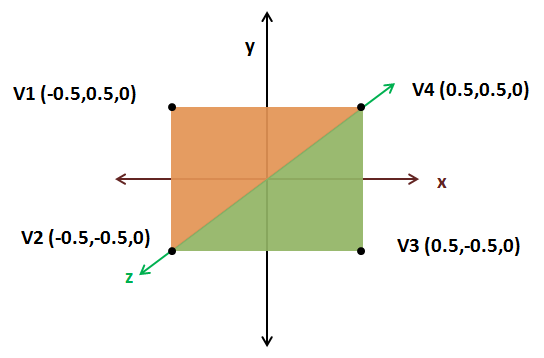
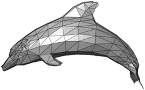
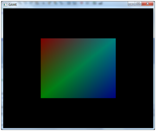

# More on Rendering

In this chapter we will continue talking about how OpenGL renders things. In order to tidy up our code a little bit let’s create a new class called Mesh which, taking as an input an array of positions, creates the VBO and VAO objects needed to load that model into the graphics card.

```java
package org.lwjglb.engine.graph;

import java.nio.FloatBuffer;
import org.lwjgl.system.MemoryUtil;
import static org.lwjgl.opengl.GL30.*;

public class Mesh {

    private final int vaoId;

    private final int vboId;

    private final int vertexCount;

    public Mesh(float[] positions) {
        FloatBuffer verticesBuffer = null;
        try {
            verticesBuffer = MemoryUtil.memAllocFloat(positions.length);
            vertexCount = positions.length / 3;
            verticesBuffer.put(positions).flip();

            vaoId = glGenVertexArrays();
            glBindVertexArray(vaoId);

            vboId = glGenBuffers();
            glBindBuffer(GL_ARRAY_BUFFER, vboId);
            glBufferData(GL_ARRAY_BUFFER, verticesBuffer, GL_STATIC_DRAW);            
            glEnableVertexAttribArray(0);
            glVertexAttribPointer(0, 3, GL_FLOAT, false, 0, 0);
            glBindBuffer(GL_ARRAY_BUFFER, 0);

            glBindVertexArray(0);         
        } finally {
            if (verticesBuffer  != null) {
                MemoryUtil.memFree(verticesBuffer);
            }
        }
    }

    public int getVaoId() {
        return vaoId;
    }

    public int getVertexCount() {
        return vertexCount;
    }

    public void cleanUp() {
        glDisableVertexAttribArray(0);

        // Delete the VBO
        glBindBuffer(GL_ARRAY_BUFFER, 0);
        glDeleteBuffers(vboId);

        // Delete the VAO
        glBindVertexArray(0);
        glDeleteVertexArrays(vaoId);
    }
}
```

We will create our `Mesh` instance in our `DummyGame` class, removing the VAO and VBO code from `Renderer` `init` method. Our render method in the `Renderer` class will accept also a Mesh instance to render. The `cleanup` method will also be simplified since the `Mesh` class already provides one for freeing VAO and VBO resources.

```java
public void render(Mesh mesh) {
    clear();

    if (window.isResized()) {
        glViewport(0, 0, window.getWidth(), window.getHeight());
        window.setResized(false);
    }

    shaderProgram.bind();

    // Draw the mesh
    glBindVertexArray(mesh.getVaoId());
    glDrawArrays(GL_TRIANGLES, 0, mesh.getVertexCount());

    // Restore state
    glBindVertexArray(0);

    shaderProgram.unbind();
}

public void cleanup() {
    if (shaderProgram != null) {
        shaderProgram.cleanup();
    }
}
```

One important thing to note is this line:

```java
glDrawArrays(GL_TRIANGLES, 0, mesh.getVertexCount());
```

Our `Mesh` counts the number of vertices by dividing the position array length by 3 \(since we are passing X, Y and Z coordinates\). Now that we can render more complex shapes, let us try to render a more complex shape. Let us render a quad. A quad can be constructed by using two triangles as shown in the next figure.



As you can see each of the two triangles is composed of three vertices. The first one formed by the vertices V1, V2 and V4 \(the orange one\) and the second one formed by the vertices V4, V2 and V3 \(the green one\). Vertices are specified in a counter-clockwise order, so the float array to be passed will be \[V1, V2, V4, V4, V2, V3\]. Thus, the init method in our `DummyGame` class will be:

```java
@Override
public void init() throws Exception {
    renderer.init();
    float[] positions = new float[]{
        -0.5f,  0.5f, 0.0f,
        -0.5f, -0.5f, 0.0f,
         0.5f,  0.5f, 0.0f,
         0.5f,  0.5f, 0.0f,
        -0.5f, -0.5f, 0.0f,
         0.5f, -0.5f, 0.0f,
    };
    mesh = new Mesh(positions);
}
```

Now you should see a quad rendered like this:


Are we done yet? Unfortunately not. The code above still presents some issues. We are repeating coordinates to represent the quad. We are passing twice V2 and V4 coordinates. With this small shape it may not seem a big deal, but imagine a much more complex 3D model. We would be repeating the coordinates many times. Keep in mind also that now we are just using three floats for representing the position of a vertex. But later on we will need more data to represent the texture, etc. Also take into consideration that in more complex shapes the number of vertices shared between triangles can be even higher like in the figure below \(where a vertex can be shared between six triangles\).



At the end we would need much more memory because of that duplicate information and this is where Index Buffers come to the rescue. For drawing the quad we only need to specify each vertex once this way: V1, V2, V3, V4\). Each vertex has a position in the array. V1 has position 0, V2 has position 1, etc:

| V1 | V2 | V3 | V4 |
| --- | --- | --- | --- |
| 0 | 1 | 2 | 3 |

Then we specify the order in which those vertices should be drawn by referring to their position:

| 0 | 1 | 3 | 3 | 1 | 2 |
| --- | --- | --- | --- | --- | --- |
| V1 | V2 | V4 | V4 | V2 | V3 |

So we need to modify our `Mesh` class to accept another parameter, an array of indices, and now the number of vertices to draw will be the length of that indices array.

```java
public Mesh(float[] positions, int[] indices) {
    vertexCount = indices.length;
```

After we have created our VBO that stores the positions, we need to create another VBO which will hold the indices. So we rename the identifier that holds the identifier for the positions VBO and create a new one for the index VBO \(`idxVboId`\). The process of creating that VBO is similar but the type is now `GL_ELEMENT_ARRAY_BUFFER`.

```java
idxVboId = glGenBuffers();
indicesBuffer = MemoryUtil.memAllocInt(indices.length);
indicesBuffer.put(indices).flip();
glBindBuffer(GL_ELEMENT_ARRAY_BUFFER, idxVboId);
glBufferData(GL_ELEMENT_ARRAY_BUFFER, indicesBuffer, GL_STATIC_DRAW);
memFree(indicesBuffer);
```

Since we are dealing with integers we need to create an `IntBuffer` instead of a `FloatBuffer`.

And that’s it. The VAO will contain now two VBOs, one for positions and another one that will hold the indices and that will be used for rendering. Our cleanup method in our `Mesh` class must take into consideration that there is another VBO to free.

```java
public void cleanUp() {
    glDisableVertexAttribArray(0);

    // Delete the VBOs
    glBindBuffer(GL_ARRAY_BUFFER, 0);
    glDeleteBuffers(posVboId);
    glDeleteBuffers(idxVboId);

    // Delete the VAO
    glBindVertexArray(0);
    glDeleteVertexArrays(vaoId);
}
```

Finally, we need to modify our drawing call that used the `glDrawArrays` method:

```java
glDrawArrays(GL_TRIANGLES, 0, mesh.getVertexCount());
```

To another call that uses the method `glDrawElements`:

```java
glDrawElements(GL_TRIANGLES, mesh.getVertexCount(), GL_UNSIGNED_INT, 0);
```

The parameters of that method are:

* mode: Specifies the primitives for rendering, triangles in this case. No changes here.
* count: Specifies the number of elements to be rendered.
* type: Specifies the type of value in the indices data. In this case we are using integers.
* indices: Specifies the offset to apply to the indices data to start rendering.

And now we can use our newer and much more efficient method of drawing complex models by just specifying the indices.

```java
public void init() throws Exception {
    renderer.init();
    float[] positions = new float[]{
        -0.5f,  0.5f, 0.0f,
        -0.5f, -0.5f, 0.0f,
         0.5f, -0.5f, 0.0f,
         0.5f,  0.5f, 0.0f,
    };
    int[] indices = new int[]{
        0, 1, 3, 3, 1, 2,
    };
    mesh = new Mesh(positions, indices);
}
```

Now let’s add some colour to our example. We will pass another array of floats to our `Mesh` class which holds the colour for each coordinate in the quad.

```java
public Mesh(float[] positions, float[] colours, int[] indices) {
```

With that array, we will create another VBO which will be associated to our VAO.

```java
// Colour VBO
colourVboId = glGenBuffers();
FloatBuffer colourBuffer = memAllocFloat(colours.length);
colourBuffer.put(colours).flip();
glBindBuffer(GL_ARRAY_BUFFER, colourVboId);
glBufferData(GL_ARRAY_BUFFER, colourBuffer, GL_STATIC_DRAW);
glEnableVertexAttribArray(1);
glVertexAttribPointer(1, 3, GL_FLOAT, false, 0, 0);
```

Please notice that in the `glVertexAttribPointer` call, the first parameter is now a `“1”`. This is the location where our shader will be expecting that data. \(Of course, since we have another VBO we need to free it in the `cleanup` method\). You can see that we need to enable the VAO attribute at position 1 to be used during rendering.

The next step is to modify the shaders. The vertex shader is now expecting two parameters, the coordinates \(in location 0\) and the colour \(in location 1\). The vertex shader will just output the received colour so it can be processed by the fragment shader.

```glsl
#version 330

layout (location =0) in vec3 position;
layout (location =1) in vec3 inColour;

out vec3 exColour;

void main()
{
    gl_Position = vec4(position, 1.0);
      exColour = inColour;
}
```

And now our fragment shader receives as an input the colour processed by our vertex shader and uses it to generate the colour.

```glsl
#version 330

in  vec3 exColour;
out vec4 fragColor;

void main()
{
    fragColor = vec4(exColour, 1.0);
}
```

 We can now pass an array of colours like this to our `Mesh` class in order to add some colour to our quad.

```java
float[] colours = new float[]{
    0.5f, 0.0f, 0.0f,
    0.0f, 0.5f, 0.0f,
    0.0f, 0.0f, 0.5f,
    0.0f, 0.5f, 0.5f,
};
```

And we will get a fancy coloured quad like this.



