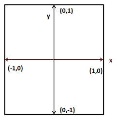
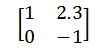
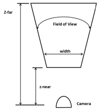
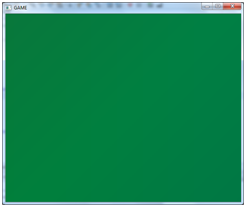
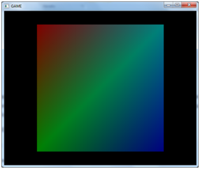

# Transformations

## Projecting

Let’s get back to our nice coloured quad we created in the previous chapter. If you look carefully, you will see that the quad is distorted and appears as a rectangle. You can even change the width of the window from 600 pixels to 900 and the distortion will be more evident. What’s happening here?

If you revisit our vertex shader code we are just passing our coordinates directly. That is, when we say that a vertex has a value for coordinate x of 0.5 we are saying to OpenGL to draw it at x position 0.5 on our screen. The following figure shows the OpenGL coordinates \(just for x and y axis\).



Those coordinates are mapped, considering our window size, to window coordinates \(which have the origin at the top-left corner of the previous figure\). So, if our window has a size of 900x580, OpenGL coordinates \(1,0\) will be mapped to coordinates \(900, 0\) creating a rectangle instead of a quad.


But, the problem is more serious than that. Modify the z coordinate of our quad from 0.0 to 1.0 and to -1.0. What do you see? The quad is exactly drawn in the same place no matter if it’s displaced along the z axis. Why is this happening? Objects that are further away should be drawn smaller than objects that are closer. But we are drawing them with the same x and y coordinates.

But, wait. Should this not be handled by the z coordinate? The answer is yes and no. The z coordinate tells OpenGL that an object is closer or farther away, but OpenGL does not know anything about the size of your object. You could have two objects of different sizes, one closer and smaller and one bigger and further that could be projected correctly onto the screen with the same size \(those would have same x and y coordinates but different z\). OpenGL just uses the coordinates we are passing, so we must take care of this. We need to correctly project our coordinates.

Now that we have diagnosed the problem, how do we fix it? The answer is using a projection matrix or frustum. The projection matrix will take care of the aspect ratio \(the relation between size and height\) of our drawing area so objects won’t be distorted. It also will handle the distance so objects far away from us will be drawn smaller. The projection matrix will also consider our field of view and the maximum distance to be displayed.

For those not familiar with matrices, a matrix is a bi-dimensional array of numbers arranged in columns and rows. Each number inside a matrix is called an element. A matrix order is the number of rows and columns. For instance, here you can see a 2x2 matrix \(2 rows and 2 columns\).



Matrices have a number of basic operations that can be applied to them \(such as addition, multiplication, etc.\) that you can consult in a math book. The main characteristics of matrices, related to 3D graphics, is that they are very useful to transform points in the space.

You can think about the projection matrix as a camera, which has a field of view and a minimum and maximum distance. The vision area of that camera will be obtained from a truncated pyramid. The following picture shows a top view of that area.



A projection matrix will correctly map 3D coordinates so they can be correctly represented on a 2D screen. The mathematical representation of that matrix is as follows \(don’t be scared\).


Where aspect ratio is the relation between our screen width and our screen height \($$a=width/height$$\). In order to obtain the projected coordinates of a given point we just need to multiply the projection matrix by the original coordinates. The result will be another vector that will contain the projected version.

So we need to handle a set of mathematical entities such as vectors, matrices and include the operations that can be done on them. We could choose to write all that code by our own from scratch or use an already existing library. We will choose the easy path and use a specific library for dealing with math operations in LWJGL which is called JOML \(Java OpenGL Math Library\). In order to use that library we just need to add another dependency to our `pom.xml` file.

```xml
        <dependency>
            <groupId>org.joml</groupId>
            <artifactId>joml</artifactId>
            <version>${joml.version}</version>
        </dependency>
```

And define the version of the library to use.

```xml
    <properties>
        [...]
        <joml.version>1.10.0</joml.version>
        [...]
    </properties>
```

Now that everything has been set up let’s define our projection matrix. We will create an instance of the class `Matrix4f` \(provided by the JOML library\) in our `Renderer` class. The `Matrix4f` class provides a method to set up a projection matrix named `setPerspective`. This method needs the following parameters:

* Field of View: The Field of View angle in radians. We will define a constant that holds that value
* Aspect Ratio.
* Distance to the near plane \(z-near\)
* Distance to the far plane \(z-far\).

We will instantiate that matrix in our `init` method so we need to pass a reference to our `Window`  instance to get its size \(you can see it in the source code\). The new constants and variables are:

```java
    /**
     * Field of View in Radians
     */
    private static final float FOV = (float) Math.toRadians(60.0f);

    private static final float Z_NEAR = 0.01f;

    private static final float Z_FAR = 1000.f;

    private Matrix4f projectionMatrix;
```

The projection matrix is created as follows:

```java
float aspectRatio = (float) window.getWidth() / window.getHeight();
projectionMatrix = new Matrix4f().setPerspective(FOV, aspectRatio,
    Z_NEAR, Z_FAR);
```

At this moment we will ignore that the aspect ratio can change \(by resizing our window\). This could be checked in the `render` method to change our projection matrix accordingly.

Now that we have our matrix, how do we use it? We need to use it in our shader, and it should be applied to all the vertices. At first, you could think of bundling it in the vertex input \(like the coordinates and the colours\). In this case we would be wasting lots of space since the projection matrix should not change even between several render calls. You may also think of multiplying the vertices by the matrix in the java code. But then, our VBOs would be useless and we will not be using the process power available in the graphics card.

The answer is to use “uniforms”. Uniforms are global GLSL variables that shaders can use and that we will employ to communicate with them.

So we need to modify our vertex shader code and declare a new uniform called `projectionMatrix` and use it to calculate the projected position.

```glsl
#version 330

layout (location=0) in vec3 position;
layout (location=1) in vec3 inColour;

out vec3 exColour;

uniform mat4 projectionMatrix;

void main()
{
    gl_Position = projectionMatrix * vec4(position, 1.0);
    exColour = inColour;
}
```

As you can see we define our `projectionMatrix` as a 4x4 matrix and the position is obtained by multiplying it by our original coordinates. Now we need to pass the values of the projection matrix to our shader. First, we need to get a reference to the place where the uniform will hold its values.

This is done with the method `glGetUniformLocation` which receives two parameters:

* The shader program identifier.
* The name of the uniform \(it should match the one defined in the shader code\).

This method returns an identifier holding the uniform location. Since we may have more than one uniform, we will store those locations in a Map indexed by the location's name \(We will need that location number later\). So in the `ShaderProgram` class we create a new variable that holds those identifiers:

```java
private final Map<String, Integer> uniforms;
```

This variable will be initialized in our constructor:

```java
uniforms = new HashMap<>();
```

And finally we create a method to set up new uniforms and store the obtained location.

```java
public void createUniform(String uniformName) throws Exception {
    int uniformLocation = glGetUniformLocation(programId,
        uniformName);
    if (uniformLocation < 0) {
        throw new Exception("Could not find uniform:" +
            uniformName);
    }
    uniforms.put(uniformName, uniformLocation);
}
```

Now, in our `Renderer` class we can invoke the `createUniform` method once the shader program has been compiled \(in this case, we will do it once the projection matrix has been instantiated\).

```java
shaderProgram.createUniform("projectionMatrix");
```

At this moment, we already have a holder ready to be set up with data to be used as our projection matrix. Since the projection matrix won’t change between rendering calls we may set up the values right after the creation of the uniform. But we will do it in our render method. You will see later that we may reuse that uniform to do additional operations that need to be done in each render call.

We will create another method in our `ShaderProgram` class to setup the data, named `setUniform`. Basically we transform our matrix into a 4x4 `FloatBuffer` by using the utility methods provided by the JOML library and send them to the location we stored in our locations map.

```java
public void setUniform(String uniformName, Matrix4f value) {
    // Dump the matrix into a float buffer
    try (MemoryStack stack = MemoryStack.stackPush()) {
        glUniformMatrix4fv(uniforms.get(uniformName), false,
                           value.get(stack.mallocFloat(16)));
    }
}
```

As you can see we are creating buffers in a different way here. We are using auto-managed buffers, and allocating them on the stack. This is due to the fact that the size of this buffer is small and that it will not be used beyond this method. Thus, we use the `MemoryStack` class.

Now we can use that method in the `Renderer` class in the `render` method, after the shader program has been bound:

```java
shaderProgram.setUniform("projectionMatrix", projectionMatrix);
```

We are almost done. We can now show the quad correctly rendered. So you can now launch your program and will obtain a... black background without any coloured quad. What’s happening? Did we break something? Well, actually no. Remember that we are now simulating the effect of a camera looking at our scene. And we provided two distances, one to the farthest plane \(equal to 1000f\) and one to the closest plane \(equal to 0.01f\). Our coordinates are:

```java
float[] positions = new float[]{
    -0.5f,  0.5f, 0.0f,
    -0.5f, -0.5f, 0.0f,
     0.5f, -0.5f, 0.0f,
     0.5f,  0.5f, 0.0f,
};
```

That is, our z coordinates are outside the visible zone. Let’s assign them a value of `-0.05f`. Now you will see a giant green square like this:



What is happening now is that we are drawing the quad too close to our camera. We are actually zooming into it. If we assign now a value of `-1.05f` to the z coordinate we can now see our coloured quad.



If we continue pushing the quad backwards we will see it becoming smaller. Notice also that our quad does not appear as a rectangle anymore.

## Applying Transformations

Let’s recall what we’ve done so far. We have learned how to pass data in an efficient format to our graphics card, and how to project that data and assign them colours using vertex and fragments shaders. Now we should start drawing more complex models in our 3D space. But in order to do that we must be able to load an arbitrary model and represent it in our 3D space at a specific position, with the appropriate size and the required rotation.

So right now, in order to do that representation we need to provide some basic operations to act upon any model:

* Translation: Move an object by some amount on any of the three axes.
* Rotation: Rotate an object by some amount of degrees around any of the three axes.
* Scale: Adjust the size of an object.


The operations described above are known as transformations. And you are probably guessing, correctly, that the way we are going to achieve that is by multiplying our coordinates by a set of matrices \(one for translation, one for rotation and one for scaling\). Those three matrices will be combined into a single matrix called world matrix and passed as a uniform to our vertex shader.

The reason why it is called world matrix is because we are transforming from model coordinates to world coordinates. When you learn about loading 3D models you will see that those models are defined in their own coordinate systems. They don’t know the size of your 3D space and they need to be placed in it. So when we multiply our coordinates by our matrix what we are doing is transforming from one coordinate system \(the model one\) to another \(the one for our 3D world\).

That world matrix will be calculated like this \(the order is important since multiplication using matrices is not commutative\):


$$
World Matrix=\left[Translation Matrix\right]\left[Rotation Matrix\right]\left[Scale Matrix\right]
$$


If we include our projection matrix in the transformation matrix it would be like this:


$$
\begin{array}{lcl}
Transf & = & \left[Proj Matrix\right]\left[Translation Matrix\right]\left[Rotation Matrix\right]\left[Scale Matrix\right] \\
 & = & \left[Proj Matrix\right]\left[World Matrix\right]
\end{array}
$$


The translation matrix is defined like this:


$$
\begin{bmatrix}
1 & 0 & 0 & dx \\
0 & 1 & 0 & dy \\
0 & 0 & 1 & dz \\
0 & 0 & 0 & 1
\end{bmatrix}
$$


Translation Matrix Parameters:

* dx: Displacement along the x axis.
* dy: Displacement along the y axis.
* dz: Displacement along the z axis.

The scale matrix is defined like this:


$$
\begin{bmatrix}
sx & 0 & 0 & 0 \\
0 & sy & 0 & 0 \\
0 & 0 & sz & 0 \\
0 & 0 & 0 & 1
\end{bmatrix}
$$


Scale Matrix Parameters:

* sx: Scaling along the x axis.
* sy: Scaling along the y axis.
* sz: Scaling along the z axis.

The rotation matrix is much more complex. But keep in mind that it can be constructed by the multiplication of 3 rotation matrices for a single axis, each.

Now, in order to apply those concepts we need to refactor our code a little bit. In our game we will be loading a set of models which can be used to render many objects at different positions according to our game logic \(imagine a FPS game which loads three models for different enemies. There are only three models but using these models we can draw as many enemies as we want\). Do we need to create a VAO and the set of VBOs for each of those objects? The answer is no. We only need to load it once per model. What we need to do is to draw it independently according to its position, size and rotation. We need to transform those models when we are rendering them.

So we will create a new class named `GameItem` that will hold a reference to a model, to a `Mesh` instance. A `GameItem` instance will have variables for storing its position, its rotation state and its scale. This is the definition of that class.

```java
package org.lwjglb.engine;

import org.joml.Vector3f;
import org.lwjglb.engine.graph.Mesh;

public class GameItem {

    private final Mesh mesh;

    private final Vector3f position;

    private float scale;

    private final Vector3f rotation;

    public GameItem(Mesh mesh) {
        this.mesh = mesh;
        position = new Vector3f();
        scale = 1;
        rotation = new Vector3f();
    }

    public Vector3f getPosition() {
        return position;
    }

    public void setPosition(float x, float y, float z) {
        this.position.x = x;
        this.position.y = y;
        this.position.z = z;
    }

    public float getScale() {
        return scale;
    }

    public void setScale(float scale) {
        this.scale = scale;
    }

    public Vector3f getRotation() {
        return rotation;
    }

    public void setRotation(float x, float y, float z) {
        this.rotation.x = x;
        this.rotation.y = y;
        this.rotation.z = z;
    }

    public Mesh getMesh() {
        return mesh;
    }
}
```

We will create another class which will deal with transformations named `Transformation`.

```java
package org.lwjglb.engine.graph;

import org.joml.Matrix4f;
import org.joml.Vector3f;

public class Transformation {

    private final Matrix4f projectionMatrix;

    private final Matrix4f worldMatrix;

    public Transformation() {
        worldMatrix = new Matrix4f();
        projectionMatrix = new Matrix4f();
    }

    public final Matrix4f getProjectionMatrix(float fov, float width, float height, float zNear, float zFar) {
        return projectionMatrix.setPerspective(fov, width / height, zNear, zFar);
    }

    public Matrix4f getWorldMatrix(Vector3f offset, Vector3f rotation, float scale) {
        return worldMatrix.translation(offset).
                rotateX((float)Math.toRadians(rotation.x)).
                rotateY((float)Math.toRadians(rotation.y)).
                rotateZ((float)Math.toRadians(rotation.z)).
                scale(scale);
    }
}
```

As you can see this class groups the projection and world matrices. Given a set of vectors that model the displacement, rotation and scale it returns the world matrix. The method `getWorldMatrix` returns the matrix that will be used to transform the coordinates for each `GameItem` instance. That class also provides a method that gets the projection matrix based on the Field Of View, the aspect ratio and the near and far distances.

An important thing to notice is that the `mul` method of the `Matrix4f` class modifies the matrix instance which the method is being applied to. So if we directly multiply the projection matrix with the transformation matrix we will modify the projection matrix itself. This is why we are always initializing each matrix to the identity matrix upon each call.

In the `Renderer` class, in the constructor method, we just instantiate the `Transformation` with no arguments and in the `init` method we just create the uniform.

```java
public Renderer() {
    transformation = new Transformation();
}

public void init(Window window) throws Exception {
    // .... Some code before ...
    // Create uniforms for world and projection matrices
    shaderProgram.createUniform("projectionMatrix");
    shaderProgram.createUniform("worldMatrix");

    window.setClearColor(0.0f, 0.0f, 0.0f, 0.0f);
}
```

In the render method of our `Renderer` class we now receive an array of GameItems:

```java
public void render(Window window, GameItem[] gameItems) {
    clear();

    if (window.isResized()) {
        glViewport(0, 0, window.getWidth(), window.getHeight());
        window.setResized(false);
    }

    shaderProgram.bind();

    // Update projection Matrix
    Matrix4f projectionMatrix = transformation.getProjectionMatrix(FOV, window.getWidth(), window.getHeight(), Z_NEAR, Z_FAR);
    shaderProgram.setUniform("projectionMatrix", projectionMatrix);        

    // Render each gameItem
    for (GameItem gameItem : gameItems) {
        // Set world matrix for this item
        Matrix4f worldMatrix =
            transformation.getWorldMatrix(
                gameItem.getPosition(),
                gameItem.getRotation(),
                gameItem.getScale());
        shaderProgram.setUniform("worldMatrix", worldMatrix);
        // Render the mesh for this game item
        gameItem.getMesh().render();
    }

    shaderProgram.unbind();
}
```

We update the projection matrix once per `render` call. By doing it this way we can deal with window resize operations. Then we iterate over the `GameItem` array and create a transformation matrix according to the position, rotation and scale of each of them. This matrix is pushed to the shader and the `Mesh` is drawn. The projection matrix is the same for all the items to be rendered. This is the reason why it’s a separate variable in our `Transformation` class.

We moved the rendering code to draw a `Mesh` to its class:

```java
public void render() {
    // Draw the mesh
    glBindVertexArray(getVaoId());

    glDrawElements(GL_TRIANGLES, getVertexCount(), GL_UNSIGNED_INT, 0);

    // Restore state
    glBindVertexArray(0);
}
```

Our vertex shader is modified by simply adding a new `worldMatrix` matrix and it uses it with the `projectionMatrix` to calculate the position:

```glsl
#version 330

layout (location=0) in vec3 position;
layout (location=1) in vec3 inColour;

out vec3 exColour;

uniform mat4 worldMatrix;
uniform mat4 projectionMatrix;

void main()
{
    gl_Position = projectionMatrix * worldMatrix * vec4(position, 1.0);
    exColour = inColour;
}
```

As you can see the code is exactly the same. We are using the uniform to correctly project our coordinates taking into consideration our frustum, position, scale and rotation information.

Another important thing to think about is, why don’t we pass the translation, rotation and scale matrices instead of combining them into a world matrix? The reason is that we should try to limit the matrices we use in our shaders. Also keep in mind that the matrix multiplication that we do in our shader is done once per each vertex. The projection matrix does not change between render calls and the world matrix does not change per `GameItem` instance. If we passed the translation, rotation and scale matrices independently we would be doing many more matrix multiplications. Think about a model with tons of vertices. That’s a lot of extra operations.

But you may think now that if the world matrix does not change per `GameItem` instance, why didn't we do the matrix multiplication in our Java class? We could multiply the projection matrix and the world matrix just once per `GameItem` and send it as a single uniform. In this case we would be saving many more operations, right? The answer is that this is a valid point for now, but when we add more features to our game engine we will need to operate with world coordinates in the shaders anyway, so it’s better to handle those two matrices in an independent way.

Finally we only need to change the `DummyGame` class to create an instance of `GameItem` with its associated `Mesh` and add some logic to translate, rotate and scale our quad. Since it’s only a test example and does not add too much you can find it in the source code that accompanies this book.

