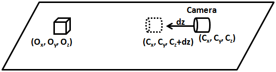
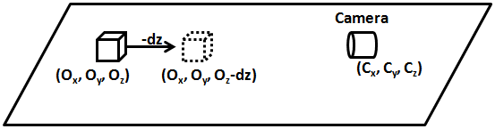
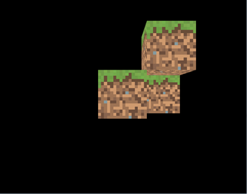

# Camera

In this chapter we will learn how to move inside a rendered 3D scene. This capability is like having a camera that can travel inside the 3D world and in fact that's the term used to refer to it.

But if you try to search for specific camera functions in OpenGL you will discover that there is no camera concept, or in other words the camera is always fixed, centered in the \(0, 0, 0\) position at the center of the screen.

So what we will do is a simulation that gives us the impression that we have a camera capable of moving inside the 3D scene. How do we achieve this? Well, if we cannot move the camera then we must move all the objects contained in our 3D space at once. In other words, if we cannot move a camera we will move the whole world.

So, suppose that we would like to move the camera position along the z axis from a starting position \(Cx, Cy, Cz\) to a position \(Cx, Cy, Cz+dz\) to get closer to the object which is placed at the coordinates \(Ox, Oy, Oz\).



What we will actually do is move the object \(all the objects in our 3D space indeed\) in the opposite direction that the camera should move. Think about it like the objects being placed in a treadmill.



A camera can be displaced along the three axis \(x, y and z\) and also can rotate along them \(roll, pitch and yaw\).


So basically what we must do is to be able to move and rotate all of the objects of our 3D world. How are we going to do this? The answer is to apply another transformation that will translate all of the vertices of all of the objects in the opposite direction of the movement of the camera and that will rotate them according to the camera rotation. This will be done of course with another matrix, the so called view matrix. This matrix will first perform the translation and then the rotation along the axis.

Let's see how we can construct that matrix. If you remember from the transformations chapter our transformation equation was like this:

$$
\begin{array}{lcl}
Transf & = & \lbrack ProjMatrix \rbrack \cdot \lbrack TranslationMatrix \rbrack \cdot \lbrack  RotationMatrix \rbrack \cdot \lbrack  ScaleMatrix \rbrack \\ 
 & = & \lbrack   ProjMatrix \rbrack  \cdot \lbrack  WorldMatrix \rbrack
\end{array}
$$

The view matrix should be applied before multiplying by the projection matrix, so our equation should be now like this:

$$
\begin{array}{lcl}
Transf & = & \lbrack  ProjMatrix \rbrack \cdot \lbrack  ViewMatrix \rbrack \cdot \lbrack  TranslationMatrix \rbrack \cdot \lbrack  RotationMatrix \rbrack \cdot \lbrack ScaleMatrix \rbrack \\
  & = & \lbrack ProjMatrix \rbrack \cdot \lbrack  ViewMatrix \rbrack \cdot \lbrack  WorldMatrix \rbrack 
\end{array}
$$

Now we have three matrices, let's think a little bit about the life cycles of those matrices. The projection matrix should not change very much while our game is running, in the worst case it may change once per render call. The view matrix may change once per render call if the camera moves. The world matrix changes once per `GameItem` instance, so it will change several times per render call.

So, how many matrices should we push to our vertex shader? You may see some code that uses three uniforms, one for each matrix, but in principle the most efficient approach is to combine the projection and view matrices, let’s call it `pv` matrix, and push the `world` and the `pv` matrices to our shader. With this approach we have the possibility to work with world coordinates and avoid some extra multiplications.

But actually the most convenient approach is to combine the view and the world matrix. Why this? Because remember that the whole camera concept is a trick, what we are doing is pushing the whole world to simulate world displacement and to show only a small portion of the 3D world. So if we work directly with world coordinates we may be working with world coordinates that are far away from the origin and we may incur in some precision problems. If we work in what’s called the camera space we will be working with points that, although are far away from the world origin, are closer to the camera. The matrix that results of the combination of the view and the world matrix is often called as the model view matrix.

So let’s start modifying our code to support a camera. First of all we will create a new class called `Camera` which will hold the position and rotation state of our camera. This class will provide methods to set the new position or rotation state \(`setPosition` or `setRotation`\) or to update those values with an offset upon the current state \(`movePosition` and `moveRotation`\).

```java
package org.lwjglb.engine.graph;

import org.joml.Vector3f;

public class Camera {

    private final Vector3f position;

    private final Vector3f rotation;

    public Camera() {
        position = new Vector3f();
        rotation = new Vector3f();
    }

    public Camera(Vector3f position, Vector3f rotation) {
        this.position = position;
        this.rotation = rotation;
    }

    public Vector3f getPosition() {
        return position;
    }

    public void setPosition(float x, float y, float z) {
        position.x = x;
        position.y = y;
        position.z = z;
    }

    public void movePosition(float offsetX, float offsetY, float offsetZ) {
        if ( offsetZ != 0 ) {
            position.x += (float)Math.sin(Math.toRadians(rotation.y)) * -1.0f * offsetZ;
            position.z += (float)Math.cos(Math.toRadians(rotation.y)) * offsetZ;
        }
        if ( offsetX != 0) {
            position.x += (float)Math.sin(Math.toRadians(rotation.y - 90)) * -1.0f * offsetX;
            position.z += (float)Math.cos(Math.toRadians(rotation.y - 90)) * offsetX;
        }
        position.y += offsetY;
    }

    public Vector3f getRotation() {
        return rotation;
    }

    public void setRotation(float x, float y, float z) {
        rotation.x = x;
        rotation.y = y;
        rotation.z = z;
    }

    public void moveRotation(float offsetX, float offsetY, float offsetZ) {
        rotation.x += offsetX;
        rotation.y += offsetY;
        rotation.z += offsetZ;
    }
}
```

Next in the `Transformation` class we will define a new matrix to hold the values of the view matrix.

```java
private final Matrix4f viewMatrix;
```

We will also provide a method to update its value. Similarly to the projection matrix, this matrix will be the same for all the objects to be rendered in a render cycle.

```java
public Matrix4f getViewMatrix(Camera camera) {
    Vector3f cameraPos = camera.getPosition();
    Vector3f rotation = camera.getRotation();

    viewMatrix.identity();
    // First do the rotation so camera rotates over its position
    viewMatrix.rotate((float)Math.toRadians(rotation.x), new Vector3f(1, 0, 0))
        .rotate((float)Math.toRadians(rotation.y), new Vector3f(0, 1, 0));
    // Then do the translation
    viewMatrix.translate(-cameraPos.x, -cameraPos.y, -cameraPos.z);
    return viewMatrix;
}
```

As you can see, we first need to do the rotation and then the translation. If we did the opposite we would not be rotating along the camera position but along the coordinates origin. Please also note that in the `movePosition` method of the `Camera` class we just not simply increase the camera position by an offset. We also take into consideration the rotation along the y axis, the yaw, in order to calculate the final position. If we would just increase the camera position by the offset the camera will not move in the direction it's facing.

Besides what is mentioned above, we do not have here a full free fly camera \(for instance, if we rotate along the x axis the camera does not move up or down in the space when we move it forward\). This will be done in later chapters since is a little bit more complex.

Finally we will remove the previous method `getWorldMatrix` and add a new one called `getModelViewMatrix`.

```java
public Matrix4f getModelViewMatrix(GameItem gameItem, Matrix4f viewMatrix) {
    Vector3f rotation = gameItem.getRotation();
    modelViewMatrix.set(viewMatrix).translate(gameItem.getPosition()).
		rotateX((float)Math.toRadians(-rotation.x)).
		rotateY((float)Math.toRadians(-rotation.y)).
		rotateZ((float)Math.toRadians(-rotation.z)).
			scale(gameItem.getScale());
    return modelViewMatrix;
}
```

The `getModelViewMatrix` method will be called once per each `GameItem` instance.

In the `render` method of the `Renderer` class we just need to update the view matrix according to the camera values, just after the projection matrix is also updated.

```java
// Update projection Matrix
Matrix4f projectionMatrix = transformation.getProjectionMatrix(FOV, window.getWidth(), window.getHeight(), Z_NEAR, Z_FAR);
shaderProgram.setUniform("projectionMatrix", projectionMatrix);

// Update view Matrix
Matrix4f viewMatrix = transformation.getViewMatrix(camera);

shaderProgram.setUniform("texture_sampler", 0);
// Render each gameItem
for (GameItem gameItem : gameItems) {
    // Set model view matrix for this item
    Matrix4f modelViewMatrix = transformation.getModelViewMatrix(gameItem, viewMatrix);
    shaderProgram.setUniform("modelViewMatrix", modelViewMatrix);
    // Render the mes for this game item
    gameItem.getMesh().render();
}
```

And that’s all, our base code supports the concept of a camera. Now we need to use it. We can change the way we handle the input and update the camera. We will set the following controls:

* Keys “A” and “D” to move the camera to the left and right \(x axis\) respectively.
* Keys “W” and “S” to move the camera forward and backwards \(z axis\) respectively.
* Keys “Z” and “X” to move the camera up and down \(y axis\) respectively.

We will use the mouse position to rotate the camera along the x and y axis when the right button of the mouse is pressed.  
As you can see we will be using the mouse for the first time. We will create a new class named `MouseInput` that encapsulates mouse access. Here’s the code for that class.

```java
package org.lwjglb.engine;

import org.joml.Vector2d;
import org.joml.Vector2f;
import static org.lwjgl.glfw.GLFW.*;

public class MouseInput {

    private final Vector2d previousPos;

    private final Vector2d currentPos;

    private final Vector2f displVec;

    private boolean inWindow = false;

    private boolean leftButtonPressed = false;

    private boolean rightButtonPressed = false;

    public MouseInput() {
        previousPos = new Vector2d(-1, -1);
        currentPos = new Vector2d(0, 0);
        displVec = new Vector2f();
    }

    public void init(Window window) {
        glfwSetCursorPosCallback(window.getWindowHandle(), (windowHandle, xpos, ypos) -> {
            currentPos.x = xpos;
            currentPos.y = ypos;
        });
        glfwSetCursorEnterCallback(window.getWindowHandle(), (windowHandle, entered) -> {
            inWindow = entered;
        });
        glfwSetMouseButtonCallback(window.getWindowHandle(), (windowHandle, button, action, mode) -> {
            leftButtonPressed = button == GLFW_MOUSE_BUTTON_1 && action == GLFW_PRESS;
            rightButtonPressed = button == GLFW_MOUSE_BUTTON_2 && action == GLFW_PRESS;
        });
    }

    public Vector2f getDisplVec() {
        return displVec;
    }

    public void input(Window window) {
        displVec.x = 0;
        displVec.y = 0;
        if (previousPos.x > 0 && previousPos.y > 0 && inWindow) {
            double deltax = currentPos.x - previousPos.x;
            double deltay = currentPos.y - previousPos.y;
            boolean rotateX = deltax != 0;
            boolean rotateY = deltay != 0;
            if (rotateX) {
                displVec.y = (float) deltax;
            }
            if (rotateY) {
                displVec.x = (float) deltay;
            }
        }
        previousPos.x = currentPos.x;
        previousPos.y = currentPos.y;
    }

    public boolean isLeftButtonPressed() {
        return leftButtonPressed;
    }

    public boolean isRightButtonPressed() {
        return rightButtonPressed;
    }
}
```

The `MouseInput` class provides an `init` method which should be called during the initialization phase and registers a set of callbacks to process mouse events:

* `glfwSetCursorPosCallback`: Registers a callback that will be invoked when the mouse is moved.
* `glfwSetCursorEnterCallback`: Registers a callback that will be invoked when the mouse enters our window. We will be receiving mouse events even if the mouse is not in our window. We use this callback to track when the mouse is in our window.
* `glfwSetMouseButtonCallback`: Registers a callback that will be invoked when a mouse button is pressed.

The `MouseInput` class provides an input method which should be called when game input is processed. This method calculates the mouse displacement from the previous position and stores it into the `displVec` variable so it can be used by our game.

The `MouseInput` class will be instantiated in our `GameEngine` class and will be passed as a parameter to the `input` and `update` methods of the game implementation \(so we need to change the interface `IGameLogic` accordingly\).

```java
void input(Window window, MouseInput mouseInput);

void update(float interval, MouseInput mouseInput);
```

The mouse input will be processed in the input method of the `GameEngine` class before passing the control to the game implementation.

```java
protected void input() {
    mouseInput.input(window);
    gameLogic.input(window, mouseInput);
}
```

Now we are ready to update our `DummyGame` class to process the keyboard and mouse input. The input method of that class will be like this:

```java
@Override
public void input(Window window, MouseInput mouseInput) {
    cameraInc.set(0, 0, 0);
    if (window.isKeyPressed(GLFW_KEY_W)) {
        cameraInc.z = -1;
    } else if (window.isKeyPressed(GLFW_KEY_S)) {
        cameraInc.z = 1;
    }
    if (window.isKeyPressed(GLFW_KEY_A)) {
        cameraInc.x = -1;
    } else if (window.isKeyPressed(GLFW_KEY_D)) {
        cameraInc.x = 1;
    }
    if (window.isKeyPressed(GLFW_KEY_Z)) {
        cameraInc.y = -1;
    } else if (window.isKeyPressed(GLFW_KEY_X)) {
        cameraInc.y = 1;
    }
}
```

It just updates a `Vector3f` variable named `cameraInc` which holds the camera displacement that should be applied.
The update method of the `DummyGame` class modifies the camera position and rotation according to the processed key and mouse events.

```java
@Override
public void update(float interval, MouseInput mouseInput) {
    // Update camera position
    camera.movePosition(cameraInc.x * CAMERA_POS_STEP,
        cameraInc.y * CAMERA_POS_STEP,
        cameraInc.z * CAMERA_POS_STEP);

    // Update camera based on mouse            
    if (mouseInput.isRightButtonPressed()) {
        Vector2f rotVec = mouseInput.getDisplVec();
        camera.moveRotation(rotVec.x * MOUSE_SENSITIVITY, rotVec.y * MOUSE_SENSITIVITY, 0);
    }
}
```

Now we can add more cubes to our world, scale them, set them up in a specific location and play with our new camera. As you can see all the cubes share the same mesh.

```java
GameItem gameItem1 = new GameItem(mesh);
gameItem1.setScale(0.5f);
gameItem1.setPosition(0, 0, -2);

GameItem gameItem2 = new GameItem(mesh);
gameItem2.setScale(0.5f);
gameItem2.setPosition(0.5f, 0.5f, -2);

GameItem gameItem3 = new GameItem(mesh);
gameItem3.setScale(0.5f);
gameItem3.setPosition(0, 0, -2.5f);

GameItem gameItem4 = new GameItem(mesh);
gameItem4.setScale(0.5f);

gameItem4.setPosition(0.5f, 0, -2.5f);
gameItems = new GameItem[]{gameItem1, gameItem2, gameItem3, gameItem4};
```

You will get something like this.



