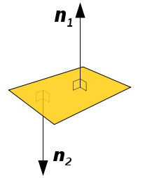
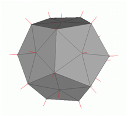
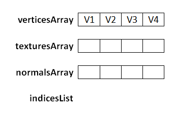
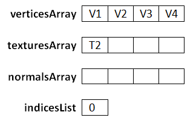
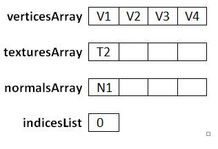
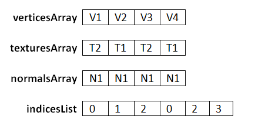
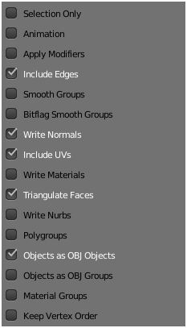

# Loading more complex models

In this chapter we will learn to load more complex models defined in external files. These models will be created by 3D modelling tools \(such as [Blender](https://www.blender.org/)\). Up to now we have been creating models by coding directly the arrays that define their geometry, but in this chapter we will learn how to load models defined in OBJ format.

OBJ \(or .OBJ\) is a geometry definition open file format developed by Wavefront Technologies which has been widely adopted. An OBJ file defines the vertices, texture coordinates and polygons that compose a 3D model. It’s a relatively easy format to parse since it is text based and each line defines an element \(a vertex, a texture coordinate, etc.\).

In an .obj file each line starts with a token which identifies the type of element:

* Comments are lines which start with \#.
* The token “v” defines a geometric vertex with coordinates \(x, y, z, w\). Example: v 0.155 0.211 0.32 1.0.
* The token “vn” defines a vertex normal with coordinates \(x, y, z\). Example: vn 0.71 0.21 0.82. More on this later.
* The token “vt” defines a texture coordinate. Example: vt 0.500 1. 
* The token “f” defines a face. With the information contained in these lines we will construct our indices array. We will handle only the case where faces are exported as triangles. It can have several variants:
  * It can define just vertex positions \(f v1 v2 v3\). Example: f 6 3 1. In this case this triangle is defined by the geometric vertices that occupy positions 6, 3 a and 1. \(Vertex indices always starts by 1\).
  * It can define vertex positions, texture coordinates and normals \(f v1/t1/n1 v2/t2/n2 V3/t3/n3\). Example: f 6/4/1 3/5/3 7/6/5. The first block is “6/4/1” and defines the coordinates, texture coordinates and normal vertex. What you see here is the position, so we are saying: pick the geometric vertex number six, the texture coordinate number four and the vertex normal number one.

OBJ format has many more entry types \(like one to group polygons, defining materials, etc.\). For now we will stick to this subset, our OBJ loader will ignore other entry types.

But what is a normal? Let’s define it first. The normal of a plane is a vector perpendicular to that plane which has a length equal to one.



As you can see in the figure above, a plane can have two normals. Which one should we use? Normals in 3D graphics are used for lighting, so we should choose the normal which is oriented towards the source of light. In other words, we should choose the normal that points out from the external face of our model.

When we have a 3D model, it is composed by polygons, triangles in our case. Each triangle is composed by three vertices. The Normal vector for a triangle will be the vector perpendicular to the triangle surface which has a length equal to one.

A vertex normal is associated to a specific vertex and is the combination of the normals of the surrounding triangles \(of course its length is equal to one\). Here you can see the vertex models of a 3D mesh \(taken from [Wikipedia](https://en.wikipedia.org/wiki/Vertex_normal#/media/File:Vertex_normals.png)\)



Let’s now start creating our OBJ loader. First of all we will modify our `Mesh` class since now it’s mandatory to use a texture. Some of the obj files that we may load may not define texture coordinates and we must be able to render them using a colour instead of a texture. In this case the face definition will be of the form: “f v//n”.

Our `Mesh` class will have a new attribute named `colour`.

```java
private Vector3f colour;
```

And the constructor will no longer require a `Texture` instance. Instead we will provide getters and setters for texture and colour attributes.

```java
public Mesh(float[] positions, float[] textCoords, float[] normals, int[] indices) {
```

Of course, in the `render` and `cleanup` methods we must check if the texture attribute is not null before using it. As you can see in the constructor we now pass a new array of floats named `normals`. How do we use normals for rendering? The answer is easy: it will be just another VBO inside our VAO, so we need to add this code.

```java
// Vertex normals VBO
vboId = glGenBuffers();
vboIdList.add(vboId);
vecNormalsBuffer = MemoryUtil.memAllocFloat(normals.length);
vecNormalsBuffer.put(normals).flip();
glBindBuffer(GL_ARRAY_BUFFER, vboId);
glBufferData(GL_ARRAY_BUFFER, vecNormalsBuffer, GL_STATIC_DRAW);
glEnableVertexAttribArray(2);
glVertexAttribPointer(2, 3, GL_FLOAT, false, 0, 0);
```

Now that we have finished the modifications in the `Mesh` class we can change our code to use either texture coordinates or a fixed colour. Thus we need to modify our fragment shader like this:

```glsl
#version 330

in  vec2 outTexCoord;
out vec4 fragColor;

uniform sampler2D texture_sampler;
uniform vec3 colour;
uniform int useColour;

void main()
{
    if ( useColour == 1 )
    {
        fragColor = vec4(colour, 1);
    }
    else
    {
        fragColor = texture(texture_sampler, outTexCoord);
    }
}
```

As you can see we have created two new uniforms:

* `colour`: Will contain the base colour.
* `useColour`: It’s a flag that we will set to 1 when we don’t want to use textures.

In the `Renderer` class we need to create those two uniforms.

```java
// Create uniform for default colour and the flag that controls it
shaderProgram.createUniform("colour");
shaderProgram.createUniform("useColour");
```

And like any other uniform, in the `render` method of the `Renderer` class we need to set the values for this uniforms for each `gameItem`.

```java
for (GameItem gameItem : gameItems) {
    Mesh mesh = gameItem.getMesh();
    // Set model view matrix for this item
    Matrix4f modelViewMatrix = transformation.getModelViewMatrix(gameItem, viewMatrix);
    shaderProgram.setUniform("modelViewMatrix", modelViewMatrix);
    // Render the mesh for this game item
    shaderProgram.setUniform("colour", mesh.getColour());
    shaderProgram.setUniform("useColour", mesh.isTextured() ? 0 : 1);
    mesh.render();
}
```

Now we can create a new class named `OBJLoader` which parses OBJ files and creates a `Mesh` instance with the data contained in it. You may find some other implementations in the web that may be a bit more efficient than this one, but I think this version is simpler to understand. This will be an utility class which will have a static method like this:

```java
public static Mesh loadMesh(String fileName) throws Exception {
```

The parameter `filename` specifies the name of the file, which must be in the CLASSPATH, that contains the OBJ model.

The first thing that we will do in that method is to read the file contents and store all the lines in an array. Then we create several lists that will hold the vertices, the texture coordinates, the normals and the faces.

```java
List<String> lines = Utils.readAllLines(fileName);

List<Vector3f> vertices = new ArrayList<>();
List<Vector2f> textures = new ArrayList<>();
List<Vector3f> normals = new ArrayList<>();
List<Face> faces = new ArrayList<>();
```

We then parse each line and, depending on the starting token, we will get a vertex position, a texture coordinate, a vertex normal or a face definition. At the end we will need to reorder that information.

```java
for (String line : lines) {
    String[] tokens = line.split("\\s+");
    switch (tokens[0]) {
        case "v":
            // Geometric vertex
            Vector3f vec3f = new Vector3f(
                Float.parseFloat(tokens[1]),
                Float.parseFloat(tokens[2]),
                Float.parseFloat(tokens[3]));
            vertices.add(vec3f);
            break;
        case "vt":
            // Texture coordinate
            Vector2f vec2f = new Vector2f(
                Float.parseFloat(tokens[1]),
                Float.parseFloat(tokens[2]));
            textures.add(vec2f);
            break;
        case "vn":
            // Vertex normal
            Vector3f vec3fNorm = new Vector3f(
                Float.parseFloat(tokens[1]),
                Float.parseFloat(tokens[2]),
                Float.parseFloat(tokens[3]));
            normals.add(vec3fNorm);
            break;
        case "f":
            Face face = new Face(tokens[1], tokens[2], tokens[3]);
            faces.add(face);
            break;
        default:
            // Ignore other lines
            break;
    }
}
return reorderLists(vertices, textures, normals, faces);
```

Before talking about reordering let’s see how face definitions are parsed. We have create a class named `Face` which parses the definition of a face. A `Face` is composed by a list of indices groups, in this case since we are dealing with triangles we will have three indices group\).


We will create another inner class named `IndexGroup` that will hold the information for a group.

```java
protected static class IdxGroup {

    public static final int NO_VALUE = -1;

    public int idxPos;

    public int idxTextCoord;

    public int idxVecNormal;

    public IdxGroup() {
        idxPos = NO_VALUE;
        idxTextCoord = NO_VALUE;
        idxVecNormal = NO_VALUE;
        }
}
```

Our `Face` class will be like this.

```java
protected static class Face {

    /**
     * List of idxGroup groups for a face triangle (3 vertices per face).
    */
    private IdxGroup[] idxGroups = new IdxGroup[3];

    public Face(String v1, String v2, String v3) {
        idxGroups = new IdxGroup[3];
        // Parse the lines
        idxGroups[0] = parseLine(v1);
        idxGroups[1] = parseLine(v2);
        idxGroups[2] = parseLine(v3);
    }

    private IdxGroup parseLine(String line) {
        IdxGroup idxGroup = new IdxGroup();

        String[] lineTokens = line.split("/");
        int length = lineTokens.length;
        idxGroup.idxPos = Integer.parseInt(lineTokens[0]) - 1;
        if (length > 1) {
            // It can be empty if the obj does not define text coords
            String textCoord = lineTokens[1];
            idxGroup.idxTextCoord = textCoord.length() > 0 ? Integer.parseInt(textCoord) - 1 : IdxGroup.NO_VALUE;
            if (length > 2) {
                idxGroup.idxVecNormal = Integer.parseInt(lineTokens[2]) - 1;
            }
        }

        return idxGroup;
    }

    public IdxGroup[] getFaceVertexIndices() {
        return idxGroups;
    }
}
```

When parsing faces we may encounter objects with no textures but with vector normals. In this case a face line could be like `f 11//1 17//1 13//1`, so we need to detect those cases.

Now we can talk about how to reorder the information we have. Our `Mesh` class expects four arrays, one for position coordinates, one for texture coordinates, one for vector normals and another one for the indices. The first three arrays will have the same number of elements since the indices array is unique \(note that the same number of elements does not imply the same length. Position elements, vertex coordinates, are 3D and are composed by three floats. Texture elements, texture coordinates, are 2D and thus are composed by two floats\). OpenGL does not allow us to define different indices arrays per type of element \(if so, we would not need to repeat vertices while applying textures\).

When you open an OBJ line you will first probably see that the list that holds the vertices positions has a higher number of elements than the lists that hold the texture coordinates and the number of vertices. That’s something that we need to solve. Let’s use a simple example which defines a quad with a texture with a pixel height \(just for illustration purposes\). The OBJ file may be like this \(don’t pay too much attention about the normals coordinate since it’s just for illustration purpose\).

```java
v 0 0 0
v 1 0 0
v 1 1 0
v 0 1 0

vt 0 1
vt 1 1

vn 0 0 1

f 1/2/1 2/1/1 3/2/1
f 1/2/1 3/2/1 4/1/1
```

When we have finished parsing the file we have the following lists \(the number of each element is its position in the file upon order of appearance\)


Now we will use the face definitions to construct the final arrays including the indices. A thing to take into consideration is that the order in which texture coordinates and vector normals are defined does not correspond to the order in which vertices are defined. If the size of the lists were the same and they were ordered, face definition lines would only just need to include a number per vertex.

So we need to order the data and setup accordingly to our needs. The first thing that we must do is create three arrays (for the vertices, the texture coordinates, and the normals) and one list for the indices. As we said before, the three arrays will have the same number of elements \(equal to the number of vertices\). The vertices array will have a copy of the list of vertices.



Now we start processing the faces. The first index group of the first face is 1/2/1. We use the first index in the index group, the one that defines the geometric vertex, to construct the index list. Let’s call it `posIndex`.
Our face is specifying that the we should add the index of the element that occupies the first position into our indices list. So we put the value of `posIndex` minus one into the `indicesList` \(we must subtract 1 since arrays start at 0 but the OBJ file format assumes that they start at 1\).


Then we use the rest of the indices of the index group to set up the `texturesArray` and `normalsArray`. The second index in the index group is 2, so what we must do is put the second texture coordinate in the same position as the one that occupies the vertex designated posIndex \(V1\).



Then we pick the third index, which is 1, so what we must do is put the first vector normal coordinate in the same position as the one that occupies the vertex designated `posIndex` \(V1\).



After we have processed the first face the arrays and lists will be like this.


After we have processed the second face the arrays and lists will be like this.



The second face defines vertices which already have been assigned, but they contain the same values, so there’s no problem in reprocessing this. I hope the process has been clarified enough, it can be somewhat tricky until you get it. The methods that reorder the data are shown below. Keep in mind that what we have are float arrays so we must transform those arrays of vertices, textures and normals into arrays of floats. So the length of these arrays will be the length of the vertices list multiplied by the number three in the case of vertices and normals or multiplied by two in the case of texture coordinates.

```java
private static Mesh reorderLists(List<Vector3f> posList, List<Vector2f> textCoordList,
    List<Vector3f> normList, List<Face> facesList) {

    List<Integer> indices = new ArrayList<>();
    // Create position array in the order it has been declared
    float[] posArr = new float[posList.size() * 3];
    int i = 0;
    for (Vector3f pos : posList) {
        posArr[i * 3] = pos.x;
        posArr[i * 3 + 1] = pos.y;
        posArr[i * 3 + 2] = pos.z;
        i++;
    }
    float[] textCoordArr = new float[posList.size() * 2];
    float[] normArr = new float[posList.size() * 3];

    for (Face face : facesList) {
        IdxGroup[] faceVertexIndices = face.getFaceVertexIndices();
        for (IdxGroup indValue : faceVertexIndices) {
            processFaceVertex(indValue, textCoordList, normList,
                indices, textCoordArr, normArr);
        }
    }
    int[] indicesArr = new int[indices.size()];
    indicesArr = indices.stream().mapToInt((Integer v) -> v).toArray();
    Mesh mesh = new Mesh(posArr, textCoordArr, normArr, indicesArr);
    return mesh;
}

private static void processFaceVertex(IdxGroup indices, List<Vector2f> textCoordList,
    List<Vector3f> normList, List<Integer> indicesList,
    float[] texCoordArr, float[] normArr) {

    // Set index for vertex coordinates
    int posIndex = indices.idxPos;
    indicesList.add(posIndex);

    // Reorder texture coordinates
    if (indices.idxTextCoord >= 0) {
        Vector2f textCoord = textCoordList.get(indices.idxTextCoord);
        texCoordArr[posIndex * 2] = textCoord.x;
        texCoordArr[posIndex * 2 + 1] = 1 - textCoord.y;
    }
    if (indices.idxVecNormal >= 0) {
        // Reorder normal vectors
        Vector3f vecNorm = normList.get(indices.idxVecNormal);
        normArr[posIndex * 3] = vecNorm.x;
        normArr[posIndex * 3 + 1] = vecNorm.y;
        normArr[posIndex * 3 + 2] = vecNorm.z;
    }
}
```

Another thing to notice is that texture coordinates are in UV format so y coordinates need to be calculated as 1 minus the value contained in the file.

Now, at last, we can render obj models. I’ve included an OBJ file that contains the textured cube that we have been using in previous chapters. In order to use it in the `init` method of our `DummyGame` class we just need to construct a `GameItem` instance like this.

```java
Texture texture = new Texture("/textures/grassblock.png");
mesh.setTexture(texture);
GameItem gameItem = new GameItem(mesh);
gameItem.setScale(0.5f);
gameItem.setPosition(0, 0, -2);
gameItems = new GameItem[]{gameItem};
```

And we will get our familiar textured cube.


We can now try with other models. We can use the famous Stanford Bunny \(it can be freely downloaded\) model, which is included in the resources. This model is not textured so we can use it this way:

```java
Mesh mesh = OBJLoader.loadMesh("/models/bunny.obj");
GameItem gameItem = new GameItem(mesh);
gameItem.setScale(1.5f);
gameItem.setPosition(0, 0, -2);
gameItems = new GameItem[]{gameItem};
```


The model looks a little bit strange because we have no textures and there’s no light so we cannot appreciate the volumes but you can check that the model is correctly loaded. In the `Window` class when we set up the OpenGL parameters add this line.

```java
glPolygonMode( GL_FRONT_AND_BACK, GL_LINE );
```

You should now see something like this when you zoom in.


Now you can see all the triangles that compose the model.

With this OBJ loader class you can now use Blender to create your models. Blender is a powerful tool but it can be some bit of overwhelming at first, there are lots of options, lots of key combinations and you need to take your time to do the most basic things by the first time. When you export the models using Blender please make sure to include the normals and export faces as triangles.



Remember to split edges when exporting, since we cannot assign several texture coordinates to the same vertex. Also, we need the normals to be defined per each triangle, not assigned to vertices. If you find light problems with some models \(next chapters\), you should verify the normals. You can visualize them inside Blender.


