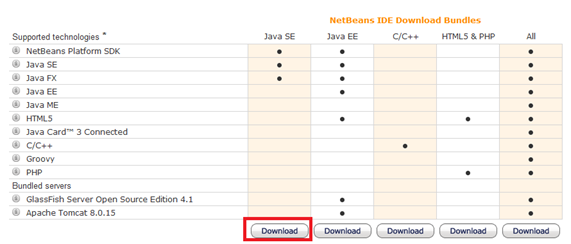
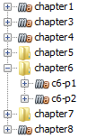

# First steps

In this book we will learn the principal techniques involved in developing 3D games. We will develop our samples in Java and we will use the Java Lightweight Game Library ([LWJGL](http://www.lwjgl.org/)). The LWJGL library enables the access to low-level APIs (Application Programming Interface) such as OpenGL.

LWJGL is a low level API that acts like a wrapper around OpenGL. If your idea is to start creating 3D games in a short period of time maybe you should consider other alternatives like  [JmonkeyEngine]. By using this low level API you will have to go through many concepts and create mane lines of code before you see the results. The benefit of doing this way is that you will get a much better understanding about 3D graphics and also you can get a better control.

As said in the previous paragraphs we will be using Java for this book. We will be using Java 8, so you need to download Java SDK from Oracle’s pages. Just choose the installer that suits your Operative System and install it. This book assumes that you have a moderate understanding of the Java language.

The source code that accompanies this book has been developed using the Netbeans IDE. You can download the latest version of that IDE from [https://netbeans.org/](https://netbeans.org/). In order to execute Netbeans you only need the Java SE version but remember to download the version that suits with your JDK version (32 bits or 64 bits).


 
For building our samples we will be using [Maven](https://maven.apache.org/). Maven is already integrated in Netbeans and you can directly open the different samples from Netbeans, just open the folder that contains the chapter sample and Netbeans will detect that it is a maven project.


 
Maven builds projects based on an XML file named ```pom.xml``` (Project Object Model) which manages project dependencies (the libraries you need to use) and the steps to be performed during the build process. Maven follows the principle of convention over configuration, that is, if you stick to the standard project structure and naming conventions the configuration file does not need to explicitly say where source files are or where compiled classes should be located.

This book does not intend to be a maven tutorial, so please find the information about it in the web in case you need it.  The source code folder defines a parent project which defines the plugins to be used and collects the versions of the libraries employed. 

We use a special plugin named ```mavennatives``` which unpacks the native libraries provided by LWJGL for your platform.

```xml
            <plugin>
                <groupId>com.googlecode.mavennatives</groupId>
                <artifactId>maven-nativedependencies-plugin</artifactId>
                <version>${natives.version}</version>
                <executions>
                    <execution>
                        <id>unpacknatives</id>
                        <phase>generate-resources</phase>
                        <goals>
                            <goal>copy</goal>
                        </goals>
                    </execution>
                </executions>
            </plugin>
```

Those libraries are placed under ```target/natives``` directory. When you execute the samples from Netbeans you need to specify the directory where the Java Virtual Machine will look for native libraries. This is done with the command line property: ```“-Djava.library.path”``` which sould be set to: ```“-Djava.library.path="target\natives”```. This is done automatically for you in the ```nbactions.xml``` file. In case you want to change it or learn how to do it manually, right click in your project and select “Properties”. In the dialog that is shown select “Run” category and set the correct value for VM Options.

 

Chapter 1 source code is taken directly from the getting started sample in the LWJGL site ([http://www.lwjgl.org/guide](http://www.lwjgl.org/guide)). You will see that we are not using Swing or JavaFX as our GUI library. Instead of that we are using [GLFW](www.glfw.org) which is a library to handle GUI components (Windows, etc.) and events (key presses, mouse movements, etc.) with an Open GL Context attached in a straight forward way. Previous versions of LWJGL provided a custom GUI API but, for LWJGL 3, GLFW is the preferred windowing API.

The samples source code is very well documented and straight forward so we won’t repeat the comments here. If you have your environment correctly set up you should be execute it and see a window with red background.


