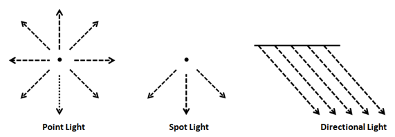
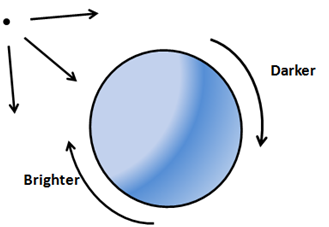
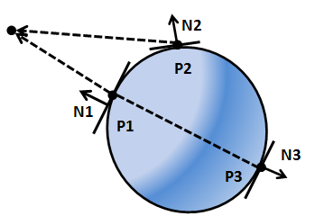
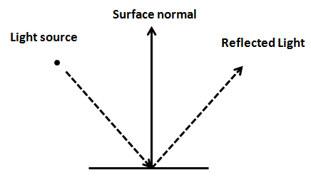
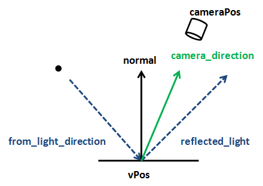

# Let there be light

In this chapter we will learn how to add light to our 3D game engine. We will not implement a physically perfect light model because, taking aside the complexity, it would require a tremendous amount of computer resources. Instead we will implement an approximation which will provide decent results: we will use an algorithm named Phong shading \(developed by Bui Tuong Phong\). Another important thing to point is that we will only model lights but we won’t model the shadows that should be generated by those lights \(this will be done in another chapter\).

Before we start, let us define some light types:

* **Point light**: This type of light models a light source that’s emitted uniformly from a point in space in all directions.
* **Spot light**: This type of light models a light source that’s emitted from a point in space, but instead of emitting in all directions is restricted to a cone.
* **Directional light**: This type for light models the light that we receive from the sun, all the objects in the 3D the space are hit by parallel ray lights coming from a specific direction. No matter if the object is close or far away, all the ray lights impact the objects with the same angle.
* **Ambient light**: This type of light comes from everywhere in the space and illuminates all the objects in the same way.



Thus, to model light we need to take into consideration the type of light plus, its position and some other parameters like its colour. Of course, we must also consider the way that objects, impacted by ray lights, absorb and reflect light.

The Phong shading algorithm will model the effects of light for each point in our model, that is for every vertex. This is why it’s called a local illumination simulation, and this is the reason why this algorithm will not calculate shadows: it will just calculate the light to be applied to every vertex without taking into consideration if the vertex is behind an object that blocks the light. We will overcome this drawback in later chapters. But, because of that, it's a simple and fast algorithm that provides very good effects. We will use here a simplified version that does not take into account materials deeply.

The Phong algorithm considers three components for lighting:

* **Ambient light**: models light that comes from everywhere, this will serve us to illuminate \(with the required intensity\) the areas that are not hit by any light, it’s like a background light.
* **Diffuse reflectance**: takes into consideration that surfaces that are facing the light source are brighter.
* **Specular reflectance**: models how light reflects on polished or metallic surfaces.

At the end what we want to obtain is a factor that, multiplied by colour assigned to a fragment, will set that colour brighter or darker depending on the light it receives. Let’s name our components as $$A$$ for ambient, $$D$$ for diffuse and $$S$$ for specular. That factor will be the addition of those components:

$$L = A + D + S$$

In fact, those components are indeed colours, that is the colour components that each light component contributes to. This is due to the fact that light components will not only provide a degree of intensity but they can modify the colour of the model. In our fragment shader we just need to multiply that light colour by the original fragment colour \(obtained from a texture or a base colour\).

We can also assign different colours, for the same materials, that will be used in the ambient, diffuse and specular components. Hence, these components will be modulated by the colours associated to the material. If the material has a texture, we will simply use a single texture for each of the components.

So the final colour for a non textured material will be: $$L = A * ambientColour + D * diffuseColour + S * specular Colour$$.

And the final colour for a textured material will be:

$$L = A * textureColour + D * textureColour + S * textureColour$$

## Ambient Light component

Let's consider the first component, the ambient light component. This is just a constant factor that will make all of our objects brighter or darker. We can use it to simulate light for a specific part of the day \(dawn, dusk, etc.\) also it can be used to add some light to points that are not hit directly by ray lights but could be lighted by indirect light \(caused by reflections\) in an easy way.

Ambient light is the easiest component to calculate: we just need to pass a colour, since it will be multiplied by our base colour it just modulates that base colour. Imagine that we have determined that a colour for a fragment is $$(1.0, 0.0, 0.0)$$, that is red. Without ambient light it will be displayed as a fully red fragment. If we set ambient light to $$(0.5, 0.5, 0.5)$$ the final colour will be $$(0.5, 0, 0)$$, that is a darker version of red. This light will darken all the fragments in the same way \(it may seem to be a little strange to be talking about light that darkens objects but in fact that is the effect that we get\). Besides that, it can add some colour if the RGB components are not the same, so we just need a vector to modulate ambient light intensity and colour.

## Diffuse reflectance

Let’s talk now about diffuse reflectance. This models the fact that surfaces which face in a perpendicular way to the light source look brighter than surfaces where light is received in a more indirect angle. Those objects receive more light, the light density \(let me call it this way\) is higher.



But, how do we calculate this? Do you remember from previous chapter that we introduced the concept of normals? The normal was the vector perpendicular to a surface that had a length equal to one. Let’s draw the normals for three points in the previous figure. As you can see, the normal for each point will be the vector perpendicular to the tangent plane for each point. Instead of drawing rays coming from the source of light we will draw vectors from each point to the point of light \(that is, in the opposite direction\).



As you can see, the normal associated to $$P1$$, named $$N1$$, is parallel to the vector that points to the light source, which models the opposite of the light ray \($$N1$$ has been sketched displaced so you can see it, but it’s equivalent mathematically\). $$P1$$ has an angle equal to $$0$$ with the vector that points to the light source. Its surface is perpendicular to the light source and $$P1$$ would be the brightest point.

The normal associated to $$P2$$, named $$N2$$, has an angle of around 30 degrees with the vector that points the light source, so it should be darker tan $$P1$$. Finally, the normal associated to $$P3$$, named $$N3$$, is also parallel to the vector that points to the light source but the two vectors are in the opposite direction. $$P3$$ has an angle of 180 degrees with the vector that points the light source, and should not get any light at all.

So it seems that we have a good approach to determine the light intensity that gets to a point, and this is related to the angle that forms the normal with a vector that points to the light source. How can we calculate this?

There’s a mathematical operation that we can use, the dot product. This operation takes two vectors and produces a number \(a scalar\) that is positive if the angle between them is acute, or negative if the angle between them is wide. If both vectors are normalized, that is the both have a length equal to one, the dot product will be between $$-1$$ and $$1$$. The dot product will be one if both vectors look exactly in the same direction \(angle $$0$$\); it will be $$0$$ if both vectors form a square angle, and it will be $$-1$$ if both vectors point in opposite directions.

Let’s define two vectors, $$v1$$ and $$v2$$, and let $$alpha$$ be the angle between them. The dot product is defined by the following formula.


If both vectors are normalized, their length, their module will be equal to one, so the dot product is equal to the cosine if the angle between them. We will use that operation to calculate the diffuse reflectance component.

So we need to calculate the vector that points to the source of light. How we do this? We have the position of each point \(the vertex position\) and we have the position of the light source. First of all, both coordinates must be in the same coordinate space. To simplify, let’s assume that they are both in world coordinate space: then those positions are the coordinates of the vectors that point to the vertex position \($$VP$$\) and to the light source \($$VS$$\), as shown in the next figure.


If we subtract $$V$$S from $$VP$$ we get the vector that we are looking for, which is called $$L$$.

Now we can compute the dot product between the vector that points to the light source and the normal. This product is called the Lambert term, due to Johann Lambert who was the first to propose that relation to model the brightness of a surface.

Let’s summarize how we can calculate it. We define the following variables:

* $$vPos$$: Position of our vertex in model view space coordinates.
* $$lPos$$: Position of the light in view space coordinates.
* $$intensity$$: Intensity of the light \(from 0 to 1\).
* $$lColour$$: Colour of the light.
* $$normal$$: The vertex normal.

First we need to calculate the vector that points to the light source from current position: $$toLightDirection = lPos - vPos$$. The result of that operation needs to be normalized.

Then we need to calculate the diffuse factor \(a scalar\): $$diffuseFactor = normal \cdot toLightDirection$$. It’s calculated as dot product between two vectors, and since we want it to be between $$-1$$ and $$1$$ both vectors need to be normalized. Colours need to be between $$0$$ and $$1$$ so if a value is lower than $$0$$ we will set it to 0.

Finally we just need to modulate the light colour by the diffuse factor and the light intensity:

$$colour = diffuseColour * lColour * diffuseFactor * intensity$$

## Specular component

Before considering the specular component, we first need to examine how light is reflected. When light hits a surface some part of it is absorbed and the other part is reflected, if you remember from your physics class, reflection is when light bounces off an object.



Of course, surfaces are not totally polished, and if you look at closer distance you will see a lot of imperfections. Besides that, you have many ray lights \(photons in fact\), that impact that surface, and that get reflected in a wide range of angles. Thus, what we see is like a beam of light being reflected from the surface. That is, light is diffused when impacting over a surface, and that’s the diffuse component that we have been talking about previously.


But when light impacts a polished surface, for instance a metal, the light suffers from lower diffusion and most of it gets reflected in the opposite direction as it hit that surface.


This is what the specular component models, and it depends on the material characteristics. Regarding specular reflectance, it’s important to note that the reflected light will only be visible if the camera is in a proper position, that is, if it's in the area where the reflected light is emitted.


Now that the mechanism behind specular reflection has been explained we are ready to calculate that component. First we need a vector that points from the light source to the vertex point. When we were calculating the diffuse component we calculated just the opposite, a vector that points to the light source. $$toLightDirection$$, so let’s calculate it as $$fromLightDirection = -(toLightDirection)$$.

Then we need to calculate the reflected light that results from the impact of the $$fromLightDirection$$ into the surface by taking into consideration its normal. There’s the GLSL function `reflect` that does exactly that. So, $$reflectedLight = reflect(fromLightSource, normal)$$.

We also need a vector that points to the camera, let’s name it $$cameraDirection$$, and it will be calculated as the difference between the camera position and the vertex position: $$cameraDirection = cameraPos - vPos$$. The camera position vector and the vertex position need to be in the same coordinate system and the resulting vector needs to be normalized. The following figure sketches the main components we have calculated up to now.



Now we need to calculate the light intensity that we see, which we will call $$specularFactor$$. This component will be higher if the $$cameraDirection$$ and the $$reflectedLight$$ vectors are parallel and point in the same direction and will take its lower value if they point in opposite directions. In order to calculate this the dot product comes to the rescue again. So $$specularFactor = cameraDirection \cdot reflectedLight$$. We only want this value to be between $$0$$ and $$1$$ so if it’s lower than $$0$$ it will be set to 0.

We also need to take into consideration that this light must be more intense if the camera is pointing to the reflected light cone. This will be achieved by raising the $$specularFactor$$ to a parameter named $$specularPower$$.

$$specularFactor = specularFactor^{specularPower}$$.

Finally we need to model the reflectivity of the material, which will also modulate the intensity if the light reflected. This will be done with another parameter named reflectance. So the colour of the specular component will be: $$specularColour * lColour * reflectance * specularFactor * intensity$$.

## Attenuation

We now know how to calculate the three components that will serve us to model a point light with an ambient light. But our light model is still not complete, as the light that an object reflects is independent of the distance from the light source. That is, we need to simulate light attenuation.

Attenuation is a function of the distance and light. The intensity of light is inversely proportional to the square of distance. That fact is easy to visualize, as light propagates its energy along the surface of a sphere with a radius that’s equal to the distance traveled by the light, and the surface of a sphere is proportional to the square of its radius. We can calculate the attenuation factor with this formula: $$1.0 / (atConstant + atLinear * dist + atExponent * dist^{2})$$.

In order to simulate attenuation we just need to multiply that attenuation factor by the final colour.

## Implementation

Now we can start coding all the concepts described above, we beginning with our shaders. Most of the work will be done in the fragment shader, but we need to pass some data from the vertex shader to it. In the previous chapters the fragment shader just received the texture coordinates, now we are also going to pass two more parameters:

* The vertex normal \(normalized\) transformed to model view space coordinates.
* The vertex position transformed to model view space coordinates.

This is the code of the vertex shader.

```glsl
#version 330

layout (location=0) in vec3 position;
layout (location=1) in vec2 texCoord;
layout (location=2) in vec3 vertexNormal;

out vec2 outTexCoord;
out vec3 mvVertexNormal;
out vec3 mvVertexPos;

uniform mat4 modelViewMatrix;
uniform mat4 projectionMatrix;

void main()
{
    vec4 mvPos = modelViewMatrix * vec4(position, 1.0);
    gl_Position = projectionMatrix * mvPos;
    outTexCoord = texCoord;
    mvVertexNormal = normalize(modelViewMatrix * vec4(vertexNormal, 0.0)).xyz;
    mvVertexPos = mvPos.xyz;
}
```

Before we continue with the fragment shader, there’s a very important concept that must be highlighted. From the code above you can see that `mvVertexNormal`, the variable contains the vertex normal, is transformed into model view space coordinates. This is done by multiplying the `vertexNormal` by the `modelViewMatrix` as with the vertex position. But there’s a subtle difference, the w component of that vertex normal is set to 0 before multiplying it by the matrix: `vec4(vertexNormal, 0.0)`. Why are we doing this? Because we do want the normal to be rotated and scaled but we do not want it to be translated, we are only interested into its direction but not in its position. This is achieved by setting is w component to 0 and is one of the advantages of using homogeneous coordinates, by setting the w component we can control what transformations are applied. You can do the matrix multiplication by hand and see why this happens.

Now we can start to do the real work in our fragment shader, besides declaring as input parameters the values that come from the vertex shader we are going to define some useful structures to model light and material characteristic. First of all, we will define the structures that model the light.

```glsl
struct Attenuation
{
    float constant;
    float linear;
    float exponent;
};

struct PointLight
{
    vec3 colour;
    // Light position is assumed to be in view coordinates
    vec3 position;
    float intensity;
    Attenuation att;
};
```

A point light is defined by a colour, a position, a number between $$0$$ and $$1$$ which models its intensity and a set of parameters which will model the attenuation equation.

The structure that models the material characteristics is:

```glsl
struct Material
{
    vec4 ambient;
    vec4 diffuse;
    vec4 specular;
    int hasTexture;
    float reflectance;
};
```

A material is defined by a a set of colours \(if we don’t use texture to colour the fragments\):

* The colour used for the ambient component.
* The colour used for the diffuse component.
* The colour used for the specular component.

A material also is defined by a flag that controls if it has an associated texture or not and a reflectance index. We will use the following uniforms in our fragment shader.

```glsl
uniform sampler2D texture_sampler;
uniform vec3 ambientLight;
uniform float specularPower;
uniform Material material;
uniform PointLight pointLight;
uniform vec3 camera_pos;
```

We are creating new uniforms to set the following variables:

* The ambient light: which will contain a colour that will affect every fragment in the same way.
* The specular power \(the exponent used in the equation that was presented when talking about the specular light\).
* A point light.
* The material characteristics.
* The camera position in view space coordinates.

We will also define some global variables that will hold the material colour components to be used in the ambient, diffuse and specular components. We use these variables since, if the component has a texture, we will use the same colour for all the components and we do not want to perform redundant texture lookups. The variables are defined like this:

```glsl
vec4 ambientC;
vec4 diffuseC;
vec4 speculrC;
```

We now can define a function that will setup these variables according to the material characteristics:

```glsl
void setupColours(Material material, vec2 textCoord)
{
    if (material.hasTexture == 1)
    {
        ambientC = texture(texture_sampler, textCoord);
        diffuseC = ambientC;
        speculrC = ambientC;
    }
    else
    {
        ambientC = material.ambient;
        diffuseC = material.diffuse;
        speculrC = material.specular;
    }
}
```

Now we are going to define a function that, taking as its input a point light, the vertex position and its normal, returns the colour contribution calculated for the diffuse and specular light components described previously.

```glsl
vec4 calcPointLight(PointLight light, vec3 position, vec3 normal)
{
    vec4 diffuseColour = vec4(0, 0, 0, 0);
    vec4 specColour = vec4(0, 0, 0, 0);

    // Diffuse Light
    vec3 light_direction = light.position - position;
    vec3 to_light_source  = normalize(light_direction);
    float diffuseFactor = max(dot(normal, to_light_source ), 0.0);
    diffuseColour = diffuseC * vec4(light.colour, 1.0) * light.intensity * diffuseFactor;

    // Specular Light
    vec3 camera_direction = normalize(-position);
    vec3 from_light_source = -to_light_source;
    vec3 reflected_light = normalize(reflect(from_light_source, normal));
    float specularFactor = max( dot(camera_direction, reflected_light), 0.0);
    specularFactor = pow(specularFactor, specularPower);
    specColour = speculrC * specularFactor * material.reflectance * vec4(light.colour, 1.0);

    // Attenuation
    float distance = length(light_direction);
    float attenuationInv = light.att.constant + light.att.linear * distance +
        light.att.exponent * distance * distance;
    return (diffuseColour + specColour) / attenuationInv;
}
```

The previous code is relatively straightforward, it just calculates a colour for the diffuse component, another one for the specular component and modulates them by the attenuation suffered by the light in its travel to the vertex we are processing.

Please be aware that vertices coordinates are in view space. When calculating the specular component, we must get the direction to the point of view, that is the camera. This could be done like this:

```glsl
 vec3 camera_direction = normalize(camera_pos - position);
```

But, since `position` is in view space, the camera position is always at the origin, that is, $$(0, 0, 0)$$, so we calculate it like this:

```glsl
 vec3 camera_direction = normalize(vec3(0, 0, 0) - position);
```

Which can be simplified like this:

```glsl
 vec3 camera_direction = normalize(-position);
```

With the previous function, the main function of the vertex shader is very simple.

```glsl
void main()
{
    setupColours(material, outTexCoord);

    vec4 diffuseSpecularComp = calcPointLight(pointLight, mvVertexPos, mvVertexNormal);

    fragColor = ambientC * vec4(ambientLight, 1) + diffuseSpecularComp;
}
```

The call to the `setupColours` function will set up the `ambientC`, `diffuseC` and `speculrC` variables with the appropriate colours. Then, we calculate the diffuse and specular components, taking into consideration the attenuation. We do this using a single function call for convenience, as it has been explained above. The final colour is calculated by adding the ambient component \(multiplying `ambientC` by the ambient light\). As you can see the ambient light is not affected by attenuation.

We have introduced some new concepts into our shader that require further explanation. We are defining structures and using them as uniforms. How do we pass those structures? First of all we will define two new classes that model the properties of a point light and a material, named oh surprise, `PointLight` and `Material`. They are just plain POJOs so you can check them in the source code that accompanies this book. Then, we need to create new methods in the `ShaderProgram` class, first to be able to create the uniforms for the point light and material structures.

```java
public void createPointLightUniform(String uniformName) throws Exception {
    createUniform(uniformName + ".colour");
    createUniform(uniformName + ".position");
    createUniform(uniformName + ".intensity");
    createUniform(uniformName + ".att.constant");
    createUniform(uniformName + ".att.linear");
    createUniform(uniformName + ".att.exponent");
}

public void createMaterialUniform(String uniformName) throws Exception {
    createUniform(uniformName + ".ambient");
    createUniform(uniformName + ".diffuse");
    createUniform(uniformName + ".specular");
    createUniform(uniformName + ".hasTexture");
    createUniform(uniformName + ".reflectance");
}
```

As you can see, it’s very simple, we just create a separate uniform for all the attributes that compose the structure. Now we need to create another two methods to set up the values of those uniforms and that will take as parameters `PointLight` and `Material` instances.

```java
public void setUniform(String uniformName, PointLight pointLight) {
    setUniform(uniformName + ".colour", pointLight.getColor() );
    setUniform(uniformName + ".position", pointLight.getPosition());
    setUniform(uniformName + ".intensity", pointLight.getIntensity());
    PointLight.Attenuation att = pointLight.getAttenuation();
    setUniform(uniformName + ".att.constant", att.getConstant());
    setUniform(uniformName + ".att.linear", att.getLinear());
    setUniform(uniformName + ".att.exponent", att.getExponent());
}

public void setUniform(String uniformName, Material material) {
    setUniform(uniformName + ".ambient", material.getAmbientColour());
    setUniform(uniformName + ".diffuse", material.getDiffuseColour());
    setUniform(uniformName + ".specular", material.getSpecularColour());
    setUniform(uniformName + ".hasTexture", material.isTextured() ? 1 : 0);
    setUniform(uniformName + ".reflectance", material.getReflectance());
}
```

In this chapter source code you will see also that we also have modified the `Mesh` class to hold a material instance and that we have created a simple example that creates a point light that can be moved by using the “N” and “M” keys in order to show how a point light focusing over a mesh with a reflectance value higher than 0 looks like.

Let's get back to our fragment shader. As we have said, we need another uniform that contains the camera position, camera\_pos. These coordinates must be in view space. Usually we will set up light coordinates in world space coordinates, so we need to multiply them by the view matrix in order to be able to use them in our shader. Therefore, we need to create a new method in the `Transformation` class that returns the view matrix so we can transform light coordinates.

```java
// Get a copy of the light object and transform its position to view coordinates
PointLight currPointLight = new PointLight(pointLight);
Vector3f lightPos = currPointLight.getPosition();
Vector4f aux = new Vector4f(lightPos, 1);
aux.mul(viewMatrix);
lightPos.x = aux.x;
lightPos.y = aux.y;
lightPos.z = aux.z; 
shaderProgram.setUniform("pointLight", currPointLight);
```

We will not include the whole source code because this chapter would be too long and it would not contribute much to clarify the concepts explained here. You can check it in the source code that accompanies this book.


