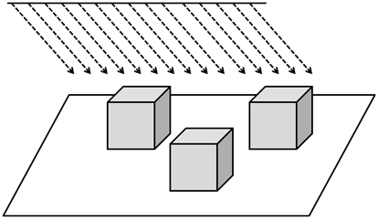
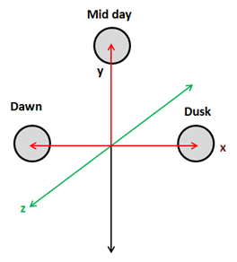
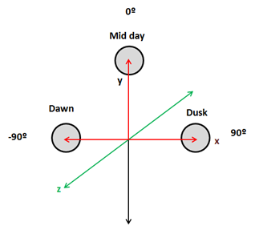
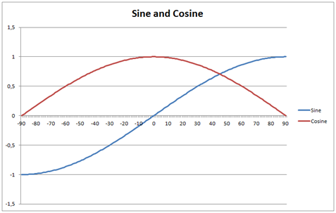
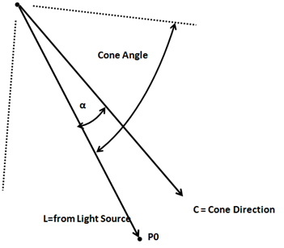

# Let there be even more light

In this chapter we are going to implement other light types that we introduced in previous chapter. We will start with directional lightning.


## Directional Light 

If you recall, directional lighting hits all the objects by parallel rays all coming from the same direction. It models light sources that are very far away but have a high intensity such us the Sun.


 
Another characteristic of directional light is that it is not affected by attenuation.  Think again about Sun light, all objects that are hit by ray lights are illuminated with the same intensity, the distance from the sun is so huge that the position of the objects is irrelevant. In fact directional lights are modelled as light sources placed at the infinity, if it was affected by attenuation it would have no effect in any object (it’s colour contribution would be equal to $$0$$).

Besides that, directional light are composed also by a diffuse and a specular components, the only differences with point lights is that they do not have a position but a direction and that they are not affected by attenuation.  Let’s get back to the direction attribute of directional light, and imagine we are modelling the movement of the sun across our 3D world, if we are assuming that the north is placed towards the increasing z-axis, the following picture shows the direction to the light source at dawn, midnight and dusk.



 
Light directions for the above positions are:
* Dawn: (-1, 0, 0)
* Mid day: (0, 1, 0)
* Dusk: (1, 0, 0)

Side note: You may think that above coordinates are equal to position ones, but they model a vector, a direction, not a position. From the mathematical point of view a vector and a position are not distinguishable but they have a totally different meaning.

But, how do we model the fact that this light is located at the infinity ? The answer is by using the w coordinate, that is, by using homogeneous coordinates and setting the w coordinate to $$0$$:

* Dawn: (-1, 0, 0, 0)
* Mid day: (0, 1, 0, 0)
* Dusk: (1, 0, 0, 0)

This is the same case as when we pass the normals, for normals we set the w component to 0 to state that we are not interested in displacements, just in the direction. Also, when we deal with directional light we need to do the same, camera translations should not affect the direction of a directional light.

So let’s start coding and model our directional light. The first thing that we are going to do is to create a class that models its attributes. It will be another POJO with a copy constructor which stores the direction,  the colour and the intensity.

```java
package org.lwjglb.engine.graph;

import org.joml.Vector3f;

public class DirectionalLight {
    
    private Vector3f color;

    private Vector3f direction;

    private float intensity;

    public DirectionalLight(Vector3f color, Vector3f direction, float intensity) {
        this.color = color;
        this.direction = direction;
        this.intensity = intensity;
    }

    public DirectionalLight(DirectionalLight light) {
        this(new Vector3f(light.getColor()), new Vector3f(light.getDirection()), light.getIntensity());
    }

    // Getters and settes beyond this point...
```

As you can see, we are still using a ```Vector3f``` to model the direction. Keep calm, we will deal with the w component when we transfer the directional light to the shader. And by the way, the next thing that we will do is to update the ```ShaderProgram``` to create and update the uniform that will hold the directional light.
In our fragment shader we will define a structure that models a directional light.

```glsl
struct DirectionalLight
{
    vec3 colour;
    vec3 direction;
    float intensity;
};
```

With that definition the new methods in the ```ShaderProgram``` class are straight forward.

```java
// ...
public void createDirectionalLightUniform(String uniformName) throws Exception {
    createUniform(uniformName + ".colour");
    createUniform(uniformName + ".direction");
    createUniform(uniformName + ".intensity");
}
// ...
public void setUniform(String uniformName, DirectionalLight dirLight) {
    setUniform(uniformName + ".colour", dirLight.getColor() );
    setUniform(uniformName + ".direction", dirLight.getDirection());
    setUniform(uniformName + ".intensity", dirLight.getIntensity());
}
```

Now we need to use that uniform. We will model how the sun appears to move across the sky by controlling its angle in our ```DummyGame``` class. 


 
We need to update light direction so when the sun it’s at dawn (-90º) it’s direction is (-1,0,0) and its x coordinate progressively increases from -1 to  0 and the “y” coordinate increases to 1 as it approaches mid day.  Then the “x” coordinate increases to 1 and the “y” coordinates decreases to 0 again. This can be done by setting the x coordinate to the $$sine$$ of the angle and y coordinate to the $$cosine$$ of the angle.

 

We will also modulate light intensity, the intensity will be increasing when it’s getting away from dawn and will decrease as it approaches to dusk. We will simulate the night by setting the intensity to 0. Besides that, we will also modulate the colour so the light gets more red at dawn and at dusk.  This will be done in the update method of the ```DummyGame``` class.

```java
// Update directional light direction, intensity and colour
lightAngle += 1.1f;
if (lightAngle > 90) {
    directionalLight.setIntensity(0);
    if (lightAngle >= 360) {
        lightAngle = -90;
    }
} else if (lightAngle <= -80 || lightAngle >= 80) {
    float factor = 1 - (float)(Math.abs(lightAngle) - 80)/ 10.0f;
    directionalLight.setIntensity(factor);
    directionalLight.getColor().y = Math.max(factor, 0.9f);
    directionalLight.getColor().z = Math.max(factor, 0.5f);
} else {
    directionalLight.setIntensity(1);
    directionalLight.getColor().x = 1;
    directionalLight.getColor().y = 1;
    directionalLight.getColor().z = 1;
}
double angRad = Math.toRadians(lightAngle);
directionalLight.getDirection().x = (float) Math.sin(angRad);
directionalLight.getDirection().y = (float) Math.cos(angRad);
```

Then we need to pass the directional light to our shaders in the render method of the ```Renderer``` class.

```java
// Get a copy of the directional light object and transform its position to view coordinates
DirectionalLight currDirLight = new DirectionalLight(directionalLight);
Vector4f dir = new Vector4f(currDirLight.getDirection(), 0);
dir.mul(viewMatrix);
currDirLight.setDirection(new Vector3f(dir.x, dir.y, dir.z));
shaderProgram.setUniform("directionalLight", currDirLight);
```

As you can see we need to transform the light direction coordinates to view space, but we set the w component to 0 since we are not interested in applying translations.

Now we are ready to do the real work which will be done in the fragment shader since the vertex shader does not be modified.  We have yet stated above that we need to define a new struct, named ```DirectionalLight```, to model a directional light, and we will need a new uniform form that.

```glsl
uniform DirectionalLight directionalLight;
```

We need to refactor our code a little bit, in the previous chapter we had a function called ```calcPointLight``` that calculate the diffuse and specular components and also applied the attenuation. As we have explained directional light also contributes to the diffuse and specular components but is not affected by attenuation, so we will create a new function named ```calcLightColour``` that just calculates those components.

```glsl
vec4 calcLightColour(vec3 light_colour, float light_intensity, vec3 position, vec3 to_light_dir, vec3 normal)
{
    vec4 diffuseColour = vec4(0, 0, 0, 0);
    vec4 specColour = vec4(0, 0, 0, 0);

    // Diffuse Light
    float diffuseFactor = max(dot(normal, to_light_dir), 0.0);
    diffuseColour = vec4(light_colour, 1.0) * light_intensity * diffuseFactor;

    // Specular Light
    vec3 camera_direction = normalize(camera_pos - position);
    vec3 from_light_dir = -to_light_dir;
    vec3 reflected_light = normalize(reflect(from_light_dir , normal));
    float specularFactor = max( dot(camera_direction, reflected_light), 0.0);
    specularFactor = pow(specularFactor, specularPower);
    specColour = light_intensity  * specularFactor * material.reflectance * vec4(light_colour, 1.0);

    return (diffuseColour + specColour);
}
```

Then the method ```calcPointLight``` applies attenuation factor to the light colour calculated in the previous function.

```glsl
vec4 calcPointLight(PointLight light, vec3 position, vec3 normal)
{
    vec3 light_direction = light.position - position;
    vec3 to_light_dir  = normalize(light_direction);
    vec4 light_colour = calcLightColour(light.colour, light.intensity, position, to_light_dir, normal);

    // Apply Attenuation
    float distance = length(light_direction);
    float attenuationInv = light.att.constant + light.att.linear * distance +
        light.att.exponent * distance * distance;
    return light_colour / attenuationInv;
}
```

We will create also a new function to calculate the effect of a directional light which just invokes the ```calcLightColour``` function with the light direction.

```glsl
vec4 calcDirectionalLight(DirectionalLight light, vec3 position, vec3 normal)
{
    return calcLightColour(light.colour, light.intensity, position, normalize(light.direction), normal);
}
```

Finally, our main method just aggregates the colour components of the ambient point and directional lights to calculate the fragment colour.

```glsl
void main()
{
    vec4 baseColour; 
    if ( material.useColour == 1 )
    {
        baseColour = vec4(material.colour, 1);
    }
    else
    {
        baseColour = texture(texture_sampler, outTexCoord);
    }
    vec4 totalLight = vec4(ambientLight, 1.0);
    totalLight += calcDirectionalLight(directionalLight, mvVertexPos, mvVertexNormal);
    totalLight += calcPointLight(pointLight, mvVertexPos, mvVertexNormal); 
    
    fragColor = baseColour * totalLight;
}
```

And that’s it, we can now simulate the movement of the, artificial, sun across the sky and get something like this (movement is accelerated so it can be viewed without waiting too long).

 

## Spot Light 

Now we will implement a spot light which are very similar to a point light but the emitted light is restricted to a  3D cone. It models the light that comes out from focuses or any other light source that does not emit in all directions. A spot light has the same attributes as a point light but adds two new parameters, the cone angle and the cone direction.
 


Spot light contribution is calculated in the same way as a point light with some exceptions. The point which the vector that points from the vertex position to the light source is not contained inside the light cone are not affected by the point light.
 


How do we calculate if it’s inside the light cone or not ? We need to do a dot product again between the vector that points from the light source and the cone direction vector (both of them normalized).

 

The dot product between L and C vectors is equal to: $$\vec{L}\cdot\vec{C}=|\vec{L}|\cdot|\vec{C}|\cdot Cos(\alpha)$$. If, in our spot light definition we store the cosine of the cutoff angle, if the dot product is higher than that value we will now that it is inside the light cone (recall the cosine graph, when α angle is 0, the cosine will be 1, the smaller the angle the higher the cosine).
The second difference is that the point that are far away from the cone vector will receive less light, that is, the attenuation will be higher. There are several ways of calculate this, we will chose a simple approach by multiplying the attenuation by the following factor:
1- (1-Cos(∝))/(1-Cos(cone angle))
(In our fragment shaders we won’t have the angle but the cosine of the cut off angle. You can check that the formula above produces values from 0 to 1, 0 when the angle is equal to the cutoff angle and 1 when the angle is 0).

The implementation will be very similar to the rest of lights. We need to create a new class named ```SpotLight```, set up the appropriate uniforms, pass it to the shader and modify the fragment shader to get it. You can check the source code for this chapter. 

Another important thing when passing the uniforms is that translations should not be applied to the light cone direction since we are only interested in directions. So as in the case of the directional light, when transforming to view space coordinates we  must set $$w$$ component to $$0$$.
