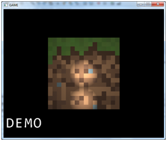

# HUD and some other things

In this chapter we will create a HUD (Heads-Up Display) for our game. That is, a set of 2D shapes and text that is displayed at any time over the 3D scene to show relevant information. We will create a simple HUD that will serve us to show some basic techniques for representing that information.

You will see also that some little refactoring has been applied to the source code, especially in the Render class to prepare it for the separation of the 3D scene and the HUD rendering. 

## Text rendering
 
The first thing that we will do is render text. in order to do so what we are going to do is to map a texture that contains alphabet characters into a quad which is formed by a set of tiles, each of them representing a single letter. The first thing that we must do is to create the texture that contains the alphabet, there are many programs out there that can do this task, such as,  [CBG](http://www.codehead.co.uk/cbfg/), [F2IBuilder](http://sourceforge.net/projects/f2ibuilder/), etc.

We will use Codehead’s Bitmap Font Generator (CBFG). This tool lets you configure many options such as the texture size, the font type, the anti-aliasing to be applied, etc. The following figure depicts the configuration that we will use to generate our texture file. In this chapter we will assume that we will be rendering text encoded in ISO-8859-1 format, if you need to deal with different character sets you will need to tweak a little bit the code.
 


When you have finished configuring all the settings you can export the result to several image formats. In this case we will export it as a BMP file and later on we will transform it to PNG so it can be loaded as a texture. When transform it to PNG we will set up also the black background as transparent so, that is, we will set the black colour to have an alpha value equals to 0 (You can use GIMP to do that). We will have something similar as the following picture.

 

We have all the characters displayed in rows and columns. In this case the images is composed by 15 columns  and 17 rows. By using the character code of a specific letter we can calculate the row and the column that is in enclosed in the image. The column is calculated as follows:  $$column = code \space mod \space numberOfColumns$$. Where $$mod$$ is the module operation. The row is calculated as follows: $$row = code / numberOfCols$$, in this case we will do a integer by integer operation so we can ignore the decimal part.

We will create a new class named ```TextItem``` that will construct all the graphical elements needed to render text. This is a simplified version that does not deal with multiline texts, etc but it will allow us to present textual information in the HUD.  Here you can see the first lines and the constructor of this class.

```java
package org.lwjglb.engine;

import java.nio.charset.Charset;
import java.util.ArrayList;
import java.util.List;
import org.lwjglb.engine.graph.Material;
import org.lwjglb.engine.graph.Mesh;
import org.lwjglb.engine.graph.Texture;

public class TextItem extends GameItem {

    private static final float ZPOS = 0.0f;

    private static final int VERTICES_PER_QUAD = 4;

    private String text;
    
    private final int numCols;
    
    private final int numRows;
    
    public TextItem(String text, String fontFileName, int numCols, int numRows) throws Exception {
        super();
        this.text = text;
        this.numCols = numCols;
        this.numRows = numRows;
        Texture texture = new Texture(fontFileName);
        this.setMesh(buildMesh(texture, numCols, numRows));
    }
```

As you can see this class extends the ```GameItem``` class, this is because we will be interested in changing the text position in the screen and may also need to scale and rotate it. The constructor receives the text itself and the relevant data of the texture that will be used to render it (the file that contains the image and the number of columns and rows).

In the constructor we load the texture image file and invoke a method that will create a Mesh instance that models our text. Let’s examine the ```buildMesh``` method.

```java
private Mesh buildMesh(Texture texture, int numCols, int numRows) {
    byte[] chars = text.getBytes(Charset.forName("ISO-8859-1"));
    int numChars = chars.length;

    List<Float> positions = new ArrayList();
    List<Float> textCoords = new ArrayList();
    float[] normals   = new float[0];
    List<Integer> indices   = new ArrayList();
        
    float tileWidth = (float)texture.getWidth() / (float)numCols;
    float tileHeight = (float)texture.getHeight() / (float)numRows;
```

The first lines of code create the data structures that will be used to store the positions, texture coordinates, normals and indices of the Mesh. In this case we will not apply lighting so the normals array will be empty. What we are going to do is construct a quad composed by a set of tiles, each of them represent a single character and we need to assign also the appropriate texture coordinates depending on the character code. The following picture shows the different elements that compose the tiles and the quad.


So, for each character we need to create a tile which is formed by two triangles which can be defined by using four vertices (V1, V2, V3 and V4), the indices will be (0, 1, 2) for the first triangle (the lower one) and (3, 0, 2) for the other one (the upper one).  Texture coordinates are calculated based on the column and the row associated to each character, texture coordinates need to be in the range [0,1] so we just need to dived the current row or the current column by the total number of rows or columns to get the coordinate associated to V1. For the rest of vertices we just need to increase the current column or row by one in order to get the appropriate coordinate.

The following loop creates all the vertex position, texture coordinates and indices associated to the quad that contains the text. 

```java
for(int i=0; i<numChars; i++) {
    byte currChar = chars[i];
    int col = currChar % numCols;
    int row = currChar / numCols;
            
    // Build a character tile composed by two triangles
            
    // Left Top vertex
    positions.add((float)i*tileWidth); // x
    positions.add(0.0f); //y
    positions.add(ZPOS); //z
    textCoords.add((float)col / (float)numCols );
    textCoords.add((float)row / (float)numRows );
    indices.add(i*VERTICES_PER_QUAD);
                        
    // Left Bottom vertex
    positions.add((float)i*tileWidth); // x
    positions.add(tileHeight); //y
    positions.add(ZPOS); //z
    textCoords.add((float)col / (float)numCols );
    textCoords.add((float)(row + 1) / (float)numRows );
    indices.add(i*VERTICES_PER_QUAD + 1);

    // Right Bottom vertex
    positions.add((float)i*tileWidth + tileWidth); // x
    positions.add(tileHeight); //y
    positions.add(ZPOS); //z
    textCoords.add((float)(col + 1)/ (float)numCols );
    textCoords.add((float)(row + 1) / (float)numRows );
    indices.add(i*VERTICES_PER_QUAD + 2);

    // Right Top vertex
    positions.add((float)i*tileWidth + tileWidth); // x
    positions.add(0.0f); //y
    positions.add(ZPOS); //z
    textCoords.add((float)(col + 1)/ (float)numCols );
    textCoords.add((float)row / (float)numRows );
    indices.add(i*VERTICES_PER_QUAD + 3);
            
    // Add indices por left top and bottom right vertices
    indices.add(i*VERTICES_PER_QUAD);
    indices.add(i*VERTICES_PER_QUAD + 2);
}
```

The are some important things to notice in the previous fragment of code:
* We will represent the vertices using screen coordinates (remember that the origin of the screen coordinates is located at the top left corner). The y coordinate of the vertices on top of the triangles is lower than the y coordinate of the vertices on the bottom of the triangles.
* We don’t scale the shape, so each tile is at a x distance equal to a character width. The height of the triangles will be the height of each character. This is because we want to represent the text as similar as possible as the original texture.
* We set a fixed value for the z coordinate, since it will be irrelevant in order to draw this object.
The next figure shows the coordinates of some vertices.
 
Why do we use screen coordinates ? First of all, because we will be rendering 2D objects in our HUD and often is more handy to use them, and secondly because we will use an orthographic projection in order to draw them. We will explain what is an orthographic projection later on.

The ```TextItem``` class is completed with other methods to get the text and to change it. Whenever the text is changed, we need to clean up the previous VAOs (stored in the Mesh instance) and create a new one. We do not need to destroy the texture, so we have created a new method in the ```Mesh``` class to just remove that data.

```java
public String getText() {
    return text;
}
    
public void setText(String text) {
    this.text = text;
    Texture texture = this.getMesh().getMaterial().getTexture();
    this.getMesh().deleteBuffers();
    this.setMesh(buildMesh(texture, numCols, numRows));
}
```

As it has been said in the beginning of this chapter, we need firs to render our 3D scene and the render our 2D HUD. The HUD is composed by 2D objects, texts, shapes and we won’t apply any lightning effects. Besides that we will use a orthographic projection (also named orthogonal projection) in order to render all those objects. An Orthographic projection is a 2D representation of a 3D object, you may have seen some samples in blueprints of 3D objects which show the representation of those objects from the top or from some sides. The following picture shows the orthographic projection of a cylinder from the top and from the front.

 

This projection is very convenient in order to draw 2D objects because it "ignores" the z coordinate, the distance to the view, so the size of the objects does not decrease with the distance (as in the perspective projection). In order to project an object using an ortographic projection we will need to use another matrix, the orthographic matrix which you can see below.


 
This matrix also corrects the distortions that otherwise will be generated due to the fact that our window is not always a square but a rectangle. The right and bottom parameters will be the screen size, the left and the top ones will be the origin. The orthographic projection matrix transforms screen coordinates to 3D space coordinates, the following picture shows how this mapping is done.

 

This will allow us to use screen coordinates.
So we will need another set of shaders, one vertex and one fragment shader in order to draw the objects in our HUD. The vertex shader is very simple.

```glsl
#version 330

layout (location=0) in vec3 position;
layout (location=1) in vec2 texCoord;
layout (location=2) in vec3 vertexNormal;

out vec2 outTexCoord;

uniform mat4 projModelMatrix;

void main()
{
    gl_Position = projModelMatrix * vec4(position, 1.0);
    outTexCoord = texCoord;
}
```

It will just receive the vertices positions, the texture coordinates, the indices and the normals and will transform them to the 3D space coordinates using a matrix that combines the orthographic projection matrix and the model matrix associated to each element. That matrix is the multiplication of the ortographic projection matrix and the model matrix, $$projModelMatrix  =  ortographicMatrix \cdot modelMatrix$$. Since we are not doing anything with the coordinates in model space, it’s much more efficient to multiply both matrices in the java code to avoid doing it for each vertex, we will just do it once per item. Remember that our vertices should be expressed in screen coordinates.

The fragment shader is also very simple.

```glsl
#version 330

in vec2 outTexCoord;
in vec3 mvPos;
out vec4 fragColor;

uniform sampler2D texture_sampler;
uniform vec3 colour;

void main()
{
    fragColor = vec4(colour, 1) * texture(texture_sampler, outTexCoord);
}
```

It just uses the texture coordinates and multiples that colour by a base colour. This can be used to change the colour of the text to be rendered. Now that we have created two more shaders we can use them in the Renderer class, but before that we will create an interface named ```IHud``` that will contain all the objects that are to be displayed in the HUD. The interface also provides a default cleanup method.

```java
package org.lwjglb.engine;

public interface IHud {

    GameItem[] getGameItems();

    default void cleanup() {
        GameItem[] gameItems = getGameItems();
        for (GameItem gameItem : gameItems) {
            gameItem.getMesh().cleanUp();
        }
    }
}
```

By using that interface our different games can define custom HUDs but the rendering mechanisms do not need to be changed. Now we can get back to the ```Renderer``` class, which by the way has been moved to the engine graphics package because it’s generic enough to not be dependent on the specific implementation of each game. In the Render class we added a new method to create ,link and set up a new ```ShaderProgram``` that uses the shaders described above.

```java
private void setupHudShader() throws Exception {
    hudShaderProgram = new ShaderProgram();
    hudShaderProgram.createVertexShader(Utils.loadResource("/shaders/hud_vertex.vs"));
    hudShaderProgram.createFragmentShader(Utils.loadResource("/shaders/hud_fragment.fs"));
    hudShaderProgram.link();

    // Create uniforms for Ortographic-model projection matrix and base colour
    hudShaderProgram.createUniform("projModelMatrix");
    hudShaderProgram.createUniform("colour");
}
```

The ```render``` method firs invokes the method ```renderScene``` which contains the code from previous chapter that rendered the 3D scene and a new method, named ```renderHud```, to render the HUD.

```java
public void render(Window window, Camera camera, GameItem[] gameItems,
    SceneLight sceneLight, IHud hud) {

    clear();

    renderScene(window, camera, gameItems, sceneLight);

    renderHud(window, hud);
}
```

The renderHud method is as follows:

```java
private void renderHud(Window window, IHud hud) {
    
	hudShaderProgram.bind();

    Matrix4f ortho = transformation.getOrthoProjectionMatrix(0, window.getWidth(), window.getHeight(), 0);
    for (GameItem gameItem : hud.getGameItems()) {
        Mesh mesh = gameItem.getMesh();
        // Set ortohtaphic and model matrix for this HUD item
        Matrix4f projModelMatrix = transformation.getOrtoProjModelMatrix(gameItem, ortho);
        hudShaderProgram.setUniform("projModelMatrix", projModelMatrix);
        hudShaderProgram.setUniform("colour", gameItem.getMesh().getMaterial().getColour());

        // Render the mesh for this HUD item
        mesh.render();
    }

    hudShaderProgram.unbind();
}
```

The previous fragment of code, iterates over the elements that compose the HUD and multiplies the orthographic projection matrix by  the model matrix associated to each element. The orthographic projection matrix is updated in each call (because the screen dimensions can change), and it’s calculated in the following way:

```java
public final Matrix4f getOrthoProjectionMatrix(float left, float right, float bottom, float top) {
    orthoMatrix.identity();
    orthoMatrix.setOrtho2D(left, right, bottom, top);
    return orthoMatrix;
}
```

In our game package we will create a ```Hud``` class which implements the ```IHud``` interface and receives a text in the constructor creating internally a ```TexItem``` instance.

```java
package org.lwjglb.game;

import org.joml.Vector3f;
import org.lwjglb.engine.GameItem;
import org.lwjglb.engine.IHud;
import org.lwjglb.engine.TextItem;

public class Hud implements IHud {

    private static final int FONT_COLS = 15;
    
    private static final int FONT_ROWS = 17;

    private static final String FONT_TEXTURE = "/textures/font_texture.png";

    private final GameItem[] gameItems;

    private final TextItem statusTextItem;

    public Hud(String statusText) throws Exception {
        this.statusTextItem = new TextItem(statusText, FONT_TEXTURE, FONT_COLS, FONT_ROWS);
        this.statusTextItem.setPosition(10f, 400f, 0);
        this.statusTextItem.getMesh().getMaterial().setColour(new Vector3f(1, 1, 1));
        gameItems = new GameItem[]{statusTextItem};
    }

    public void setStatusText(String statusText) {
        this.statusTextItem.setText(statusText);
    }

    @Override
    public GameItem[] getGameItems() {
        return gameItems;
    }
}
```

In the ```DummyGame``` class we create an instance of that class an initialize it with a default text, and we will get something like this.
 


In the Texture class we need to modify the way textures are interpolated in order for the text to be more clear (you will only notice if you play with the text scaling).

```java
glTexParameteri(GL_TEXTURE_2D, GL_TEXTURE_MIN_FILTER, GL_NEAREST);
glTexParameteri(GL_TEXTURE_2D, GL_TEXTURE_MAG_FILTER, GL_NEAREST);
```

If you play with the zoom so the text overlaps with the cube you will see this effect.


The text is not drawn with a transparent background. This is due to the fact that we must explicitly enable support for blending so the alpha component has any effect. We will do this in the Window class when we set up the other initialization parameters with the following fragment of code.

```java
// Support for transparencies
glEnable(GL_BLEND);
glBlendFunc(GL_SRC_ALPHA, GL_ONE_MINUS_SRC_ALPHA);
```

Now you will see the text drawn with a transparent background.

 
