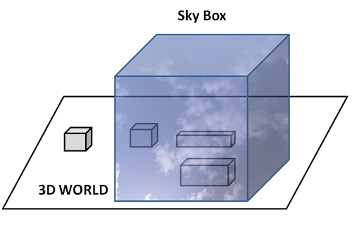

# Sky Box and some optimizations

## Skybox

A skybox will allow us to set a background to give the illusion that our 3D world is bigger. That background is wrapped around the camera position and covers the whole space. The technique that we are going to use here is to construct a big cube that will be displayed around the 3D scene, that is, the centre of the camera position will be the centre of the cube. The sides of that cube will be wrapped with a texture with hills, a blue sky and clouds that will be mapped in a way that the image appears to be a continuous landscape.

The following picture depicts the skybox concept.



The process of creating a sky box can be summarized in the following steps:

* Create a big cube.
* Apply a texture to it that provides the illusion that we are seeing a giant landscape with no edges.
* Render the cube so its sides are at a far distance and its origin is located at the centre of the camera.

Let’s start with the texture. You will find that there are lots of pre-generated textures for you to use in the internet. The one used in the sample for this chapter has been downloaded from here: [http://www.custommapmakers.org/skyboxes.php](http://www.custommapmakers.org/skyboxes.php). The concrete sample that we have used is this one: [http://www.custommapmakers.org/skyboxes/zips/ely\_hills.zip](http://www.custommapmakers.org/skyboxes/zips/ely_hills.zip) and has been created by Colin Lowndes.

The textures from that site are composed by separate TGA files, one for each side of the cube. The texture loader that we have created expects a single file in PNG format so we need to compose a single PNG image with the images of each face. We could apply other techniques, such as cube mapping, in order to apply the textures automatically. But, in order to keep this chapter as simple as possible, you will have to manually arrange them into a single file. The result image will look like this.


After that, we need to create a .obj file which contains a cube with the correct texture coordinates for each face. The picture below shows the tiles associated to each face \(you can find the .obj file used in this chapter in the book’s source code\).


Once the resources have been set up, we can start coding. We will start by creating a new class named `SkyBox` with a constructor that receives the path to the OBJ model that contains the sky box cube and the texture file. This class will inherit from `GameItem` as the HUD class from the previous chapter. Why it should inherit from `GameItem`? First of all, for convenience, we can reuse most of the code that deals with meshes and textures. Secondly, because, although the skybox will not move, we will be interested in applying rotations and scaling to it. If you think about it a `SkyBox` is indeed a game item. The definition of the `SkyBox` class is as follows.

```java
package org.lwjglb.engine;

import org.lwjglb.engine.graph.Material;
import org.lwjglb.engine.graph.Mesh;
import org.lwjglb.engine.graph.OBJLoader;
import org.lwjglb.engine.graph.Texture;

public class SkyBox extends GameItem {

    public SkyBox(String objModel, String textureFile) throws Exception {
        super();
        Mesh skyBoxMesh = OBJLoader.loadMesh(objModel);
        Texture skyBoxtexture = new Texture(textureFile);
        skyBoxMesh.setMaterial(new Material(skyBoxtexture, 0.0f));
        setMesh(skyBoxMesh);
        setPosition(0, 0, 0);
    }
}
```

If you check the source code for this chapter you will see that we have done some refactoring. We have created a class named `Scene` which groups all the information related to the 3D world. This is the definition and the attributes of the `Scene` class, that contains an instance of the `SkyBox` class.

```java
package org.lwjglb.engine;

public class Scene {

    private GameItem[] gameItems;

    private SkyBox skyBox;

    private SceneLight sceneLight;

    public GameItem[] getGameItems() {
        return gameItems;
    }

    // More code here...
```

The next step is to create another set of vertex and fragment shaders for the skybox. But, why not reuse the scene shaders that we already have? The answer is that, actually, the shaders that we will need are a simplified version of those shaders: we will not be applying lights to the sky box \(or to be more precise, we won’t need point, spot or directional lights\). Below you can see the skybox vertex shader.

```glsl
#version 330

layout (location=0) in vec3 position;
layout (location=1) in vec2 texCoord;
layout (location=2) in vec3 vertexNormal;

out vec2 outTexCoord;

uniform mat4 modelViewMatrix;
uniform mat4 projectionMatrix;

void main()
{
    gl_Position = projectionMatrix * modelViewMatrix * vec4(position, 1.0);
    outTexCoord = texCoord;
}
```

You can see that we still use the model view matrix. As is has been explained before, we will scale the skybox, so we need that transformation matrix. You may see some other implementations that increase the size of the cube that models the sky box at start time and do not need to multiply the model and the view matrix. We have chosen this approach because it’s more flexible and it allows us to change the size of the skybox at runtime, but you can easily switch to the other approach if you want.

The fragment shader is also very simple.

```glsl
#version 330

in vec2 outTexCoord;
in vec3 mvPos;
out vec4 fragColor;

uniform sampler2D texture_sampler;
uniform vec3 ambientLight;

void main()
{
    fragColor = vec4(ambientLight, 1) * texture(texture_sampler, outTexCoord);
}
```

As you can see, we added an ambient light uniform to the shader. The purpose of this uniform is to modify the colour of the skybox texture to simulate day and night \(If not, the skybox will look like if it was midday when the rest of the world is dark\).

In the `Renderer` class we just have added a new method to use those shaders and setup the uniforms \(nothing new here\).

```java
private void setupSkyBoxShader() throws Exception {
    skyBoxShaderProgram = new ShaderProgram();
    skyBoxShaderProgram.createVertexShader(Utils.loadResource("/shaders/sb_vertex.vs"));
    skyBoxShaderProgram.createFragmentShader(Utils.loadResource("/shaders/sb_fragment.fs"));
    skyBoxShaderProgram.link();

    skyBoxShaderProgram.createUniform("projectionMatrix");
    skyBoxShaderProgram.createUniform("modelViewMatrix");
    skyBoxShaderProgram.createUniform("texture_sampler");
    skyBoxShaderProgram.createUniform("ambientLight");
}
```

And of course, we need to create a new render method for the skybox that will be invoked in the global render method.

```java
private void renderSkyBox(Window window, Camera camera, Scene scene) {
    skyBoxShaderProgram.bind();

    skyBoxShaderProgram.setUniform("texture_sampler", 0);

    // Update projection Matrix
    Matrix4f projectionMatrix = transformation.getProjectionMatrix(FOV, window.getWidth(), window.getHeight(), Z_NEAR, Z_FAR);
    skyBoxShaderProgram.setUniform("projectionMatrix", projectionMatrix);
    SkyBox skyBox = scene.getSkyBox();
    Matrix4f viewMatrix = transformation.getViewMatrix(camera);
    viewMatrix.m30(0);
    viewMatrix.m31(0);
    viewMatrix.m32(0);
    Matrix4f modelViewMatrix = transformation.getModelViewMatrix(skyBox, viewMatrix);
    skyBoxShaderProgram.setUniform("modelViewMatrix", modelViewMatrix);
    skyBoxShaderProgram.setUniform("ambientLight", scene.getSceneLight().getAmbientLight());

    scene.getSkyBox().getMesh().render();

    skyBoxShaderProgram.unbind();
}
```

The method above is quite similar to the other render ones but there’s a difference that needs to be explained. As you can see, we pass the projection matrix and the model view matrix as usual. But, when we get the view matrix, we set some of the components to 0. Why we do this? The reason behind that is that we do not want translation to be applied to the sky box.

Remember that when we move the camera, what we are actually doing is moving the whole world. So if we just multiply the view matrix as it is, the skybox will be displaced when the camera moves. But we do not want this, we want to stick it at the origin coordinates at \(0, 0, 0\). This is achieved by setting to 0 the parts of the view matrix that contain the translation increments \(the `m30`, `m31` and `m32` components\).

You may think that you could avoid using the view matrix at all since the sky box must be fixed at the origin. In that case, you would see that the skybox does not rotate with the camera, which is not what we want. We need it to rotate but not translate.

And that’s all, you can check in the source code for this chapter that in the `DummyGame` class that we have created more block instances to simulate a ground and the skybox. You can also check that we now change the ambient light to simulate light and day. What you will get is something like this.


The sky box is a small one so you can easily see the effect of moving through the world \(in a real game it should be much bigger\). You can also see that the world space objects, the blocks that form the terrain are larger than the skybox, so as you move through it you will see blocks appearing through the mountains. This is more evident because of the relatively small size of the sky box we have set. But anyway we will need to alleviate that by adding an effect that hides or blur distant objects \(for instance applying a fog effect\).

Another reason for not creating a bigger sky box is because we need to apply several optimizations in order to be more efficient \(they will be explained later on\).

You can play with the render method and comment the lines that prevent the skybox from translating. Then you will be able to get out of the box and see something like this.


Although it is not what a skybox should do, it can help you understand the concept behind this technique. Remember that this is a simple example, you could improve it by adding other effects such as the sun moving through the sky or moving clouds. Also, in order to create bigger worlds you will need to split the world into fragments and only load the ones that are contiguous to the fragment where the player is currently in.

Another point that is worth mentioning is: when should we render the sky box, before the scene or after? Rendering after the scene has been drawn is more optimal, since most of the fragments will be discarded due to depth testing. That is, non visible skybox fragments, the ones, that will be hidden by scene elements will be discarded. When OpenGL will try to render them, and depth test is enabled, it will discard the ones which are behind some previously rendered fragments, which will have a lower depth value. So the answer might be obvious, right? Just render the skybox after the scene has been rendered.

The problem with this approach is handling transparent textures. If in the scene we have objects with transparent textures, they will be drawn using the "background" colour, which is now black. If we render the skybox before, the transparent effect will be applied correctly.

So, shall we render it before the scene then? Well, yes and no. If you render before the scene is rendered you will solve transparency issues but you will impact performance. In fact, you still may face transparency issues without a sky box. For instance, let's say that you have a transparent item, which overlaps with an object that is far away. If the transparent object is rendered first, you will face also transparency issues. So, perhaps another approach may be to draw transparent items, separately, after all the other items have been rendered. This is the approach used by some commercial games. For now, we will render the skybox after the scene has been rendered, trying to get better performance.

## Some optimizations

From the previous example, the fact that the skybox is relatively small makes the effect a little bit weird \(you can see objects appearing magically behind the hills\). So, OK, let’s increase the skybox size and the size of our world. Let’s scale the size of the skybox by a factor of 50 so the world will be composed by 40,000 `GameItem` instances \(cubes\).

If you change the scale factor and rerun the example you will see that performance problem starts to arise and the movement through the 3D world is not smooth. It’s time to put an eye on performance \(you may know the old saying that states that “premature optimization is the root of all evil”, but since this chapter 13, I hope nobody will say that this premature\).

Let’s start with a concept that will reduce the amount of data that is being rendered, called face culling. In our examples we are rendering thousands of cubes, and a cube is made of six faces. We are rendering the six faces for each cube even if they are not visible. You can check this if you zoom inside a cube, you will see its interior like this.


Faces that cannot be seen should be discarded immediately and this is what face culling does. In fact, for a cube you can only see 3 faces at the same time, so we can just discard half of the faces \(40,000 _ 3 _ 2 triangles\) just by applying face culling \(this will only be valid if your game does not require you to dive into the inner side of a model, you can see why later on\).

For every triangle, face culling checks if it's facing towards us and discards the ones that are not facing that direction. But, how do we know if a triangle is facing towards us or not? Well, the way that OpenGL does this is by the winding order of the vertices that compose a triangle.

Remember from the first chapters that we may define the vertices of a triangle in clockwise or counter-clockwise order. In OpenGL, by default, triangles that are in counter-clockwise order are facing towards the viewer and triangles that are in clockwise order are facing backwards. The key thing here, is that this order is checked while rendering taking into consideration the point of view. So a triangle that has been defined in counter-clock wise order can be interpreted, at rendering time, as being defined clockwise because of the point of view.

Let’s put it in practice. In the `init` method of the `Window` class, add the following lines:

```java
glEnable(GL_CULL_FACE);
glCullFace(GL_BACK);
```

The first line will enable face culling and the second line states that faces that are facing backwards should be culled \(removed\). With that line if you look upwards you will see something like this.


What’s happening? if you review the vertices order for the top face you will see that is has been defined in counter-clockwise order. Well, it was, but remember that the winding refers to the point of view. In fact, if you apply translation also to the skybox so you are able to see it from the upside you will see that the top face is rendered again once you are outside it.


Let’s sketch what’s happening. The following picture shows one of the triangles of the top face of the skybox cube, which is defined by three vertices defined in counter-clockwise order.


But remember that we are inside the skybox, if we look at the cube from the interior, what we will see is that the vertices are defined in clockwise order.


This is because, the skybox was defined to be looked from the outside. So we need to flip the definition of some of the faces in order to be viewed correctly when face culling is enabled.

But there’s still more room for optimization. Let’s review our rendering process. In the `render` method of the `Renderer` class what we are doing is iterate over a `GameItem` array and render the associated `Mesh`. For each `GameItem` we do the following:

1. Set up the model view matrix \(unique per `GameItem`\).
2. Get the `Mesh` associated to the `GameItem` and activate the texture, bind the VAO and enable its attributes.
3. Perform a call to draw the triangles.
4. Disable the texture and the VAO elements.

But, in our current game, we reuse the same `Mesh` for the 40,000 GameItems, we are repeating the operations from point 2 to point 4 again and again. This is not very efficient, keep in mind that each call to an OpenGL function is a native call that incurs in some performance overhead. Besides that, we should always try to limit the state changes in OpenGL \(activating and deactivating textures, VAOs are state changes\).

We need to change the way we do things and organize our structures around Meshes since it will be very frequent to have many GameItems with the same Mesh. Now we have an array of GameItems each of them pointing to the same Mesh. We have something like this.


Instead, we will create a Map of Meshes with a list of the GameItems that share that Mesh.


The rendering steps will be, for each `Mesh`:

1. Set up the model view matrix \(unique per `GameItem`\).
2. Get the `Mesh` associated to the `GameItem` and Activate the `Mesh` texture, bind the VAO and enable its attributes.
3. For each `GameItem` associated:
   a.    Set up the model view matrix \(unique per Game Item\).
   b.    Perform a call to draw the triangles.
4. Disable the texture and the VAO elements.

In the Scene class, we will store the following `Map`.

```java
private Map<Mesh, List<GameItem>> meshMap;
```

We still have the `setGameItems` method, but instead of just storing the array, we construct the mesh map.

```java
public void setGameItems(GameItem[] gameItems) {
    int numGameItems = gameItems != null ? gameItems.length : 0;
    for (int i=0; i<numGameItems; i++) {
        GameItem gameItem = gameItems[i];
        Mesh mesh = gameItem.getMesh();
        List<GameItem> list = meshMap.get(mesh);
        if ( list == null ) {
            list = new ArrayList<>();
            meshMap.put(mesh, list);
        }
        list.add(gameItem);
    }
}
```

The `Mesh` class now has a method to render a list of the associated GameItems and we have split the activating and deactivating code into separate methods.

```java
private void initRender() {
    Texture texture = material.getTexture();
    if (texture != null) {
        // Activate firs texture bank
        glActiveTexture(GL_TEXTURE0);
        // Bind the texture
        glBindTexture(GL_TEXTURE_2D, texture.getId());
    }

    // Draw the mesh
    glBindVertexArray(getVaoId());
}

private void endRender() {
    // Restore state
    glBindVertexArray(0);

    glBindTexture(GL_TEXTURE_2D, 0);
}

public void render() {
    initRender();

    glDrawElements(GL_TRIANGLES, getVertexCount(), GL_UNSIGNED_INT, 0);

    endRender();
}

public void renderList(List<GameItem> gameItems, Consumer<GameItem> consumer) {
    initRender();

    for (GameItem gameItem : gameItems) {
        // Set up data required by gameItem
        consumer.accept(gameItem);
        // Render this game item
        glDrawElements(GL_TRIANGLES, getVertexCount(), GL_UNSIGNED_INT, 0);
    }

    endRender();
}
```

As you can see, we still have the old method that renders the a `Mesh` taking into consideration that we have only one GameItem \(this may be used in other cases, so it has not been removed\). The new method renders a list of GameItems and receives as a parameter a `Consumer` \(a function that uses the new functional programming paradigms introduced in Java 8\), which will be used to setup what’s specific for each GameItem before drawing the triangles. We will use this to set up the model view matrix, since we do not want the `Mesh` class to be coupled with the uniforms names and the parameters involved when setting these things up.

In the `renderScene` method of the `Renderer` class you can see that we just iterate over the Mesh map and setup the model view matrix uniform via a lambda.

```java
for (Mesh mesh : mapMeshes.keySet()) {
    sceneShaderProgram.setUniform("material", mesh.getMaterial());
    mesh.renderList(mapMeshes.get(mesh), (GameItem gameItem) -> {
        Matrix4f modelViewMatrix = transformation.buildModelViewMatrix(gameItem, viewMatrix);
        sceneShaderProgram.setUniform("modelViewMatrix", modelViewMatrix);
    }
    );
}
```

Another set of optimizations that we can do is that we are creating tons of objects in the render cycle. In particular, we were creating too many `Matrix4f` instances that holds a copy a the model view matrix for each `GameItem` instance. We will create specific matrices for that in the Transformation class, and reuse the same instance. If you check the code you will see also that we have changed the names of the methods, the `getXX` methods just return the store matrix instance and any method that changes the value of a matrix is called `buildXX` to clarify its purpose.

We have also avoided the construction of new `FloatBuffer` instances each time we set a uniform for a Matrix and removed some other useless instantiations. With all that in place you can see now that the rendering is smoother and more agile.

You can check all the details in the source code.

