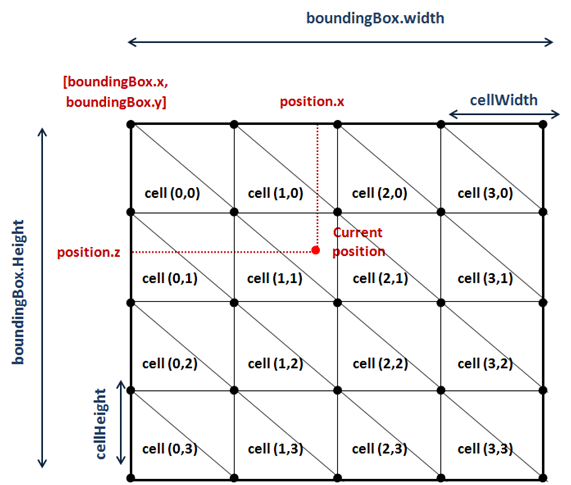

# Terrain Collisions

Once we have created a terrain the next step is to detect collisions to avoid traversing through it. If you recall from previous chapter, a terrain is composed by blocks, and each of those blocks is constructed from a height map. The height map is used to set the height of the vertices that compose the triangles that form the terrain.

In order to detect a collision we must compare current position $$y$$ value with the $$y$$ value of the point of the terrain we are currently in. If we are above terrain’s $$y$$ value there’s no collision, if not, we need to get back. Simple concept, does it ? Indeed it is but we need to perform several calculations before we are able to do that comparison.

The first thing we need to define what our current position is. Since we do not have a player concept yet the answer is easy, the current position will be the camera position. So we already have one of the components of the comparison, thus, the next thing to calculate is terrain height at current position.

As it's been said before, the terrain is composed by a grid of terrain blocks as shown in the next figure.


 
Each terrain block is constructed from the same height map mesh, but is scaled and displaced precisely to form a terrain grid that looks like a continuous landscape.

So, what we need to do first is determine in which terrain block the current position is in. In order to do that we will calculate the bounding box of each terrain block taking into consideration the displacement and the scaling. Since the terrain will not be displaced or scaled at runtime, we can do those calculations in the ```Terrain``` class constructor. By doing this way we access them later at any time without repeating those operations in eacha game loop cycle.

We will create a new method that calculates the bounding box of a terrain block, named ```getBoundingBox```.

```java
private Rectangle2D.Float getBoundingBox(GameItem terrainBlock) {
    float scale = terrainBlock.getScale();
    Vector3f position = terrainBlock.getPosition();

    float topLeftX = HeightMapMesh.STARTX * scale + position.x;
    float topLeftZ = HeightMapMesh.STARTZ * scale + position.z;
    float width = Math.abs(HeightMapMesh.STARTX * 2) * scale;
    float height = Math.abs(HeightMapMesh.STARTZ * 2) * scale;
    Rectangle2D.Float boundingBox = new Rectangle2D.Float(topLeftX, topLeftZ, width, height);
    return boundingBox;
}
```

We need to calculate the world coordinates of our terrain block. In the previous chapter you saw that all of our terrain meshes were created inside a quad with its origin set to [STARTX, STARTZ], so we need to transform that coordinates to the world coordinates taking into consideration the scale and the displacement as shown in the next figure.


 
As it’s been said above, this is done in the Terrain class constructor, so we need to add a new attribute which will hold the bounding boxes:

```java
private final Rectangle2D.Float[][] boundingBoxes;
```

In the ```Terrain``` constructor, while we are creating the terrain blocks we just need to invoke the method that calculates the bounding box.

```java
public Terrain(int terrainSize, float scale, float minY, float maxY, String heightMapFile, String textureFile, int textInc) throws Exception {
    this.terrainSize = terrainSize;
    gameItems = new GameItem[terrainSize * terrainSize];

    BufferedImage heightMapImage = ImageIO.read(getClass().getResourceAsStream(heightMapFile));
    // The number of vertices per column and row
    verticesPerCol = heightMapImage.getWidth();
    verticesPerRow = heightMapImage.getHeight();

    heightMapMesh = new HeightMapMesh(minY, maxY, heightMapImage, textureFile, textInc);
    boundingBoxes = new Rectangle2D.Float[terrainSize][terrainSize];
    for (int row = 0; row < terrainSize; row++) {
        for (int col = 0; col < terrainSize; col++) {
            float xDisplacement = (col - ((float) terrainSize - 1) / (float) 2) * scale * HeightMapMesh.getXLength();
            float zDisplacement = (row - ((float) terrainSize - 1) / (float) 2) * scale * HeightMapMesh.getZLength();

            GameItem terrainBlock = new GameItem(heightMapMesh.getMesh());
            terrainBlock.setScale(scale);
            terrainBlock.setPosition(xDisplacement, 0, zDisplacement);
            gameItems[row * terrainSize + col] = terrainBlock;

            boundingBoxes[row][col] = getBoundingBox(terrainBlock);
        }
    }
}
```

So, with all the bounding boxes pre-calculated, we are ready to create a new method that will return the height of the terrain taking as a parameter the current position. This method will be named ```getHeightVector``` and its defined like this.

```java
public float getHeight(Vector3f position) {
    float result = Float.MIN_VALUE;
    // For each terrain block we get the bounding box, translate it to view coodinates
    // and check if the position is contained in that bounding box
    Rectangle2D.Float boundingBox = null;
    boolean found = false;
    GameItem terrainBlock = null;
    for (int row = 0; row < terrainSize && !found; row++) {
        for (int col = 0; col < terrainSize && !found; col++) {
            terrainBlock = gameItems[row * terrainSize + col];
            boundingBox = boundingBoxes[row][col];
            found = boundingBox.contains(position.x, position.z);
        }
    }

    // If we have found a terrain block that contains the position we need
    // to calculate the height of the terrain on that position
    if (found) {
        Vector3f[] triangle = getTriangle(position, boundingBox, terrainBlock);
        result = interpolateHeight(triangle[0], triangle[1], triangle[2], position.x, position.z);
    }

    return result;
}
```

The first thing that to we do in that method is to determine the terrain block that we are in. Since we already have the bounding box for each terrain block, the algorithm is simple. We just simply need to iterate over the array of bounding boxes and check if the current position is inside (the class 
```Rectangle2D``` already provides a method for this).

Once we have found the terrain block, we need to calculate the triangle which we are in. This is done in the ```getTriangle``` method that will be described later on. After that, we have the coordinates of the triangle that we are in, cinluding their heights. But, we need the height of apoint that is not located at any of those vertices but in a point in between. This is done in the $$interpolateHeight$$ method. We will also explain how this is done later on.

Let’s first start with the process of determining the triangle that we are in. The quad that forms a terrain block can be seen as a grid in which each cell is formed by two triangles Let’s define some variables first:

* $$boundingBox.x$$ is the $$x$$ coordinate of the origin of the bounding box associated to the quad.
* $$boundingBox.y$$ is the $$z$$ coordinates  of the origin of the bounding box associated to the quad (Altogh you see a “$$y$$”, it models the $$z$$ axis).
* $$boundingBox.width$$ is the width of the quad
* $$boundingBox.height$$ is the height of the quad.
* $$cellWidth$$ is the width  of a cell.
* $$cellHeight$$ is the height of a cell.

All of the variables defined above are expressed in world coordinates.  To calculate the width of a cell we just need to divide the bounding box width by the number of vertices per column:

$$cellWidth = boundingBox.width / verticesPerCol$$

And the variable ```cellHeight``` is calculated analogous 

$$cellHeight = boundingBox.hieght / verticesPerRow$$

Once we have those variables we can calculate the row and the column of the cell we are currently in width is quite straight forward:

$$col = (position.x – boundingBox.x) / boundingBox.width$$
$$col = (row = position.z – boundingBox.y) / boundingBox.height$$

The following picture shows all the variables  described above for a sample terrain block.



With all that information we are able to calculate the positions of the vertices of the triangles contained in the cell. How we can do this ? Let’s examine the triangles that form a single cell.
 


You can see that the cell is divided by a diagonal that separates the two triangles. The way to determine  the triangle associated to the current position, is by checking if the $$z$$ coordinate is above or below that diagonal. In our case, if current position $$z$$ value is less than the $$z$$ value of the diagonal setting the $$x$$ value to the $$x$$ value of current position we are in T1. If its greater than that we are in T2.

We can determine that by calculating the line equation that matches the diagonal.

If you rememeber your school math classes, the equation of a line that passes from two points (in 2D) is:

$$y-y1=m\\dot(x-x1)$$

Where m is the line slope, that is, how much the height changes when moving through the x axis. Not that the “y” coordinates are the “z” ones in our case, and that we are using 2D coordinates since the value of “y” is not going to be calculated by this method. So, in our case the line equation should be rewritten like this.
z-z1=m(z-z1)
The slope formula is like this:
m=(z1-z2)/(x1-x2)
So the equation of the diagonal to get the z value given a xpos is like this:
Z= m*(xpos-x1)+z1=((z1-z2)/(x1-x2))*(zpos-x1)+z1
Where x1 and z1 are the z and z coordinates of the vertex V1 of the previous figure and x2 and z2 are the z and z coordinates of the vertex V2.
So the method to get the triangle that the current position is in, named getTriangle, applying all the calculations described above gets like this:
protected Vector3f[] getTriangle(Vector3f position, Rectangle2D.Float boundingBox, GameItem terrainBlock) {
    // Get the column and row of the heightmap associated to the current position
    float cellWidth = boundingBox.width / (float) verticesPerCol;
    float cellHeight = boundingBox.height / (float) verticesPerRow;
    int col = (int) ((position.x - boundingBox.x) / cellWidth);
    int row = (int) ((position.z - boundingBox.y) / cellHeight);

    Vector3f[] triangle = new Vector3f[3];
    triangle[1] = new Vector3f(
        boundingBox.x + col * cellWidth,
        getWorldHeight(row + 1, col, terrainBlock),
        boundingBox.y + (row + 1) * cellHeight);
    triangle[2] = new Vector3f(
        boundingBox.x + (col + 1) * cellWidth,
        getWorldHeight(row, col + 1, terrainBlock),
        boundingBox.y + row * cellHeight);
    if (position.z < getDiagonalZCoord(triangle[1].x, triangle[1].z, triangle[2].x, triangle[2].z, position.x)) {
        triangle[0] = new Vector3f(
            boundingBox.x + col * cellWidth,
            getWorldHeight(row, col, terrainBlock),
            boundingBox.y + row * cellHeight);
    } else {
        triangle[0] = new Vector3f(
            boundingBox.x + (col + 1) * cellWidth,
            getWorldHeight(row + 2, col + 1, terrainBlock),
            boundingBox.y + (row + 1) * cellHeight);
    }

    return triangle;
}

protected float getDiagonalZCoord(float x1, float z1, float x2, float z2, float x) {
    float z = ((z1 - z2) / (x1 - x2)) * (x - x1) + z1;
    return z;
}

protected float getWorldHeight(int row, int col, GameItem gameItem) {
    float y = heightMapMesh.getHeight(row, col);
    return y * gameItem.getScale() + gameItem.getPosition().y;
}

You can see that we have two additional methods. The first one, named getDiagonalZCoord, calculates the z coordinate of the diagonal given a x position and two vertices. The other one, is used to retrieve the height of the triangle vertices, the y coordinate. When the terrain mesh is constructed the hieght of each vertex is precalculated and stored, we only need to translate it to world coordinates.
Ok, so we have the triangle coordinates that the current position is in, finally we are ready to calculate terrain height at current position. How can we do this ? Well, our triangle is contained in a plane, and a plane can be defined by three points, in this case, the three vertices that define a triangle.

 

 
The plane equation is as follows:
ax+by+cz+d=0
The values of the constants of the previous equation are:
        float a = (pB.y - pA.y) * (pC.z - pA.z) - (pC.y - pA.y) * (pB.z - pA.z);
        float b = (pB.z - pA.z) * (pC.x - pA.x) - (pC.z - pA.z) * (pB.x - pA.x);
        float c = (pB.x - pA.x) * (pC.y - pA.y) - (pC.x - pA.x) * (pB.y - pA.y);
Where A, B and C are the three vertices needed to define the plane.
We have the x and z coordinates of the current position and we need to calculate the y value:
float y = (-d - a * x - c * z) / b;
This is calculated in the following method:
protected float interpolateHeight(Vector3f pA, Vector3f pB, Vector3f pC, float x, float z) {
    // Plane equation ax+by+cz+d=0
    float a = (pB.y - pA.y) * (pC.z - pA.z) - (pC.y - pA.y) * (pB.z - pA.z);
    float b = (pB.z - pA.z) * (pC.x - pA.x) - (pC.z - pA.z) * (pB.x - pA.x);
    float c = (pB.x - pA.x) * (pC.y - pA.y) - (pC.x - pA.x) * (pB.y - pA.y);
    float d = -(a * pA.x + b * pA.y + c * pA.z);
    // y = (-d -ax -cz) / b
    float y = (-d - a * x - c * z) / b;
    return y;
}

And that’s all ! we are now able to detect the collisions, in the DummyGame class we can change the following lines when we update the camera position:
// Update camera position
Vector3f prevPos = new Vector3f(camera.getPosition());
camera.movePosition(cameraInc.x * CAMERA_POS_STEP, cameraInc.y * CAMERA_POS_STEP, cameraInc.z * CAMERA_POS_STEP);        
// Check if there has been a collision. If true, set the y position to
// the maximum height
float height = terrain.getHeight(camera.getPosition());
if ( camera.getPosition().y <= height )  {
    camera.setPosition(prevPos.x, prevPos.y, prevPos.z);
}

As you can see the concept of detecting terrain collisions is easy but we need to carefully perform a set of calculations and be aware of the different coordinate systems we are dealing with.
Although the algorithm presented here is valid in most of the cases, there are still situations that need to be handled carefully. One effect that you may observer is the one called tunnelling. Imagine the following situation, we are travelling at fast speed through our terrain and thus, the position increment has a higher value, since we are detecting collisions with the final position we may have skipped obstacles that lay in between.

 

There are many possible solutions to avoid that effect, the simplest one is to split the calculation to be performed in smaller increments, that added will sum up the desired final position displacement.
