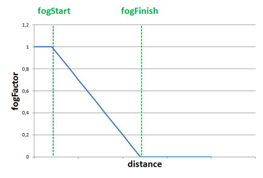
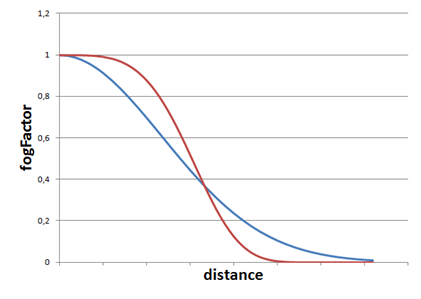
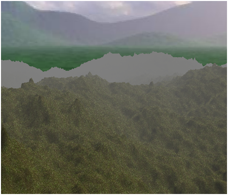
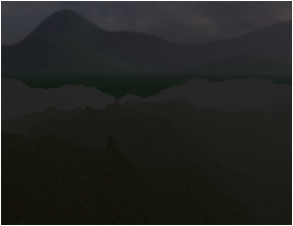
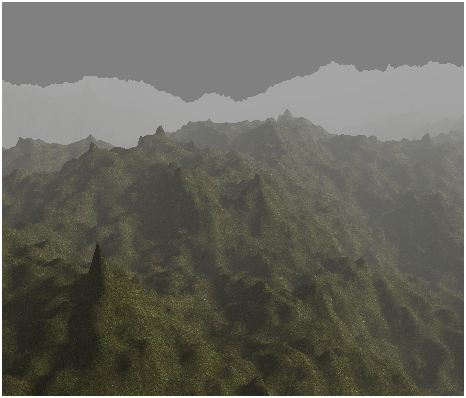

# Fog

Before we deal with more complex topics we will review how to create a fog effect in our game engine. With that effect we will simulate how distant objects get dimmed and seem to vanish into a dense fog.

Let us first examine what are the attributes that define fog. The first one is the fog colour. In the real world the fog has a gray colour, but we can use this effect to simulate wide areas invaded by a fog with different colours. The attribute is the fog's density.

Thus, in order to apply the fog effect we need to find a way to fade our 3D scene objects into the fog colour as long as they get far away from the camera. Objects that are close to the camera will not be affected by the fog, but objects that are far away will not be distinguishable. So we need to be able to calculate a factor that can be used to blend the fog colour and each fragment colour in order to simulate that effect. That factor will need to be dependent on the distance to the camera.

Let’s name that factor as , and set its range from 0 to 1. When  takes the 1 value, it means that the object will not be affected by fog, that is, it’s a nearby object. When  takes the 0 value, it means that the objects will be completely hidden in the fog.

Then, the equation needed to calculate the fog colour will be:


*  is the colour that results from applying the fog effect.
*  is the parameters that controls how the fog colour and the fragment colour are blended. It basically controls the object visibility.
*  is the colour of the fog.
* , is the colour of the fragment without applying any fog effect on it.

Now we need to find a way to calculate  depending on the distance. We can chose different models, and the first one could be to use a linear model. That is a model that, given a distance, changes the fogFactor value in a linear way.

The linear model can be defined by the following parameters:

* : The distance at where fog effects starts to be applied.
* : The distance at where fog effects reaches its maximum value.
* : Distance to the camera.

With those parameters, the equation to be applied would be:


For objects at distance lower than  we just simply set the  to . The following graph shows how the  changes with the distance.



The linear model is easy to calculate but it is not very realistic and it does not take into consideration the fog density. In reality fog tends to grow in a smoother way. So the next suitable model is a exponential one. The equation for that model is as follows:


The new variables that come into play are:

*  which models the thickness or density of the fog.
*  which is used to control how fast the fog increases with distance

The following picture shows two graphs for the equation above for different values of the exponent \( for the blue line and  for the red one\)



In our code we will use a formula which sets a value of two for the exponent \(you can easily modify the example to use different values\).

Now that the theory has been explained we can put it into practice. We will implement the effect in the scene fragment shader since we have there all the variables we need. We will start by defining a struct that models the fog attributes.

```text
struct Fog
{
    int active;
    vec3 colour;
    float density;
};
```

The `active` attribute will be used to activate or deactivate the fog effect. The fog will be passed to the shader through another uniform named `fog`.

```text
uniform Fog fog;
```

We will create also a new class named `Fog` which is another POJO \(Plain Old Java Object\) which contains the fog attributes.

```java
package org.lwjglb.engine.graph.weather;

import org.joml.Vector3f;

public class Fog {

    private boolean active;

    private Vector3f colour;

    private float density;

    public static Fog NOFOG = new Fog();

    public Fog() {
        active = false;
        this.colour = new Vector3f(0, 0, 0);
        this.density = 0;
    }

    public Fog(boolean active, Vector3f colour, float density) {
        this.colour = colour;
        this.density = density;
        this.active = active;
    }

   // Getters and setters here….
```

We will add a `Fog` instance in the `Scene` class. As a default, the `Scene` class will initialize the `Fog` instance to the constant `NOFOG` which models a deactivated instance.

Since we added a new uniform type we need to modify the `ShaderProgram` class to create and initialize the fog uniform.

```java
public void createFogUniform(String uniformName) throws Exception {
    createUniform(uniformName + ".active");
    createUniform(uniformName + ".colour");
    createUniform(uniformName + ".density");
}

public void setUniform(String uniformName, Fog fog) {
    setUniform(uniformName + ".activeFog", fog.isActive() ? 1 : 0);
    setUniform(uniformName + ".colour", fog.getColour() );
    setUniform(uniformName + ".density", fog.getDensity());
}
```

In the `Renderer` class we just need to create the uniform in the `setupSceneShader` method:

```java
sceneShaderProgram.createFogUniform("fog");
```

And use it in the `renderScene` method:

```java
sceneShaderProgram.setUniform("fog", scene.getFog());
```

We are now able to define fog characteristics in our game, but we need to get back to the fragment shader in order to apply the fog effect. We will create a function named `calcFog` which is defined like this.

```text
vec4 calcFog(vec3 pos, vec4 colour, Fog fog)
{
    float distance = length(pos);
    float fogFactor = 1.0 / exp( (distance * fog.density)* (distance * fog.density));
    fogFactor = clamp( fogFactor, 0.0, 1.0 );

    vec3 resultColour = mix(fog.colour, colour.xyz, fogFactor);
    return vec4(resultColour.xyz, colour.w);
}
```

As you can see we first calculate the distance to the vertex. The vertex coordinates are defined in the `pos` variable and we just need to calculate the length. Then we calculate the fog factor using the exponential model with an exponent of two \(which is equivalent to multiply it twice\). We clamp the `fogFactor` to a range between  and  and use the `mix` function. In GLSL, the `mix` function is used to blend the fog colour and the fragment colour \(defined by variable colour\). It's equivalent to apply this equation:


We also preserve the w componente, the transparency, of the original colour. We don't want this component to be affected, the fragment should mantain its transparency level.

At the end of the fragment shader after applying all the light effects we just simply assign the returned value to the fragment colour if the fog is active.

```text
if ( fog.activeFog == 1 ) 
{
    fragColor = calcFog(mvVertexPos, fragColor, fog);
}
```

With all that code completed, we can set up a Fog with the following data:

```java
scene.setFog(new Fog(true, new Vector3f(0.5f, 0.5f, 0.5f), 0.15f));
```

And we will get an effect like this:



You will see that distant objects get faded in the distance and that fog starts to disappear when you approach to them. There’s a problem, though with the skybox, it looks a little bit weird that the horizon is not affected by the fog. There are several ways to solve this:

* Use a different skybox in which you only see a sky.
* Remove the skybox, since you have a dense fog, you should not be able to see a background.

Maybe none of the two solutions fits you, and you can try to match the fog colour to the skybox background but you will end up doing complex calculations and the result will not be much better.

If you let the example run you will see how directional light gets dimmed and the scene darkens, but there’s a problem with the fog, it is not affected by light and you will get something like this.


Distant objects are set to the fog colour which is a constant and not affected by light. This fact produces like a glowing in the dark effect \(which may be ok for you or not\). We need to change the funcion that calculates the fog to take into consideration the light. The function will receive the ambient light and the directional light to modulate the fog colour.

```text
vec4 calcFog(vec3 pos, vec4 colour, Fog fog, vec3 ambientLight, DirectionalLight dirLight)
{
    vec3 fogColor = fog.colour * (ambientLight + dirLight.colour * dirLight.intensity);
    float distance = length(pos);
    float fogFactor = 1.0 / exp( (distance * fog.density)* (distance * fog.density));
    fogFactor = clamp( fogFactor, 0.0, 1.0 );

    vec3 resultColour = mix(fogColor, colour.xyz, fogFactor);
    return vec4(resultColour.xyz, 1);
}
```

As you can see with the directional light we just use the colour and the intensity, we are not interested in the direction. With that modification we just need to slightly modify the call to the function like this:

```text
if ( fog.active == 1 ) 
{
    fragColor = calcFog(mvVertexPos, fragColor, fog, ambientLight, directionalLight);
}
```

And we will get something like this when the night falls.



One important thing to highlight is that we must wisely choose the fog colour. This is even more important when we have no skybox but a fixed colour background. We should set up the fog colour to be equal to the clear colour. If you uncomment the code that render the skybox and rerun the example you will get something like this.


But if we modify the clear colour to be equal to `(0.5, 0.5, 0.5)` the result will be like this.



