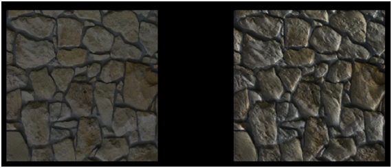

# Normal Mapping

In this chapter, we will explain a technique that will dramatically improve how our 3D models look like. By now we are able to apply textures to complex 3D models, but we are still far away from what real objects look like. Surfaces in the real world are not perfectly plain, they have imperfections that our 3D models currently do not have.

In order to render more realistic scenes, we are going to use normal maps. If you look at a flat surface in the real world you will see that those imperfections can be seen even at distance by the way that the light reflects on it. In a 3D scene, a flat surface will have no imperfections, we can apply a texture to it but we won’t change the way that light reflects on it. That’s the thing that makes the difference.

We may think of increasing the detail of our models by increasing the number of triangles and reflect those imperfections, but performance will degrade. What we need is a way to change the way light reflects on surfaces to increase the realism. This is achieved with the normal mapping technique.

Let’s go back to the plain surface example, a plane can be defined by two triangles which form a quad. If you remember from the lighting chapters, the element that models how light reflects are surface normals. In this case, we have a single normal for the whole surface, each fragment of the surface uses the same normal when calculating how light affects them. This is shown in the next figure.


If we could change the normals for each fragment of the surface we could model surface imperfections to render them in a more realistic way. This is shown in the next figure.


The way we are going to achieve this is by loading another texture that stores the normals for the surface. Each pixel of the normal texture will contain the values of the $$x$$, y and $$z$$ coordinates of the normal stored as an RGB value.

Let’s use the following texture to draw a quad.


An example of a normal map texture for the image above may be the following.


As you can see, it's as if we had applied a colour transformation to the original texture. Each pixel stores normal information using colour components. One thing that you will usually see when viewing normal maps is that the dominant colours tend to blue. This is due to the fact that normals point to the positive $$z$$ axis. The $$z$$ component will usually have a much higher value than the $$x$$ and $$y$$ ones for plain surfaces as the normal points out of the surface. Since $$x$$, $$y$$, $$z$$ coordinates are mapped to RGB, the blue component will have also a higher value.

So, to render an object using normal maps we just need an extra texture and use it while rendering fragments to get the appropriate normal value.

Let’s start changing our code in order to support normal maps. We will add a new texture instance to the `Material` class so we can attach a normal map texture to our game items. This instance will have its own getters and setters and method to check if the material has a normal map or not.

```java
public class Material {

    private static final Vector4f DEFAULT_COLOUR = new Vector3f(1.0f, 1.0f, 1.0f, 10.f);

    private Vector3f ambientColour;

    private Vector3f diffuseColour;

    private Vector3f specularColour;
    
    private float reflectance;

    private Texture texture;

    private Texture normalMap;

    // … Previous code here

    public boolean hasNormalMap() {
        return this.normalMap != null;
    }

    public Texture getNormalMap() {
        return normalMap;
    }

    public void setNormalMap(Texture normalMap) {
        this.normalMap = normalMap;
    }
}
```

We will use the normal map texture in the scene fragment shader. But, since we are working in view coordinates space we need to pass the model view matrix in order to do the proper transformation. Thus, we need to modify the scene vertex shader.

```glsl
#version 330

layout (location=0) in vec3 position;
layout (location=1) in vec2 texCoord;
layout (location=2) in vec3 vertexNormal;

out vec2 outTexCoord;
out vec3 mvVertexNormal;
out vec3 mvVertexPos;
out mat4 outModelViewMatrix;

uniform mat4 modelViewMatrix;
uniform mat4 projectionMatrix;

void main()
{
    vec4 mvPos = modelViewMatrix * vec4(position, 1.0);
    gl_Position = projectionMatrix * mvPos;
    outTexCoord = texCoord;
    mvVertexNormal = normalize(modelViewMatrix * vec4(vertexNormal, 0.0)).xyz;
    mvVertexPos = mvPos.xyz;
    outModelViewMatrix = modelViewMatrix;
}
```

In the scene fragment shader we need to add another input parameter.

```glsl
in mat4 outModelViewMatrix;
```

In the fragment shader, we will need to pass a new uniform for the normal map texture sampler:

```glsl
uniform sampler2D texture_sampler;
```

Also, in the fragment shader, we will create a new function that calculates the normal for the current fragment.

```glsl
vec3 calcNormal(Material material, vec3 normal, vec2 text_coord, mat4 modelViewMatrix)
{
    vec3 newNormal = normal;
    if ( material.hasNormalMap == 1 )
    {
        newNormal = texture(normalMap, text_coord).rgb;
        newNormal = normalize(newNormal * 2 - 1);
        newNormal = normalize(modelViewMatrix * vec4(newNormal, 0.0)).xyz;
    }
    return newNormal;
}
```

The function takes the following parameters:

* The material instance.
* The vertex normal.
* The texture coordinates.
* The model view matrix.

The first thing we do in that function is to check if this material has a normal map associated or not. If not, we just simply use the vertex normal as usual. If it has a normal map, we use the normal data stored in the normal texture map associated with the current texture coordinates.

Remember that the colour we get are the normal coordinates, but since they are stored as RGB values they are contained in the range \[0, 1\]. We need to transform them to be in the range \[-1, 1\], so we just multiply by two and subtract 1. Then, we normalize that value and transform it to view model coordinate space \(as with the vertex normal\).

And that’s all, we can use the returned value as the normal for that fragment in all the lighting calculations.

In the `Renderer` class we need to create the normal map uniform, and in the `renderScene` method we need to set it up like this:

```java
...
sceneShaderProgram.setUniform("fog", scene.getFog());
sceneShaderProgram.setUniform("texture_sampler", 0);
sceneShaderProgram.setUniform("normalMap", 1);
...
```

You may notice some interesting thing in the code above. We are setting $$0$$ for the material texture uniform \(`texture_sampler`\) and $$1$$ for the normal map texture \(`normalMap`\). If you recall from the texture chapter. We are using more than one texture, so we must set up the texture unit for each separate texture.

We need to take this also into consideration when we are rendering a `Mesh`.

```java
private void initRender() {
    Texture texture = material.getTexture();
    if (texture != null) {
        // Activate first texture bank
        glActiveTexture(GL_TEXTURE0);
        // Bind the texture
        glBindTexture(GL_TEXTURE_2D, texture.getId());
    }
    Texture normalMap = material.getNormalMap();
    if ( normalMap != null ) {
        // Activate first texture bank
        glActiveTexture(GL_TEXTURE1);
        // Bind the texture
        glBindTexture(GL_TEXTURE_2D, normalMap.getId());
    }

    // Draw the mesh
    glBindVertexArray(getVaoId());
}
```

As you can see we need to bind each of the textures available and activate the associated texture unit in order to be able to work with more than one texture. In the `renderScene` method in the `Renderer` class we do not need to explicitly set up the uniform of the texture since it’s already contained in the `Material`.

In order to show the improvements that normal maps provide, we have created an example that shows two quads side by side. The right quad has a texture map applied and the left one not. We also have removed the terrain, the skybox and the HUD and setup a directional light with can be changed with the left and right cursor keys so you can see the effect. We have modified the base source code a bit in order to support not having a skybox or a terrain. We have also clamped the light effect in the fragment shader in the rang \[0, 1\] to avoid over exposing effect of the image.

The result is shown in the next figure.



As you can see the quad that has a normal texture applied gives the impression of having more volume. Although it is, in essence, a plain surface like the other quad, you can see how the light reflects.
Although the code we have set up works perfectly with this example, you need to be aware of its limitations. The code only works for normal map textures that are created using object space coordinates. If this is the case we can apply the model view matrix transformations to translate the normal coordinates to the view space.

But usually, normal maps are not defined in that way, they usually are defined in the so called tangent space. The tangent space is a coordinate system that is local to each triangle of the model. In that coordinate space the $$z$$ axis always points out of the surface. This is the reason why a normal map is usually bluish, even for complex models with opposing faces.

We will stick with this simple implementation for now, but keep in mind that you must always use normal maps defined in object space. If you use maps defined in tangent space you will get weird results. In order to be able to work with them, we need to setup specific matrices to transform coordinates to the tangent space.

You can check a great tutorial on this aspect [here](https://learnopengl.com/Advanced-Lighting/Normal-Mapping)
