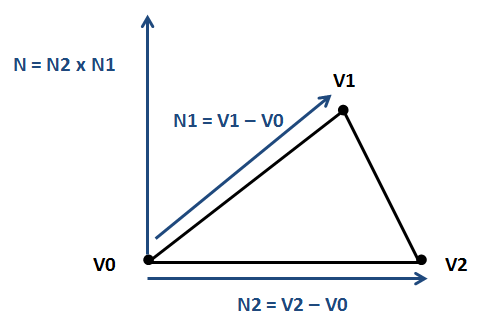
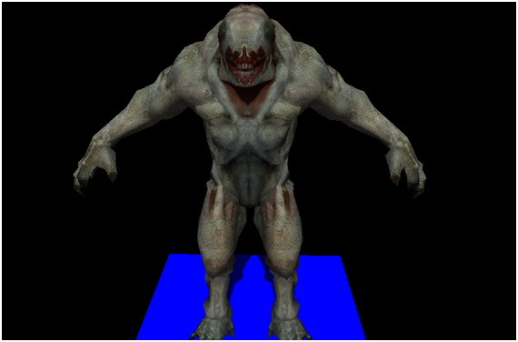
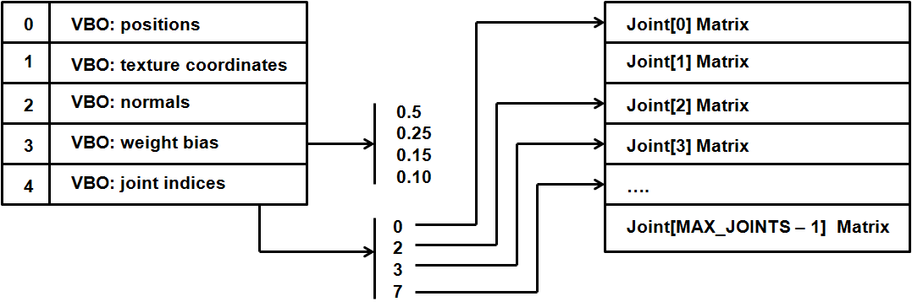
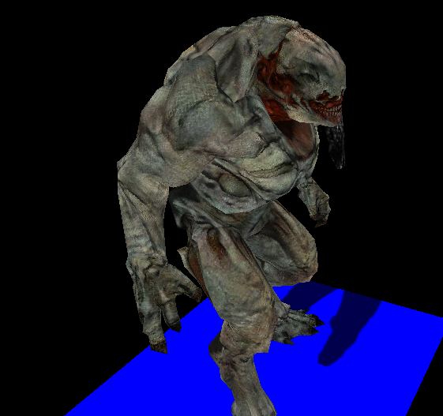

# Animations

## Introduction

Until now we have only loaded static 3D models, but in this chapter we will learn how to animate them. When thinking about animations the first approach is to create different meshes for each model positions, load them up into the GPU and draw them sequentially to create the illusion of movement. Although this approach is perfect for some games, it's not very efficient in terms of memory consumption.

This where skeletal animation comes to play. In skeletal animation the way a model animates is defined by its underlying skeleton. A skeleton is defined by a hierarchy of special points called joints. These joints are defined by their position and rotation. We have said also that it's a hierarchy, which means that the final position for each joint is affected by the position of their parents. For instance, think of a wrist: the position of a wrist is modified if a character moves the elbow and also if it moves the shoulder.

Joints do not need to represent a physical bone or articulation: they are artifacts that allow the creatives to model an animation. In addition to joints we still have vertices, the points that define the triangles that compose a 3D model. But in skeletal animation, vertices are drawn based on the position of the joints they relate to.

In this chapter we will use the MD5 format to load animated models. MD5 was created by ID Software, the creators of Doom, and it’s basically a text based file format which is well understood. Another approach would be to use the [Collada](https://en.wikipedia.org/wiki/COLLADA) format, which is a public standard supported by many tools. Collada is an XML based format but as a downside it’s very complex \(the specification for the 1.5 version has more than 500 pages\). So, we will stick to a much more simple format, MD5, that will allow us to focus on the concepts of the skeletal animation and to create a working sample.

You can also export some models from Blender to MD5 format via specific addons that you can find on the Internet \([http://www.katsbits.com/tools/\#md5]()\)

In this chapter I’ve consulted many different sources, but I  have found two that provide a very good explanation about how to create an animated model using MD5 files. Theses sources can be consulted at:

* [http://www.3dgep.com/gpu-skinning-of-md5-models-in-opengl-and-cg/](http://www.3dgep.com/gpu-skinning-of-md5-models-in-opengl-and-cg/)
* [http://ogldev.atspace.co.uk/www/tutorial38/tutorial38.html](http://ogldev.atspace.co.uk/www/tutorial38/tutorial38.html)

So let’s start by writing the code that parses MD5 files. The MD5 format defines two types of files:

* The mesh definition file: this defines the joints, the vertices and textures that compose the set of meshes that form the 3D model. This file usually has a extension named “.md5mesh”.
* The animation definition file: this defines the animations that can be applied to the model. This file usually has a extension named “.md5anim”.

An MD5 file is composed by a header and different sections contained between braces. Let’s start examining the mesh definition file. In the resources folder you will find several models in MD5 format. If you open one of them you can see a structure similar to this.


The first structure that you can find in the mesh definition file is the header. You can see below the header content from one of the samples provided:

```text
MD5Version 10
commandline ""

numJoints 33
numMeshes 6
```

The header defines the following attributes:

* The version of the MD5 specification that it complies to.
* The command used to generate this file \(from a 3D modelling tool\).
* The number of Joints that are defined in the joints section.
* The number of Meshes \(the number of meshes sections expected\).

The Joints sections defines the joints, as it names states, their positions and their relationships. A fragment of the joints section of one of the sample models is shown below.

```text
joints {
    "origin"    -1 ( -0.000000 0.016430 -0.006044 ) ( 0.707107 0.000000 0.707107 )        // 
    "sheath"    0 ( 11.004813 -3.177138 31.702473 ) ( 0.307041 -0.578614 0.354181 )        // origin
    "sword"    1 ( 9.809593 -9.361549 40.753730 ) ( 0.305557 -0.578155 0.353505 )        // sheath
    "pubis"    0 ( 0.014076 2.064442 26.144581 ) ( -0.466932 -0.531013 -0.466932 )        // origin
              ……
}
```

A Joint is defined by the following attributes:

* Joint name, a textual attribute between quotes.
* Joint parent, using an index which points to the  parent joint using its position in the joints list. The root joint has a parent equals to -1.
* Joint position, defined in  model space coordinate system.
* Joint orientation, defined also in model space coordinate system. The orientation in fact is a quaternion whose w-component is not included.

Before continuing explaining the rest of the file let’s talk about quaternions. Quaternions are four component elements that are used to represent rotation. Up to now, we have been using Euler angles \(yaw, pitch and roll\) to define rotations, which basically define rotation around the x, y and z angles. However, Euler angles present some problems when working with rotations: specifically, you must be aware of the correct order of applying rotations and some operations can get very complex.

This where quaternions come to help in order to solve this complexity. As it has been said before a quaternion is defined as a set of 4 numbers \(x, y, z, w\). Quaternions define a rotation axis and the rotation angle around that axis.


You can check in the web the mathematical definition of each of the components but the good news is that JOML, the math library we are using, provides support for them. We can construct rotation matrices based on quaternions and perform some transformation to vectors with them.

Let’s get back to the joints definition, the $$w$$ component is missing but it can be easily calculated with the help of the rest of the values. You can check the source code to see how it's done.

After the joints definition you can find the definition of the different meshes that compose a model. Below you can find a fragment of a Mesh definition from one of the samples.

```text
mesh {
    shader "/textures/bob/guard1_body.png"

    numverts 494
    vert 0 ( 0.394531 0.513672 ) 0 1
    vert 1 ( 0.447266 0.449219 ) 1 2
    ...
    vert 493 ( 0.683594 0.455078 ) 864 3

    numtris 628
    tri 0 0 2 1
    tri 1 0 1 3
    ...
    tri 627 471 479 493

    numweights 867
    weight 0 5 1.000000 ( 6.175774 8.105262 -0.023020 )
    weight 1 5 0.500000 ( 4.880173 12.805251 4.196980 )
    ...
    weight 866 6 0.333333 ( 1.266308 -0.302701 8.949338 )
}
```

Let’s review the structure presented above:

* A Mesh starts by defining a texture file. Keep in mind that the path that you will find here is the one used by the tool that created that model. That path may not match the one that is used to load those files. You have two approaches here, either you change the base path dynamically or either you change that path by hand. I’ve chosen the latter one, the simpler one.
* Next you can find the vertices definition. A vertex is defined by the following attributes:
* * Vertex index.
* * Texture coordinates.
* * The index of the first weight definition that affects this vertex.
* * The number of weights to consider.
* After the vertices, the triangles that form this mesh are defined. The triangles define the way that vertices are organized using their indices.
* Finally, the weights are defined. A Weight definition is composed by:
* * A Weight index.
* * A Joint index, which points to the joint related to this weight.
* * A bias factor, which is used to modulate the effect of this weight.
* * A position of this weight.

The following picture depicts the relation between the components described above using sample data.


Now that we understand the mesh model file we can parse it. If you look at the source code you will see that a new package has been created to host parsers for model formats. There’s one for OBJ files under `org.lwjglb.engine.loaders.obj` and the code for MD5 files is under `org.lwjglb.engine.loaders.md5`.

All the parsing code is based on regular expressions to extract the information from the MD5 text files. The parsers will create a hierarchy of objects that mimic the structure of the information components contained in the MD5 files. It may not be the most efficient parser in the world but I think it will serve to better understand the process.

The starting class to parse a MD5 model file is `MD5Model` class. This class receives as a parameter in its parse method the contents of a MD5 file and creates a hierarchy that contains the header, the list of joints and the list of meshes with all the subelements. The code is very straightforward so, I won’t include it here.

A few comments about the parsing code:

* The subelements of a Mesh are defined as inner classes inside the `MD5Mesh` class.
* You can check how the fourth component of the joints orientation are calculated in the `calculateQuaternion` method form the `MD5Utils` class.

Now that we have parsed a file we must transform that object hierarchy into something that can be processed by the game Engine, we must create a `GameItem` instance. In order to do that we will  create a new class named `MD5Loader` that will take a `MD5Model` instance and will construct a `GameItem`.

Before we start, as you noticed, a MD5 model has several Meshes, but our `GameItem` class only supports a single Mesh. We need to change this first, the class `GameItem` now looks like this.

```java
package org.lwjglb.engine.items;

import org.joml.Vector3f;
import org.lwjglb.engine.graph.Mesh;

public class GameItem {

    private Mesh[] meshes;

    private final Vector3f position;

    private float scale;

    private final Vector3f rotation;

    public GameItem() {
        position = new Vector3f();
        scale = 1;
        rotation = new Vector3f();
    }

    public GameItem(Mesh mesh) {
        this();
        this.meshes = new Mesh[]{mesh};
    }

    public GameItem(Mesh[] meshes) {
        this();
        this.meshes = meshes;
    }

    public Vector3f getPosition() {
        return position;
    }

    public void setPosition(float x, float y, float z) {
        this.position.x = x;
        this.position.y = y;
        this.position.z = z;
    }

    public float getScale() {
        return scale;
    }

    public void setScale(float scale) {
        this.scale = scale;
    }

    public Vector3f getRotation() {
        return rotation;
    }

    public void setRotation(float x, float y, float z) {
        this.rotation.x = x;
        this.rotation.y = y;
        this.rotation.z = z;
    }

    public Mesh getMesh() {
        return meshes[0];
    }

    public Mesh[] getMeshes() {
        return meshes;
    }

    public void setMeshes(Mesh[] meshes) {
        this.meshes = meshes;
    }

    public void setMesh(Mesh mesh) {
        if (this.meshes != null) {
            for (Mesh currMesh : meshes) {
                currMesh.cleanUp();
            }
        }
        this.meshes = new Mesh[]{mesh};
    }
}
```

With the modification above we can now define the contents for the `MD5Loader` class. This class will have a method named `process` that will receive a `MD5Model` instance and a default colour \(for the meshes that do not define a texture\) and will return a `GameItem` instance. The body of that method is shown below.

```java
public static GameItem process(MD5Model md5Model, Vector4f defaultColour) throws Exception {
    List<MD5Mesh> md5MeshList = md5Model.getMeshes();

    List<Mesh> list = new ArrayList<>();
    for (MD5Mesh md5Mesh : md5Model.getMeshes()) {
        Mesh mesh = generateMesh(md5Model, md5Mesh, defaultColour);
        handleTexture(mesh, md5Mesh, defaultColour);
        list.add(mesh);
    }
    Mesh[] meshes = new Mesh[list.size()];
    meshes = list.toArray(meshes);
    GameItem gameItem = new GameItem(meshes);

    return gameItem;
}
```

As you can see we just iterate over the meshes defined into the `MD5Model` class and transform them into instances of the class `org.lwjglb.engine.graph.Mesh` by using the `generateMesh` method which is the one that really does the work. Before we examine that method we will create an inner class that will serve us to build the positions and normals array.

```java
private static class VertexInfo {

    public Vector3f position;

    public Vector3f normal;

    public VertexInfo(Vector3f position) {
        this.position = position;
        normal = new Vector3f();
    }

    public VertexInfo() {
        position = new Vector3f();
        normal = new Vector3f();
    }

    public static float[] toPositionsArr(List<VertexInfo> list) {
        int length = list != null ? list.size() * 3 : 0;
        float[] result = new float[length];
        int i = 0;
        for (VertexInfo v : list) {
            result[i] = v.position.x;
            result[i + 1] = v.position.y;
            result[i + 2] = v.position.z;
            i += 3;
        }
        return result;
    }

    public static float[] toNormalArr(List<VertexInfo> list) {
        int length = list != null ? list.size() * 3 : 0;
        float[] result = new float[length];
        int i = 0;
        for (VertexInfo v : list) {
            result[i] = v.normal.x;
            result[i + 1] = v.normal.y;
            result[i + 2] = v.normal.z;
            i += 3;
        }
        return result;
    }
}
```

Let’s get back to the `generateMesh` method, the first we do is get the mesh vertices information, the weights and the structure of the joints.

```java
private static Mesh generateMesh(MD5Model md5Model, MD5Mesh md5Mesh, Vector4f defaultColour) throws Exception {
    List<VertexInfo> vertexInfoList = new ArrayList<>();
    List<Float> textCoords = new ArrayList<>();
    List<Integer> indices = new ArrayList<>();

    List<MD5Mesh.MD5Vertex> vertices = md5Mesh.getVertices();
    List<MD5Mesh.MD5Weight> weights = md5Mesh.getWeights();
    List<MD5JointInfo.MD5JointData> joints = md5Model.getJointInfo().getJoints();
```

Then we need to calculate the vertices position based on the information contained in the weights and joints. This is done in the following block:

```java
    for (MD5Mesh.MD5Vertex vertex : vertices) {
        Vector3f vertexPos = new Vector3f();
        Vector2f vertexTextCoords = vertex.getTextCoords();
        textCoords.add(vertexTextCoords.x);
        textCoords.add(vertexTextCoords.y);

        int startWeight = vertex.getStartWeight();
        int numWeights = vertex.getWeightCount();

        for (int i = startWeight; i < startWeight + numWeights; i++) {
            MD5Mesh.MD5Weight weight = weights.get(i);
            MD5JointInfo.MD5JointData joint = joints.get(weight.getJointIndex());
            Vector3f rotatedPos = new Vector3f(weight.getPosition()).rotate(joint.getOrientation());
            Vector3f acumPos = new Vector3f(joint.getPosition()).add(rotatedPos);
            acumPos.mul(weight.getBias());
            vertexPos.add(acumPos);
        }

       vertexInfoList.add(new VertexInfo(vertexPos));
    }
```

Let’s examine what we are doing here. We iterate over the vertices information and store the texture coordinates in a list, no need to apply any transformation here. Then we get the starting and total number of weights to consider to calculate the vertex position.

The vertex position is calculated by using all the weights that is related to. Each weights has a position and a bias. The sum of all bias of the weights associated to each vertex must be equal to 1.0. Each weight also has a position which is defined in the joint’s local space, so we need to transform it to model space coordinates using the joint’s orientation and position \(as if it were a transformation matrix\) to which it refers to.

To sum up, the vertex position can be expressed by this formula:

$$Vpos = \sum\limits_{i=ws}^{ws + wc} (Jt_{i} \times Wp_{i}) \dot Wb_{i}$$

Where:

* The summation starts from $$ws$$ \(Weight start\) up to $$wc$$ \(Weight count\) weights.
* $$Jt_{i}$$ is the joint’s transformation matrix associated to the weight $$W_{i}$$.
* $$Wp_{i}$$ is the weight position.
* $$Wb_{i}$$ is the weight bias.

This equation is what we implement in the body of the loop \(we do not have the transformation matrix since we have the joint position and rotation separately but the result is the same\).

With the code above we will be able to construct the positions and texture coordinates data but we still need to build up the indices and the normals. Indices can be calculated by using the triangles information, just by iterating through the list that holds those triangles.

Normals can be calculated also using triangles information. Let $$V_{0}$$, $$V_{1}$$ and $$V_{2}$$ be the triangle vertices \(in object’s model space\). The normal for the triangle can be calculated according to this formula:

$$N=(V_{2}-V_{0})\times(V_{1}-V_{0})$$

Where N should be normalized after. The following figure shows the geometric interpretation of the formula above.



For each vertex we compute its normal by the normalized sum of all the normals of the triangles it belongs to. The code that performs those calculations is shown below.

```java
    for (MD5Mesh.MD5Triangle tri : md5Mesh.getTriangles()) {
        indices.add(tri.getVertex0());
        indices.add(tri.getVertex1());
        indices.add(tri.getVertex2());

        // Normals
        VertexInfo v0 = vertexInfoList.get(tri.getVertex0());
        VertexInfo v1 = vertexInfoList.get(tri.getVertex1());
        VertexInfo v2 = vertexInfoList.get(tri.getVertex2());
        Vector3f pos0 = v0.position;
        Vector3f pos1 = v1.position;
        Vector3f pos2 = v2.position;

        Vector3f normal = (new Vector3f(pos2).sub(pos0)).cross(new Vector3f(pos1).sub(pos0));

        v0.normal.add(normal);
        v1.normal.add(normal);
        v2.normal.add(normal);
     }

     // Once the contributions have been added, normalize the result
     for(VertexInfo v : vertexInfoList) {
        v.normal.normalize();
    }
```

Then we just need to transform the Lists to arrays and process the texture information.

```java
     float[] positionsArr = VertexInfo.toPositionsArr(vertexInfoList);
     float[] textCoordsArr = Utils.listToArray(textCoords);
     float[] normalsArr = VertexInfo.toNormalArr(vertexInfoList);
     int[] indicesArr = indices.stream().mapToInt(i -> i).toArray();
     Mesh mesh = new Mesh(positionsArr, textCoordsArr, normalsArr, indicesArr);

     return mesh;
}
```

Going back to the `process` method you can see that there's a method named `handleTexture`, which is responsible for loading textures. This is the definition of that method:

```java
private static void handleTexture(Mesh mesh, MD5Mesh md5Mesh, Vector4f defaultColour) throws Exception {
    String texturePath = md5Mesh.getTexture();
    if (texturePath != null && texturePath.length() > 0) {
        Texture texture = new Texture(texturePath);
        Material material = new Material(texture);

        // Handle normal Maps;
        int pos = texturePath.lastIndexOf(".");
        if (pos > 0) {
            String basePath = texturePath.substring(0, pos);
            String extension = texturePath.substring(pos, texturePath.length());
            String normalMapFileName = basePath + NORMAL_FILE_SUFFIX + extension;
            if (Utils.existsResourceFile(normalMapFileName)) {
                Texture normalMap = new Texture(normalMapFileName);
                material.setNormalMap(normalMap);
            }
        }
        mesh.setMaterial(material);
    } else {
        mesh.setMaterial(new Material(defaultColour, 1));
    }
}
```

The implementation is very straightforward. The only peculiarity is that if a mesh defines a texture named “texture.png” its normal texture map will be defined in a file “texture\_normal.png”. We need to check if that file exists and load it accordingly.

We can now load a MD5 file and render it as we render other GameItems, but before doing that we need to disable cull face in order to render it properly since not all the triangles will be drawn in the correct direction. We will add support to the Window class to set these parameters at runtime \(you can check it in the source code the changes\).

If you load some of the sample models you will get something like this.



What you see here is the binding pose, it’s the static representation of the MD5 model used for the animators  to model them easily.  In order to get animation to work we must process the animation definition file.

## Animate the model

A MD5 animation definition file, like the model definition one, is composed by a header and different sections contained between braces. If you open one of those files you can see a structure similar like this.

  
The first structure that you can find in the animation file, as in the case of the mesh definition file, is the header. You can see below header’s content from one of the samples provided:

```
MD5Version 10
commandline ""

numFrames 140
numJoints 33
frameRate 24
numAnimatedComponents 198
```

The header defines the following attributes:

* The version of the MD5 specification that it complies to.
* The command used to generate this file \(from a 3D modelling tool\).
* The number frames defined in the file.
* The number of joints defined in the hierarchy section.
* The frame rate, frames per second, that was used while creating this animation. This parameter can be used to calculate the time between frames.
* The number of components that each frame defines.

The hierarchy section is the one that comes first and defines the joints for this animation. You can see a fragment below:

```
hierarchy {
    "origin"    -1 0 0    //
    "body"    0 63 0    // origin ( Tx Ty Tz Qx Qy Qz )
    "body2"    1 0 0    // body
    "SPINNER"    2 56 6    // body2 ( Qx Qy Qz )
    ....
}
```

A joint. In the hierarchy section, is defined by the following attributes:

* Joint name, a textual attribute between quotes.
* Joint parent, using an index which points to the  parent joint using its position in the joints list. The root joint has a parent equals to -1.
* Joint flags, which set how this joint's position and orientation will be changed according to the data defined in each animation frame.
* The start index, inside the animation data of each frame that is used when applying the flags.

The next section is the bounds one. This section defines a bounding box which contains the model for each animation frame. It will contain a line for each of the animation frames and it looks like this:

```
bounds {
    ( -24.3102264404 -44.2608566284 -0.181215778 ) ( 31.0861988068 38.7131576538 117.7417449951 )
    ( -24.3102283478 -44.1887664795 -0.1794649214 ) ( 31.1800289154 38.7173080444 117.7729110718 )
    ( -24.3102359772 -44.1144447327 -0.1794776917 ) ( 31.2042789459 38.7091217041 117.8352737427 )
    ....
}
```

Each bounding box is defined by two 3 component vectors in model space coordinates. The first vector defines the minimum bound  and the second one the maximum.

The next section is the base frame data. In this section, the position and orientation of each joint is set up before the deformations of each animation frame are applied. You can see a fragment below:

```
baseframe {
    ( 0 0 0 ) ( -0.5 -0.5 -0.5 )
    ( -0.8947336078 70.7142486572 -6.5027675629 ) ( -0.3258574307 -0.0083037354 0.0313780755 )
    ( 0.0000001462 0.0539700091 -0.0137935728 ) ( 0 0 0 )
    ....
}
```

Each line is associated to a joint and define the following attributes:

* Position of the joint, as a three components vector.
* Orientation of the joint, as the three components of a quaternion \(as in the model file\).

After that you will find several frame definitions, as many as the value assigned to the numFrames header attribute. Each frame section is like a huge array of floats that will be used by the joints when applying the transformations for each frame. You can see a fragment below.

```
frame 1 {
     -0.9279100895 70.682762146 -6.3709330559 -0.3259022534 -0.0100501738 0.0320306309
     0.3259022534 0.0100501738 -0.0320306309
     -0.1038384438 -0.1639953405 -0.0152553488 0.0299418624
     ....
}
```

The base class that parses a MD5 animation file is named `MD5AnimModel`. This class creates all the objects hierarchy that maps the contents of that file and you can check the source code for the details. The structure is similar to the MD5 model definition file.  Now that we are able to load that information we will use it to generate an animation.

We will generate the animation in the shader, so instead of pre-calculating all the positions for each frame we need to prepare the data we need so in the vertex shader we can compute the final positions.  
Let’s get back to the process method in the `MD5Loader` class, we need to modify it to take into consideration the animation information. The new definition for that method is shown below:

```java
public static AnimGameItem process(MD5Model md5Model, MD5AnimModel animModel, Vector4f defaultColour) throws Exception {
    List<Matrix4f> invJointMatrices = calcInJointMatrices(md5Model);
    List<AnimatedFrame> animatedFrames = processAnimationFrames(md5Model, animModel, invJointMatrices);

    List<Mesh> list = new ArrayList<>();
    for (MD5Mesh md5Mesh : md5Model.getMeshes()) {
        Mesh mesh = generateMesh(md5Model, md5Mesh);
        handleTexture(mesh, md5Mesh, defaultColour);
        list.add(mesh);
    }

    Mesh[] meshes = new Mesh[list.size()];
    meshes = list.toArray(meshes);

    AnimGameItem result = new AnimGameItem(meshes, animatedFrames, invJointMatrices);
    return result;
}
```

There are some changes here, the most obvious is that the method now receives a `MD5AnimModel` instance. The next one is that we do not return a `GameItem` instance but an `AnimGameItem` one. This class inherits from the `GameItem` class but adds support for animations. We will see why this was done this way later.

If we continue with the process method, the first thing we do is calling the `calcInJointMatrices` method, which is defined like this:

```java
private static List<Matrix4f> calcInJointMatrices(MD5Model md5Model) {
    List<Matrix4f> result = new ArrayList<>();

    List<MD5JointInfo.MD5JointData> joints = md5Model.getJointInfo().getJoints();
    for(MD5JointInfo.MD5JointData joint : joints) {
        Matrix4f translateMat = new Matrix4f().translate(joint.getPosition());
        Matrix4f rotationMat = new Matrix4f().rotate(joint.getOrientation());
        Matrix4f mat = translateMat.mul(rotationMat);
        mat.invert();
        result.add(mat);
    } 
    return result;
}
```

This method iterates over the joints contained in the MD5 model definition file, calculates the transformation matrix associated to each joint and then it gets the inverse of those matrices. This information is used to construct the AnimationGameItem instance.

Let’s continue with the `process` method, the next thing we do is process the animation frames by calling the `processAnimationFrames` method:

```java
private static List<AnimatedFrame> processAnimationFrames(MD5Model md5Model, MD5AnimModel animModel, List<Matrix4f> invJointMatrices) {
    List<AnimatedFrame> animatedFrames = new ArrayList<>();
    List<MD5Frame> frames = animModel.getFrames();
    for(MD5Frame frame : frames) {
        AnimatedFrame data = processAnimationFrame(md5Model, animModel, frame, invJointMatrices);
        animatedFrames.add(data);
    }
    return animatedFrames;
}
```

This method process each animation frame, defined in the MD5 animation definition file, and returns a list of `AnimatedFrame` instances. The real work is done in the `processAnimationFrame` method. Let’s explain what this method will do.

We first iterate over the joints defined in the hierarchy section in the MD5 animation file.

```java
private static AnimatedFrame processAnimationFrame(MD5Model md5Model, MD5AnimModel animModel, MD5Frame frame, List<Matrix4f> invJointMatrices) {
    AnimatedFrame result = new AnimatedFrame();

    MD5BaseFrame baseFrame = animModel.getBaseFrame();
    List<MD5Hierarchy.MD5HierarchyData> hierarchyList = animModel.getHierarchy().getHierarchyDataList();

    List<MD5JointInfo.MD5JointData> joints = md5Model.getJointInfo().getJoints();
    int numJoints = joints.size();
    float[] frameData = frame.getFrameData();
    for (int i = 0; i < numJoints; i++) {
        MD5JointInfo.MD5JointData joint = joints.get(i);
```

We get the position and orientation of the base frame element associated to each joint.

```java
        MD5BaseFrame.MD5BaseFrameData baseFrameData = baseFrame.getFrameDataList().get(i);
        Vector3f position = baseFrameData.getPosition();
        Quaternionf orientation = baseFrameData.getOrientation();
```

In principle, that information should be assigned to the joint’s position and orientation, but it needs to be transformed according to the joint’s flag. If you recall, when the structure of the animation file was presented, each joint in the hierarchy section defines a flag. That flag models how the position and orientation information should be changed according to the information defined in each animation frame.

If the first bit of that flag field is equal to 1, we should change the x component of the base frame position with the data contained in the animation frame we are processing. That animation frame defines a big float array, so which elements should we take? The answer is also in the joints definition which includes a startIndex attribute. If the second bit of the flag is equal to 1, we should change the y component of the base frame position with the value at startIndex + 1, and so on. The next bits are for the z position, and the x, y and z components of the orientation.

```java
        int flags = hierarchyList.get(i).getFlags();
        int startIndex = hierarchyList.get(i).getStartIndex();

        if ( (flags & 1 ) > 0) {
            position.x = frameData[startIndex++];
        }
        if ( (flags & 2) > 0) {
            position.y = frameData[startIndex++];
        }
        if ( (flags & 4) > 0) {
            position.z = frameData[startIndex++];
        }
        if ( (flags & 8) > 0) {
            orientation.x = frameData[startIndex++];
        }
        if ( (flags & 16) > 0) {
            orientation.y = frameData[startIndex++];
        }
        if ( (flags & 32) > 0) {
            orientation.z = frameData[startIndex++];
        }
        // Update Quaternion's w component
        orientation = MD5Utils.calculateQuaternion(orientation.x, orientation.y, orientation.z);
```

Now we have all information needed to calculate the transformation matrices to get the final position for each joint for the current animation frame. But there’s another thing that we must consider, the position of each joint is relative to its parent position, so we need to get the transformation matrix associated to each parent and use it in order to get a transformation matrix that is in model space coordinates.

```java
        // Calculate translation and rotation matrices for this joint
        Matrix4f translateMat = new Matrix4f().translate(position);
        Matrix4f rotationMat = new Matrix4f().rotate(orientation);
        Matrix4f jointMat = translateMat.mul(rotationMat);

        // Joint position is relative to joint's parent index position. Use parent matrices
        // to transform it to model space
        if ( joint.getParentIndex() > -1 ) {
            Matrix4f parentMatrix = result.getLocalJointMatrices()[joint.getParentIndex()];
            jointMat = new Matrix4f(parentMatrix).mul(jointMat);
        }

        result.setMatrix(i, jointMat, invJointMatrices.get(i));
    }

    return result;
}
```

You can see that we create an instance of the AnimatedFrame class that holds the information that will be used during animation. This class also uses the inverse matrices, we will see later on why this done this way. An important thing to note is that the setMatrix method of the AnimatedFrame is defined like this.

```java
public void setMatrix(int pos, Matrix4f localJointMatrix, Matrix4f invJointMatrix) {
    localJointMatrices[pos] = localJointMatrix;
    Matrix4f mat = new Matrix4f(localJointMatrix);
    mat.mul(invJointMatrix);
    jointMatrices[pos] = mat;
}
```

The variable `localJointMatrix` stores the transformation matrix for the joint that occupies the position “i” for the current frame. The `invJointMatrix` holds the inverse transformation matrix for the joint that occupies the position “i” for the binding pose. We store the result of multiplying the `localJointMatrix` by the `invJointMatrix`. This result will be used later to compute the final positions. We store also the original joint transformation matrix, the variable `localJointMatrix`, so we can use it to calculate this joint children's transformation matrices.

Let's get back to the MD5Loader class. The `generateMesh` method also has changed, we calculate the positions of the binding pose as it has been explained before, but for each vertex we store two arrays:

* An array that holds the weight bias associated to this vertex.
* An array that holds the joint indices associated to this vertex \(through the weights\).

We limit the size of those arrays to a value of 4. The `Mesh` class has also been modified to receive those parameters and include it in the VAO information processed by the shaders. You can check the details in the source code, but let’s recap what we have done:

* We are still loading the binding pose with their final positions calculated as the sum of the joints positions and orientations through the weights information.
* That information is loaded in the shaders as VBOs but it’s complemented by the bias of the weights associated to each vertex and the indices of the joints that affect it. This information is common to all the animation frames, since it’s defined in the MD5 definition file. This is the reason why we limit the size of the bias and joint indices arrays, they will be loaded as VBOs once when the model is sent to the GPU.
* For each animation frame we store the transformation matrices to be applied to each joint according to the positions and orientations defined in the base frame. 
* We also have calculated the inverse matrices of the transformation matrices associated to the joints that define the binding pose. That is, we know how to undo the transformations done in the binding pose. We will see how this will be applied later.


Now that we have all the pieces to solve the puzzle we just need to use them in the shader. We first need to modify the input data to receive the weights and the joint indices.

```glsl
#version 330

const int MAX_WEIGHTS = 4;
const int MAX_JOINTS = 150;

layout (location=0) in vec3 position;
layout (location=1) in vec2 texCoord;
layout (location=2) in vec3 vertexNormal;
layout (location=3) in vec4 jointWeights;
layout (location=4) in ivec4 jointIndices;
```

We have defined two constants:

* `MAX_WEIGHTS`, defines the maximum number of weights that come in the weights VBO \(an solo the joint indices\)
* `MAX_JOINTS`, defines the maximum number of joints we are going to support \(more on this later\).

Then we define the output data and the uniforms.

```glsl
out vec2 outTexCoord;
out vec3 mvVertexNormal;
out vec3 mvVertexPos;
out vec4 mlightviewVertexPos;
out mat4 outModelViewMatrix;

uniform mat4 jointsMatrix[MAX_JOINTS];
uniform mat4 modelViewMatrix;
uniform mat4 projectionMatrix;
uniform mat4 modelLightViewMatrix;
uniform mat4 orthoProjectionMatrix;
```

You can see that we have a new uniform named `jointsMatrix` which is an array of matrices \(with a maximum length set by the `MAX_JOINTS` constant\). That array of matrices holds the joint matrices calculated for all the joints in the present frame, and was calculated in the `MD5Loader` class when processing a frame. Thus, that array holds the transformations that need to be applied to a joint in the present animation frame and will serve as the basis for calculating the vertex final position.

With the new data in the VBOs and this uniform we will transform the binding pose position.  This is done in the following block.

```glsl
    vec4 initPos = vec4(0, 0, 0, 0);
    int count = 0;
    for(int i = 0; i < MAX_WEIGHTS; i++)
    {
        float weight = jointWeights[i];
        if(weight > 0) {
            count++;
            int jointIndex = jointIndices[i];
            vec4 tmpPos = jointsMatrix[jointIndex] * vec4(position, 1.0);
            initPos += weight * tmpPos;
        }
    }
    if (count == 0)
    {
        initPos = vec4(position, 1.0);
    }
```

First of all, we get the binding pose position, we iterate over the weights associated to this vertex and modify the position using the weights and the joint matrices for this frame \(stored in the jointsMatrix uniform\) by using the index that is stored in the input.



So, given a vertex position, we are calculating its frame position as:

$$Vfp = \sum\limits_{i=0}^{MAX WEIGTHS} Wb_{i} \dot (Jfp_{i} \times Jt^{-1}_{i}) \times Vpos$$

where:

* $$Wfvp$$ is the vertex final position
* $$Wb$$ is the vertex weight
* $$Jfp$$ is the joint matrix transformation matrix for this frame
* $$Jt^{-1}$$ is the inverse of the joint transformation matrix for the binding pose. The multiplication of this matrix and $$Jfp$$ is what's contained in the `jointsMatrix` uniform.
* $$Vpos$$ is the vertex position in the binding position.

$$Vpos$$ is calculated by using the $$Jt$$ matrix, which is the matrix of the joint transformation matrix for the binding pose. So, at the end we are somehow undoing the modifications of the binding pose to apply the transformations for this frame. This is the reason why we need the inverse binding pose matrix.

The shader supports vertices with variable number of weights, up to a maximum of 4, and also supports the rendering of non animated items. In this case, the weights will be equal to 0 and we will get the original position.

The rest of the shader stays more or less the same, we just use the updated position and pass the correct values to be used by the fragment shader.

```glsl
    vec4 mvPos = modelViewMatrix * initPos;
    gl_Position = projectionMatrix * mvPos;
    outTexCoord = texCoord;
    mvVertexNormal = normalize(modelViewMatrix * vec4(vertexNormal, 0.0)).xyz;
    mvVertexPos = mvPos.xyz;
    mlightviewVertexPos = orthoProjectionMatrix * modelLightViewMatrix * vec4(position, 1.0);
    outModelViewMatrix = modelViewMatrix;
}
```

So, in order to test the animation we just need to pass the `jointsMatrix` to the shader. Since this information is stored only in instances of the `AnimGameItem` class, the code is very simple.  In the loop that renders the Meshes, we add this fragment.

```java
if ( gameItem instanceof AnimGameItem ) {
    AnimGameItem animGameItem = (AnimGameItem)gameItem;
    AnimatedFrame frame = animGameItem.getCurrentFrame();
    sceneShaderProgram.setUniform("jointsMatrix", frame.getJointMatrices());
}
```

Of course, you will need to create the uniform before using it, you can check the source code for that. If you run the example you will be able to see how the model animates by pressing the space bar \(each time the key is pressed a new frame is set and the jointsMatrix uniform changes\).

  
You will see something like this.



Although the animation is smooth, the sample presents some problems. First of all, light is not correctly applied and the shadow represents the binding pose but not the current frame. We will solve all these problems now.

## Correcting animation issues

The first issue we address is the light problem. You may have already noticed the case, it's due to the fact that we are not transforming normals. Thus, the normals that are used in the fragment shader are the ones that correspond to the binding pose. We need to transform them in the same way as the positions.

This issue is easy to solve, we just need to include the normals in the loop that iterates over the weights in the vertex shader.

```glsl
    vec4 initPos = vec4(0, 0, 0, 0);
    vec4 initNormal = vec4(0, 0, 0, 0);
    int count = 0;
    for(int i = 0; i < MAX_WEIGHTS; i++)
    {
        float weight = jointWeights[i];
        if(weight > 0) {
            count++;
            int jointIndex = jointIndices[i];
            vec4 tmpPos = jointsMatrix[jointIndex] * vec4(position, 1.0);
            initPos += weight * tmpPos;

            vec4 tmpNormal = jointsMatrix[jointIndex] * vec4(vertexNormal, 0.0);
            initNormal += weight * tmpNormal;
        }
    }
    if (count == 0)
    {
        initPos = vec4(position, 1.0);
        initNormal = vec4(vertexNormal, 0.0);
    }
```

Then we just calculate the output vertex normal as always:

```glsl
mvVertexNormal = normalize(modelViewMatrix * initNormal).xyz;
```

The next issue is the shadow problem. If you recall from the shadows chapter, we are using shadow maps to draw shadows. We are rendering the scene from the light perspective in order to create a depth map that tells us if a point is in shadow or not. But, as in the case of the normals, we are just passing the binding pose coordinates and not changing them according to the current frame. This is the reason why the shadow does not corresponds to the current position.

The solution is easy, we just need to modify the depth vertex shader to use the `jointsMatrix` and the weights and joint indices to transform the position. This is how the depth vertex shader looks like.

```glsl
#version 330

const int MAX_WEIGHTS = 4;
const int MAX_JOINTS = 150;

layout (location=0) in vec3 position;
layout (location=1) in vec2 texCoord;
layout (location=2) in vec3 vertexNormal;
layout (location=3) in vec4 jointWeights;
layout (location=4) in ivec4 jointIndices;

uniform mat4 jointsMatrix[MAX_JOINTS];
uniform mat4 modelLightViewMatrix;
uniform mat4 orthoProjectionMatrix;

void main()
{
    vec4 initPos = vec4(0, 0, 0, 0);
    int count = 0;
    for(int i = 0; i < MAX_WEIGHTS; i++)
    {
        float weight = jointWeights[i];
        if(weight > 0) {
            count++;
            int jointIndex = jointIndices[i];
            vec4 tmpPos = jointsMatrix[jointIndex] * vec4(position, 1.0);
            initPos += weight * tmpPos;
        }
    }
    if (count == 0)
    {
        initPos = vec4(position, 1.0);
    }
    gl_Position = orthoProjectionMatrix * modelLightViewMatrix * initPos;
}
```

You need to modify the `Renderer` class to set up the new uniforms for this shader, and the final result will be much better. The light will be applied correctly and the shadow will change for each animation frame as shown in the next figure.


And that's all, you have now a working example that animates MD5 models. The source code can still be improved and you can modify the matrices that are loaded in each render cycle to interpolate between frames positions. You can check the sources used for this chapter to see how this can be done.

