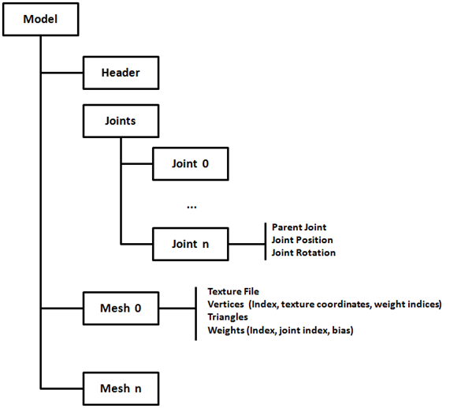

# Animations

By now we have just loaded static 3D models, in this chapter we will learn how to animate them. When thinking about animations the first approach is to create different meshes for each model positions, load them up into the GPU and draw them sequentially to create the illusion of animation. Although this approach is perfect for some games it's not very efficient (in terms of memory consumption).

This where skeletal animation comes to play. In skeletal animation the way a model animates is defined by its underlying skeleton. A skeleton is defined by a hierarchy of special points called joints. Those points are defined by their position and rotation. Since it's a hierarchy the final position for each joint is affected by their parents. For instance, think on a wrist, the position of a wrist is modified if a character moves the elbow and also if it moves the shoulder.

Joints do not need to represent a physical bone or articulation, they are artifacts that allows the creatives to model an animation. Besides joints we still have vertices, the points that define the triangles that compose a 3D model. But, in skeletal animation, vertices are drawn based on the position of the joints it is related to.

In this chapter we will use MD5 format to load animated models. MD5 format was create by ID Software, the creators of Doom, and it’s basically a text based file format which is well understood.  Another approach would be to use the [Collada](https://en.wikipedia.org/wiki/COLLADA) format, which is a public standard supported by many tools. Collada is an XML based format but as a downside it’s very complex (The specification for the 1.5 version has more than 500 pages). So, we will stick which a much more simple format, MD5, that will allow us to focus in the concepts of the skeletal animation and to create a working sample.

You can also export some models from Blnder to MD5 format via specific addons that you can find on the Internet ([http://www.katsbits.com/tools/#md5]())

In this chapter I’ve consulted many different sources, but I  have found two that provide a very good explanation about how t create an animated model using MD5 files. Theses sources can be consulted at:
* [http://www.3dgep.com/gpu-skinning-of-md5-models-in-opengl-and-cg/](http://www.3dgep.com/gpu-skinning-of-md5-models-in-opengl-and-cg/)
* [http://ogldev.atspace.co.uk/www/tutorial38/tutorial38.html](http://ogldev.atspace.co.uk/www/tutorial38/tutorial38.html)

So let’s start by writing the code that parses MD5 files. The MD5 format defines two types of files:
* The mesh definition file: which defines the joints and the vertices and textures that compose the set of meshes that form the 3D model. This file usually has a extension named “.md5mesh”. 
* The animation definition file: which defines the animations that can be applied to the model. This file usually has a extension named “.md5anim”. 

A MD5 file is composed by a header an different sections contained between braces. Let’s start examining the mesh definition file. In the resources folder you will find several models in MD5 format. If you open one of them you can see a structure similar like this.

 

The first structure that you can find in the mesh definition file is the header. You can see below header’s content from one of the samples provided:

```text
MD5Version 10
commandline ""

numJoints 33
numMeshes 6
```

The header defines the following attributes:
* The version of the MD5 specification that it complies to.
* The command used to generate this file (from a 3D modelling tool).
* The number of Joints that are defined in the joints section
* The number of Meshes (the number of meshes sections expected).
The Joints sections defines the joints, as it names states, their positions and their relationships. A fragment of the joints section of one of the sample models is shown below.

```text
joints {
	"origin"	-1 ( -0.000000 0.016430 -0.006044 ) ( 0.707107 0.000000 0.707107 )		// 
	"sheath"	0 ( 11.004813 -3.177138 31.702473 ) ( 0.307041 -0.578614 0.354181 )		// origin
	"sword"	1 ( 9.809593 -9.361549 40.753730 ) ( 0.305557 -0.578155 0.353505 )		// sheath
	"pubis"	0 ( 0.014076 2.064442 26.144581 ) ( -0.466932 -0.531013 -0.466932 )		// origin
              ……
}
```

A Joint is defined by the following attributes:
* Joint name, a textual attribute between quotes.
* Joint parent, using an index which points to the  parent joint using its position in the joints list. The root joint has a parent equals to -1.
* Joint position, defined in  model space coordinate system.
* Joint orientation, defined also in model space coordinate system. The orientation in fact is a quaternion whose w-component is not included.

Before continuing explaining the rest of the file let’s talk about quaternions. Quaternions are four component elements that are used to represent rotation. Up to now, we have been using Euler angles (yaw, pitch roll) to define rotations, which basically define rotation around the x, y and z angles. Euler angles present some problems when working with rotations, specifically you must be aware of the correct order to apply de rotations and some operations can get very complex.
This where quaternions come to help in order to solve this complexity. As it has been said before a quaternion is defined as a set of 4 numbers (x, y, z, w). Quaternions define a rotation axis and the rotation angle around that axis.


 
You can check in the web the mathematical definition of each of the components but the good news is that JOML, the math library we are using, provides support for them. We can construct rotation matrices based on quaternions and perform some transformation to vectors with them.

Let’s get back to the joints definition, the w component is missing but it can be easily calculated with the help of the rest of the values. We will review it when the code that parses MD5 files is explained.
After the joints definition you can find the definition of the different meshes that compose a model. Below you can find a fragment of a Mesh definition form one of the samples.

```text
mesh {
	shader "/textures/bob/guard1_body.png"

	numverts 494
	vert 0 ( 0.394531 0.513672 ) 0 1
	vert 1 ( 0.447266 0.449219 ) 1 2
	...
	vert 493 ( 0.683594 0.455078 ) 864 3

	numtris 628
	tri 0 0 2 1
	tri 1 0 1 3
	...
	tri 627 471 479 493

	numweights 867
	weight 0 5 1.000000 ( 6.175774 8.105262 -0.023020 )
	weight 1 5 0.500000 ( 4.880173 12.805251 4.196980 )
	...
	weight 866 6 0.333333 ( 1.266308 -0.302701 8.949338 )
}
```

Let’s review the structure presented above:
* A Mesh starts by defining a texture file. Keep in mind that the path that you will find here is the one used by the tool that created that model. That path may not match the one that is used to load those files. You have two approaches here, either you change the base path dynamically or either you change that path by hand. I’ve chosen the last one, the simplest one.
* Next you can find the vertices definition. A vertex is defined by the following attributes:
* * Vertex index.
* * Texture coordinates.
* * The index of the first weight definition that affects this vertex.
* * The number of weights to consider.
* After the vertices, the triangles that form this mesh are defined. The triangles define the way that vertices are organized using their indices.
* Finally, the weights are defined. A Weight definition is composed by:
* * A Weight index.
* * A Joint index, that points to the joint related to this weight.
* * A bias factor, that is uses to modulate the effect of this weight.
* * A position of this weight.

The following picture tries to depict the relation between the components described above using sample data.
 


Ok, so now that we understand the mesh model file we can parse it. If you look at the source code you will see that a new package has been created to host parsers for model formats. There’s one for OBJ files under ```org.lwjglb.engine.loaders.obj``` and  the code for MD5 files is under ```org.lwjglb.engine.loaders.md5```.

All the parsing code is based on regular expressions to extract the information from the MD5 text files. The parsers will create a hierarchy of objects that mimic the structure of the information components contained in the MD5 files. It may not be the most efficient parser in the world but I think it will serve to better understand the process.

The starting class to parse a MD5 model file is ```MD5Model``` class. This class receives as a parameter in its parse method the contents of a MD5 file an creates a hierarchy that contains the header, the list of joints and the list of meshes with all the subelements. The code is very straightforward so, I won’t include it here.

A few comments about the parsing code:
* The subelements of a Mesh are defined as inner classes inside the ```MD5Mesh``` class.
* You can check how the fourth component of the joints orientation are calculated in the ```calculateQuaternion``` method form the ```MD5Utils``` class.

Now that we have parsed a file we must transform that object hierarchy into something that can be processed by the game Engine, we must create a ```GameItem``` instance. In order to do that we will  create a new class named ```MD5Loader``` that will take a ```MD5Model``` instance and will construct a ```GameItem```.

Before we start, as you noticed, a MD5 model has several Meshes, but our ```GameItem``` class only supports a single Mesh. We need to change this first, the class ```GameItem``` now looks like this.

```java
package org.lwjglb.engine.items;

import org.joml.Vector3f;
import org.lwjglb.engine.graph.Mesh;

public class GameItem {

    private Mesh[] meshes;

    private final Vector3f position;

    private float scale;

    private final Vector3f rotation;

    public GameItem() {
        position = new Vector3f(0, 0, 0);
        scale = 1;
        rotation = new Vector3f(0, 0, 0);
    }

    public GameItem(Mesh mesh) {
        this();
        this.meshes = new Mesh[]{mesh};
    }

    public GameItem(Mesh[] meshes) {
        this();
        this.meshes = meshes;
    }

    public Vector3f getPosition() {
        return position;
    }

    public void setPosition(float x, float y, float z) {
        this.position.x = x;
        this.position.y = y;
        this.position.z = z;
    }

    public float getScale() {
        return scale;
    }

    public void setScale(float scale) {
        this.scale = scale;
    }

    public Vector3f getRotation() {
        return rotation;
    }

    public void setRotation(float x, float y, float z) {
        this.rotation.x = x;
        this.rotation.y = y;
        this.rotation.z = z;
    }

    public Mesh getMesh() {
        return meshes[0];
    }
    
    public Mesh[] getMeshes() {
        return meshes;
    }

    public void setMeshes(Mesh[] meshes) {
        this.meshes = meshes;
    }

    public void setMesh(Mesh mesh) {
        if (this.meshes != null) {
            for (Mesh currMesh : meshes) {
                currMesh.cleanUp();
            }
        }
        this.meshes = new Mesh[]{mesh};
    }
}
```

With the modification above we can now define the contents for the ```MD5Loader``` class. This class will have a method named ```process``` that will receive a ```MD5Model``` instance an a default colour (for the meshes that do not define a texture) and will return a ```GameItem``` instance. The body of that method is shown below.

```java
public static GameItem process(MD5Model md5Model, Vector3f defaultColour) throws Exception {
    List<MD5Mesh> md5MeshList = md5Model.getMeshes();
    int numMeshes = md5MeshList.size();
    Mesh[] meshes = new Mesh[numMeshes];
    for (int i = 0; i < numMeshes; i++) {
        Mesh mesh = generateMesh(md5Model, md5MeshList.get(i), defaultColour);
        meshes[i] = mesh;
    }
    GameItem gameItem = new GameItem(meshes);            
        
    return gameItem;
}
```

As you can see we just iterate over the meshes defined into the ```MD5Model``` class and transform them into instances of the class ```org.lwjglb.engine.graph.Mesh``` by using the ```generateMesh``` method which is the one that really does the work. Before we examine that method we will create an inner class that will serve us to build the positions and normals array.

```java
private static class VertexInfo {

    public Vector3f position;

    public Vector3f normal;

    public VertexInfo(Vector3f position) {
        this.position = position;
        normal = new Vector3f(0, 0, 0);
    }

    public VertexInfo() {
        position = new Vector3f();
        normal = new Vector3f();
    }

    public static float[] toPositionsArr(List<VertexInfo> list) {
        int length = list != null ? list.size() * 3 : 0;
        float[] result = new float[length];
        int i = 0;
        for (VertexInfo v : list) {
            result[i] = v.position.x;
            result[i + 1] = v.position.y;
            result[i + 2] = v.position.z;
            i += 3;
        }
        return result;
    }

    public static float[] toNormalArr(List<VertexInfo> list) {
        int length = list != null ? list.size() * 3 : 0;
        float[] result = new float[length];
        int i = 0;
        for (VertexInfo v : list) {
            result[i] = v.normal.x;
            result[i + 1] = v.normal.y;
            result[i + 2] = v.normal.z;
            i += 3;
        }
        return result;
    }
}
```

Let’s get back to the ```generateMesh``` method, the first we do is get the mesh vertices information, the weights and the structure of the joints.

```java
private static Mesh generateMesh(MD5Model md5Model, MD5Mesh md5Mesh, Vector3f defaultColour) throws Exception {
    List<VertexInfo> vertexInfoList = new ArrayList<>();
    List<Float> textCoords = new ArrayList<>();
    List<Integer> indices = new ArrayList<>();

    List<MD5Mesh.MD5Vertex> vertices = md5Mesh.getVertices();
    List<MD5Mesh.MD5Weight> weights = md5Mesh.getWeights();
    List<MD5JointInfo.MD5JointData> joints = md5Model.getJointInfo().getJoints();
```

Then we need to calculate the vertices position based on the information contained in the weights and joints. This is done in the following block

```java
    for (MD5Mesh.MD5Vertex vertex : vertices) {
        Vector3f vertexPos = new Vector3f();
        Vector2f vertexTextCoords = vertex.getTextCoords();
        textCoords.add(vertexTextCoords.x);
        textCoords.add(vertexTextCoords.y);

        int startWeight = vertex.getStartWeight();
        int numWeights = vertex.getWeightCount();

        for (int i = startWeight; i < startWeight + numWeights; i++) {
            MD5Mesh.MD5Weight weight = weights.get(i);
            MD5JointInfo.MD5JointData joint = joints.get(weight.getJointIndex());
            Vector3f rotatedPos = new Vector3f(weight.getPosition()).rotate(joint.getOrientation());
            Vector3f acumPos = new Vector3f(joint.getPosition()).add(rotatedPos);
            acumPos.mul(weight.getBias());
            vertexPos.add(acumPos);
        }

       vertexInfoList.add(new VertexInfo(vertexPos));
    }
```

Let’s examine what we are doing here. We iterate over the vertices information and store the texture coordinates in a list, no need to apply any transformation here. The we get the starting and total number of weights to consider to calculate the vertex position.

The vertex position is calculated by using all the weights that is related to. Each weights has a position and a bias. The sum of all bias of the weights associated to each vertex must be equal to 1.0. Each weight also has a position which is defined in  joint’s local space, so we need to transform it to model space coordinates using the joint’s orientation and position (like if it were a transformation matrix) to which it refers to.

To sum up, the vertex position can be expressed by this formula:

$$Vpos = \sum\limits_{i=ws}^{ws + wc} (Jt_{i} \times Wp_{i}) \dot Wb_{i}$$

Where:
* The summation starts from $$ws$$ (Weight start) up to $$wc$$ (Weight count) weights.
* $$Jt_{i}$$ is the joint’s transformation matrix associated to the weight $$W_{i}$$.
* $$Wp_{i}$$ is the weight position.
* $$Wb_{i}$$ is the weight bias.

This equation is what we implement in the body of the loop (we do not have the transformation matrix since we have the joint position and rotation separately but the result is the same).

With the code above we will be able to construct the positions and texture coordinates data but we still need to build up the indices and the normals. Indices can be calculated by using the triangles information, just by iterating through the list that holds those triangles.

Normals can be calculated also using triangles information. Let $$V_{0}$$, $$V_{1}$$ and $$V_{2}$$ be the triangle vertices (in object’s model space). The normal for the triangle can be calculate according to this formula:

$$N=(V_{2}-V_{0})\times(V_{1}-V_{0})$$

Where N should be normalized after. The following figure shows the geometric interpretation of the formula above.
 
For each vertex we compute its normal by the normalized sum of all the normals of the triangles it belongs to. The code that performs those calculations is shown below.
    for (MD5Mesh.MD5Triangle tri : md5Mesh.getTriangles()) {
        indices.add(tri.getVertex0());
        indices.add(tri.getVertex1());
        indices.add(tri.getVertex2());

        // Normals
        VertexInfo v0 = vertexInfoList.get(tri.getVertex0());
        VertexInfo v1 = vertexInfoList.get(tri.getVertex1());
        VertexInfo v2 = vertexInfoList.get(tri.getVertex2());
        Vector3f pos0 = v0.position;
        Vector3f pos1 = v1.position;
        Vector3f pos2 = v2.position;

        Vector3f normal = (new Vector3f(pos2).sub(pos0)).cross(new Vector3f(pos1).sub(pos0));
        normal.normalize();

        v0.normal.add(normal).normalize();
        v1.normal.add(normal).normalize();
        v2.normal.add(normal).normalize();
     }

The we just need to transform the Lists to arrays and process the texture  information.
        float[] positionsArr = VertexInfo.toPositionsArr(vertexInfoList);
        float[] textCoordsArr = Utils.listToArray(textCoords);
        float[] normalsArr = VertexInfo.toNormalArr(vertexInfoList);
        int[] indicesArr = indices.stream().mapToInt(i -> i).toArray();
        Mesh mesh = new Mesh(positionsArr, textCoordsArr, normalsArr, indicesArr);

        handleTexture(mesh, md5Mesh, defaultColour);

        return mesh;

The texture is processed in the handleTexture method:
private static void handleTexture(Mesh mesh, MD5Mesh md5Mesh, Vector3f defaultColour) throws Exception {
    String texturePath = md5Mesh.getTexture();
    if (texturePath != null && texturePath.length() > 0) {
        Texture texture = new Texture(texturePath);
        Material material = new Material(texture);

        // Handle normal Maps;
        int pos = texturePath.lastIndexOf(".");
        if (pos > 0) {
            String basePath = texturePath.substring(0, pos);
            String extension = texturePath.substring(pos, texturePath.length());
            String normalMapFileName = basePath + NORMAL_FILE_SUFFIX + extension;
            if (Utils.existsResourceFile(normalMapFileName)) {
                Texture normalMap = new Texture(normalMapFileName);
                material.setNormalMap(normalMap);
            }
        }
        mesh.setMaterial(material);
    } else {
        mesh.setMaterial(new Material(defaultColour, 1));
    }
}

The implementation is very straight forward, the only peculiarity is that if a mesh defines a texture named “texture.png” its normal texture map will be defined in a file “texture_normal.png”. We  need to check if that file exists and load it accordingly.

We can now load a MD5 file an render it as we render other GameItems, but before doing that we need to disable cull face in order to render it properly since not all the triangles will be drawn in the correct direction. We will add support to the Window class to set these parameters at runtime (you can check it in the source code the changes).
If you load some of the sample models you will get something like this.

 

What you see here is the binding pose, it’s the static representation of the MD5 model used for the animators  to model them easily.  In order to get animation to work we must process the animation definition file.


WRITING IN PROGRESS