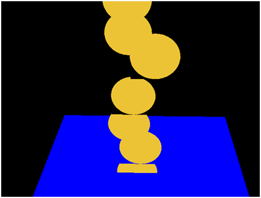
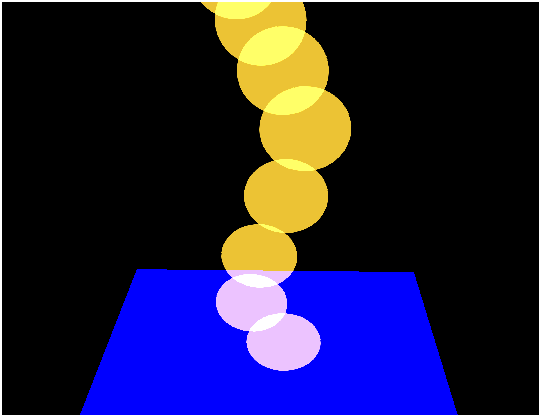
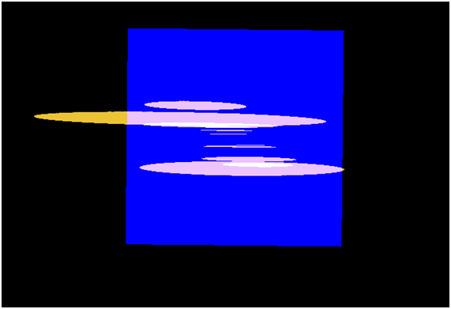
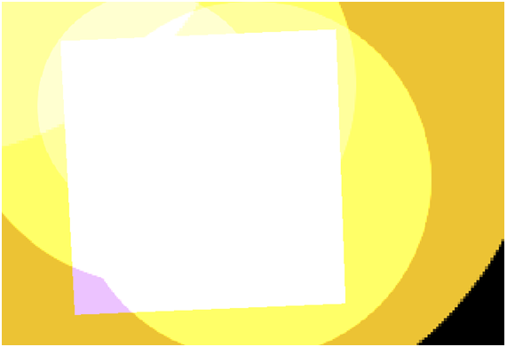
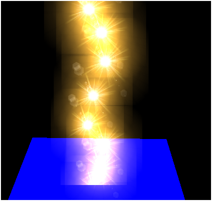
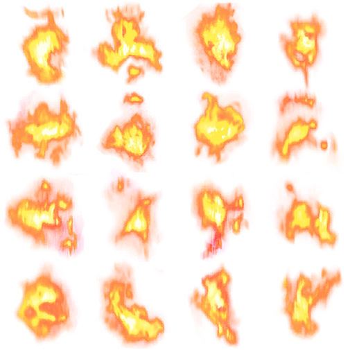

# Particles

## The basics

In this chapter we will add particle effects to the game engine. With this effect we will be able to simulate rays, fire, dust and clouds.  It’s a simple effect to implement that will improve the graphical aspect of any game.

Before we start it's worth to mention that there are many ways to implement particle effects with different results. In this case we will use billboard particles. This technique uses moving texture quads to represent a particle with the peculiarity that they are always always facing the observer, in our case, the camera. You can also use billboarding technique to show information panels over game items like a mini HUDs.

Let’s start by defining what is a particle. A particle can be defined by the following attributes:
1. A mesh that represents the quad vertices.  
2. A texture.  
3. A position at a given instant.  
4. A scale factor.  
5. Speed.  
6. A movement direction.  
7. A life time or time to live. Once this time has expired the particle ceases to exist.

The first four items are part of the `GameItem` class, but the last three are not. Thus, we will create a new class named `Particle` that extends a `GameItem` instance and that is defined like this.

```java
package org.lwjglb.engine.graph.particles;

import org.joml.Vector3f;
import org.lwjglb.engine.graph.Mesh;
import org.lwjglb.engine.items.GameItem;

public class Particle extends GameItem {

    private Vector3f speed;

    /**
     * Time to live for particle in milliseconds.
     */
    private long ttl;

    public Particle(Mesh mesh, Vector3f speed, long ttl) {
        super(mesh);
        this.speed = new Vector3f(speed);
        this.ttl = ttl;
    }

    public Particle(Particle baseParticle) {
        super(baseParticle.getMesh());
        Vector3f aux = baseParticle.getPosition();
        setPosition(aux.x, aux.y, aux.z);
        aux = baseParticle.getRotation();
        setRotation(aux.x, aux.y, aux.z);
        setScale(baseParticle.getScale());
        this.speed = new Vector3f(baseParticle.speed);
        this.ttl = baseParticle.geTtl();
    }

    public Vector3f getSpeed() {
        return speed;
    }

    public void setSpeed(Vector3f speed) {
        this.speed = speed;
    }

    public long geTtl() {
        return ttl;
    }

    public void setTtl(long ttl) {
        this.ttl = ttl;
    }

    /**
     * Updates the Particle's TTL
     * @param elapsedTime Elapsed Time in milliseconds
     * @return The Particle's TTL
     */
    public long updateTtl(long elapsedTime) {
        this.ttl -= elapsedTime;
        return this.ttl;
    }
}
```

As you can see from the code above, the particle's speed and movement direction can be expressed as a single vector. The direction of that vector models the movement direction and its module the speed. The Particle Time To Live \(TTL\) is modelled as a milliseconds counter that will be decreased whenever the game state is updated. The class has also a copy constructor, that is, a constructor that takes an instance of another Particle to make a copy.

Now, we need to create a particle generator or particle emitter, that is, a class that generates the particles dynamically, controls their life cycle and updates their position according to a specific model.  We can create many implementations that vary in how particles are created and how their positions are updated \(for instance, taking into consideration gravity or not\). So, in order to keep our game engine generic, we will create an interface that all the Particle emitters must implement. This interface, named `IParticleEmitter`, is defined like this:

```java
package org.lwjglb.engine.graph.particles;

import java.util.List;
import org.lwjglb.engine.items.GameItem;

public interface IParticleEmitter {

    void cleanup();

    Particle getBaseParticle();

    List<GameItem> getParticles();
}
```

The `IParticleEmitter` interface has a method to clean up resources, named `cleanup`, and a method to get the list of Particles, named `getParticles`. It also has a method named `getBaseParticle`, but what’s this method for? A particle emitter will create many particles dynamically. Whenever a particle expires, new ones will be created. That particle renewal cycle will use a base particle, like a pattern, to create new instances. This is what this base particle is used for, and it's also the reason why the `Particle` class defines a copy constructor.

In the game engine code we will refer only to the `IParticleEmitter` interface so the base code will not be dependent on the specific implementations. Nevertheless we can create a implementation that simulates a flow of particles that are not affected by gravity. This implementation can be used to simulate rays or fire and is named `FlowParticleEmitter`.

The behaviour of this class can be tuned with the following attributes:

* A maximum number of particles that can be alive at a time.
* A minimum period to create particles. Particles will be created one by one with a minimum period to avoid creating particles in bursts.
* A set of ranges to randomize particles speed and starting position. New particles will use  base particle position and speed which can be randomized with values between those ranges to spread the beam.

The implementation of this class is as follows:

```java
package org.lwjglb.engine.graph.particles;

import java.util.ArrayList;
import java.util.Iterator;
import java.util.List;
import org.joml.Vector3f;
import org.lwjglb.engine.items.GameItem;

public class FlowParticleEmitter implements IParticleEmitter {

    private int maxParticles;

    private boolean active;

    private final List<GameItem> particles;

    private final Particle baseParticle;

    private long creationPeriodMillis;

    private long lastCreationTime;

    private float speedRndRange;

    private float positionRndRange;

    private float scaleRndRange;

    public FlowParticleEmitter(Particle baseParticle, int maxParticles, long creationPeriodMillis) {
        particles = new ArrayList<>();
        this.baseParticle = baseParticle;
        this.maxParticles = maxParticles;
        this.active = false;
        this.lastCreationTime = 0;
        this.creationPeriodMillis = creationPeriodMillis;
    }

    @Override
    public Particle getBaseParticle() {
        return baseParticle;
    }

    public long getCreationPeriodMillis() {
        return creationPeriodMillis;
    }

    public int getMaxParticles() {
        return maxParticles;
    }

    @Override
    public List<GameItem> getParticles() {
        return particles;
    }

    public float getPositionRndRange() {
        return positionRndRange;
    }

    public float getScaleRndRange() {
        return scaleRndRange;
    }

    public float getSpeedRndRange() {
        return speedRndRange;
    }

    public void setCreationPeriodMillis(long creationPeriodMillis) {
        this.creationPeriodMillis = creationPeriodMillis;
    }

    public void setMaxParticles(int maxParticles) {
        this.maxParticles = maxParticles;
    }

    public void setPositionRndRange(float positionRndRange) {
        this.positionRndRange = positionRndRange;
    }

    public void setScaleRndRange(float scaleRndRange) {
        this.scaleRndRange = scaleRndRange;
    }

    public boolean isActive() {
        return active;
    }

    public void setActive(boolean active) {
        this.active = active;
    }

    public void setSpeedRndRange(float speedRndRange) {
        this.speedRndRange = speedRndRange;
    }

    public void update(long elapsedTime) {
        long now = System.currentTimeMillis();
        if (lastCreationTime == 0) {
            lastCreationTime = now;
        }
        Iterator<? extends GameItem> it = particles.iterator();
        while (it.hasNext()) {
            Particle particle = (Particle) it.next();
            if (particle.updateTtl(elapsedTime) < 0) {
                it.remove();
            } else {
                updatePosition(particle, elapsedTime);
            }
        }

        int length = this.getParticles().size();
        if (now - lastCreationTime >= this.creationPeriodMillis && length < maxParticles) {
            createParticle();
            this.lastCreationTime = now;
        }
    }

    private void createParticle() {
        Particle particle = new Particle(this.getBaseParticle());
        // Add a little bit of randomness of the particle
        float sign = Math.random() > 0.5d ? -1.0f : 1.0f;
        float speedInc = sign * (float)Math.random() * this.speedRndRange;
        float posInc = sign * (float)Math.random() * this.positionRndRange;        
        float scaleInc = sign * (float)Math.random() * this.scaleRndRange;        
        particle.getPosition().add(posInc, posInc, posInc);
        particle.getSpeed().add(speedInc, speedInc, speedInc);
        particle.setScale(particle.getScale() + scaleInc);
        particles.add(particle);
    }

    /**
     * Updates a particle position
     * @param particle The particle to update
     * @param elapsedTime Elapsed time in milliseconds
     */
    public void updatePosition(Particle particle, long elapsedTime) {
        Vector3f speed = particle.getSpeed();
        float delta = elapsedTime / 1000.0f;
        float dx = speed.x * delta;
        float dy = speed.y * delta;
        float dz = speed.z * delta;
        Vector3f pos = particle.getPosition();
        particle.setPosition(pos.x + dx, pos.y + dy, pos.z + dz);
    }

    @Override
    public void cleanup() {
        for (GameItem particle : getParticles()) {
            particle.cleanup();
        }
    }
}
```

Now we can extend the information contained in the `Scene` class to include an array of `ParticleEmitter` instances.

```java
package org.lwjglb.engine;

// Imports here

public class Scene {

    // More attributes here

    private IParticleEmitter[] particleEmitters;
```

At this stage we can start rendering the particles. Particles will not be affected by lights and will not cast any shadow. They will not have any skeletal animation, so it makes sense to have specific shaders to render them. The shaders will be very simple, they will just render the vertices using the projection and modelview matrices and use a texture to set the colours.

The vertex shader is defined like this.

```glsl
#version 330

layout (location=0) in vec3 position;
layout (location=1) in vec2 texCoord;
layout (location=2) in vec3 vertexNormal;

out vec2 outTexCoord;

uniform mat4 modelViewMatrix;
uniform mat4 projectionMatrix;

void main()
{
    gl_Position = projectionMatrix * modelViewMatrix * vec4(position, 1.0);
    outTexCoord = texCoord;
}
```

The fragment shader is defined like this:

```glsl
#version 330

in vec2 outTexCoord;
in vec3 mvPos;
out vec4 fragColor;

uniform sampler2D texture_sampler;

void main()
{
    fragColor = texture(texture_sampler, outTexCoord);
}
```

As you can see, they are very simple: they resemble the pair of shaders used in the first chapters. Now, as in other chapters, we need to setup and use those shaders in the `Renderer` class. The shaders' setup will be done in a method named `setupParticlesShader` which is defined like this:

```java
private void setupParticlesShader() throws Exception {
    particlesShaderProgram = new ShaderProgram();
    particlesShaderProgram.createVertexShader(Utils.loadResource("/shaders/particles_vertex.vs"));
    particlesShaderProgram.createFragmentShader(Utils.loadResource("/shaders/particles_fragment.fs"));
    particlesShaderProgram.link();

    particlesShaderProgram.createUniform("projectionMatrix");
    particlesShaderProgram.createUniform("modelViewMatrix");
    particlesShaderProgram.createUniform("texture_sampler");
}
```

And now we can create the render method named `renderParticles` in the `Renderer` class which is defined like this:

```java
private void renderParticles(Window window, Camera camera, Scene scene) {
    particlesShaderProgram.bind();

    particlesShaderProgram.setUniform("texture_sampler", 0);
    Matrix4f projectionMatrix = transformation.getProjectionMatrix();
    particlesShaderProgram.setUniform("projectionMatrix", projectionMatrix);

    Matrix4f viewMatrix = transformation.getViewMatrix();
    IParticleEmitter[] emitters = scene.getParticleEmitters();
    int numEmitters = emitters != null ? emitters.length : 0;

    for (int i = 0; i < numEmitters; i++) {
        IParticleEmitter emitter = emitters[i];
        Mesh mesh = emitter.getBaseParticle().getMesh();

        mesh.renderList((emitter.getParticles()), (GameItem gameItem) -> {
            Matrix4f modelViewMatrix = transformation.buildModelViewMatrix(gameItem, viewMatrix);
            particlesShaderProgram.setUniform("modelViewMatrix", modelViewMatrix);
        }
        );
    }
    particlesShaderProgram.unbind();
}
```

The fragment above should be self explanatory if you managed to get to this point, it just renders each particle setting up the required uniforms. We have now created all the methods we need to test the implementation of the particle effect. We just need to modify the `DummyGame` class to setup a particle emitter and the characteristics of the base particle.

```java
Vector3f particleSpeed = new Vector3f(0, 1, 0);
particleSpeed.mul(2.5f);
long ttl = 4000;
int maxParticles = 200;
long creationPeriodMillis = 300;
float range = 0.2f;
float scale = 0.5f;
Mesh partMesh = OBJLoader.loadMesh("/models/particle.obj");
Texture texture = new Texture("/textures/particle_tmp.png");
Material partMaterial = new Material(texture, reflectance);
partMesh.setMaterial(partMaterial);
Particle particle = new Particle(partMesh, particleSpeed, ttl);
particle.setScale(scale);
particleEmitter = new FlowParticleEmitter(particle, maxParticles, creationPeriodMillis);
particleEmitter.setActive(true);
particleEmitter.setPositionRndRange(range);
particleEmitter.setSpeedRndRange(range);
this.scene.setParticleEmitters(new FlowParticleEmitter[] {particleEmitter});
```

We are using a plain filled circle as the particle texture for now to better understand what’s happening. If you execute the code above you will see something like this.



Why do some particles seem to be cut off? Why the transparent background does not solve this? The reason for that is depth testing. Some fragments of the particles get discarded because they have a depth buffer value higher than the current value of the depth buffer for that zone. We can solve this by ordering the particle drawings depending in their distance to the camera or we can just disable writing to the depth buffer.

Before we draw the particles we just need to insert this line:

```java
glDepthMask(false);
```

And when we are done with rendering we restore the previous value:

```java
glDepthMask(true);
```

Then we will get something like this.


OK, problem solved. Nevertheless, we still want another effect to be applied, we would want that colours get blended so colours will be added to create better effects. This is achieved with by adding this line before rendering to setup additive blending.

```java
glBlendFunc(GL_SRC_ALPHA, GL_ONE);
```

As in the depth case, after we have rendered all the particles we restore the blending function to:

```java
glBlendFunc(GL_SRC_ALPHA, GL_ONE_MINUS_SRC_ALPHA);
```

Now we get something like this.



But we have not finished yet. If you have moved the camera over the blue square looking down you may have got something like this.



The particles do not look very good, they should look round but they resemble a sheet of paper. This point is where we should be applying the billboard technique. The quad that is used to render the particle should always be facing the camera, totally perpendicular to it as if it there was no rotation at all. The camera matrix applies translation and rotation to every object in the scene, we want to skip the rotation to be applied.

Warning: Maths ahead, you can skip it if you don't feel comfortable with this. Let’s review that view matrix once again. That matrix can be represented like this \(without any scale applied to it\).


$$
\begin{bmatrix}
\color{red}{r_{00}} & \color{red}{r_{10}} & \color{red}{r_{20}} & \color{blue}{dx} \\
\color{red}{r_{01}} & \color{red}{r_{11}} & \color{red}{r_{21}} & \color{blue}{dy} \\
\color{red}{r_{02}} & \color{red}{r_{12}} & \color{red}{r_{22}} & \color{blue}{dz} \\
0 & 0 & 0 & 1
\end{bmatrix}
$$


The red elements represent the camera rotation while the blue ones represent the translation. We need to cancel the effect of the upper left 3x3 matrix contained in the view matrix so it gets to something like this.


$$
\begin{bmatrix}
\color{red}{1} & \color{red}{0} & \color{red}{0} & \color{blue}{dx} \\
\color{red}{0} & \color{red}{1} & \color{red}{0} & \color{blue}{dy} \\
\color{red}{0} & \color{red}{0} & \color{red}{1} & \color{blue}{dz} \\
0 & 0 & 0 & 1
\end{bmatrix}
$$


So, we have a 3x3 matrix, the upper left red fragment, let's name it $$M_{r}$$ and we want it to transform it to the identify matrix: $$I$$. Any matrix multiplied by its inverse will give the identify matrix: $$M_{r} \times M_{r}^{-1} = I$$. So we just need to get the upper left 3x3 matrix from the view matrix, and multiply it by its inverse, but we can even optimize this. A rotation matrix has an interesting characteristic, its inverse coincides with its transpose matrix. That is: $$ M_{r} \times M_{r}^{-1} = M_{r} \times M_{r}^{T} = I $$. And a transpose matrix is much easier to calculate than the inverse, as it only requires swapping rows and columns.


$$
\begin{bmatrix}
r_{00} & r_{10} & r_{20} \\
r_{01} & r_{11} & r_{21} \\
r_{02} & r_{12} & r_{22}
\end{bmatrix}^{T} 
=
\begin{bmatrix}
r_{00} & r_{01} & r_{02} \\
r_{10} & r_{11} & r_{12} \\
r_{20} & r_{21} & r_{22}
\end{bmatrix}
$$


OK, let's summarize. We have this transformation: $$V \times M$$, where $$V$$ is the view matrix and $$M$$ is the model matrix. We can write that expression like this:


$$
\begin{bmatrix}
\color{red}{v_{00}} & \color{red}{v_{10}} & \color{red}{v_{20}} & v_{30} \\
\color{red}{v_{01}} & \color{red}{v_{11}} & \color{red}{v_{21}} & v_{31} \\
\color{red}{v_{02}} & \color{red}{v_{12}} & \color{red}{v_{22}} & v_{32} \\
v_{03} & v_{13} & v_{23} & v_{33}
\end{bmatrix}
\times
\begin{bmatrix}
\color{red}{m_{00}} & \color{red}{m_{10}} & \color{red}{m_{20}} & m_{30} \\
\color{red}{m_{01}} & \color{red}{m_{11}} & \color{red}{m_{21}} & m_{31} \\
\color{red}{m_{02}} & \color{red}{m_{12}} & \color{red}{m_{22}} & m_{32} \\
m_{03} & m_{13} & m_{23} & m_{33}
\end{bmatrix}
$$


We want to cancel the rotation of the view matrix, to get something like this:


$$
\begin{bmatrix}
\color{red}{1} & \color{red}{0} & \color{red}{0} & mv_{30} \\
\color{red}{0} & \color{red}{1} & \color{red}{0} & mv_{31} \\
\color{red}{0} & \color{red}{0} & \color{red}{1} & mv_{32} \\
mv_{03} & mv_{13} & mv_{23} & mv_{33}
\end{bmatrix}
$$


So we just need to set the upper left 3x3 matrix for the model matrix as the transpose matrix of the 3x3 upper part of the view matrix:


$$
\begin{bmatrix}
\color{red}{v_{00}} & \color{red}{v_{10}} & \color{red}{v_{20}} & v_{30} \\
\color{red}{v_{01}} & \color{red}{v_{11}} & \color{red}{v_{21}} & v_{31} \\
\color{red}{v_{02}} & \color{red}{v_{12}} & \color{red}{v_{22}} & v_{32} \\
v_{03} & v_{13} & v_{23} & v_{33}
\end{bmatrix}
\times
\begin{bmatrix}
\color{red}{v_{00}} & \color{red}{v_{01}} & \color{red}{v_{02}} & m_{30} \\
\color{red}{v_{10}} & \color{red}{v_{11}} & \color{red}{v_{12}} & m_{31} \\
\color{red}{v_{20}} & \color{red}{v_{21}} & \color{red}{v_{22}} & m_{32} \\
m_{03} & m_{13} & m_{23} & m_{33}
\end{bmatrix}
$$


But, after doing this, we have removed the scaling factor, indeed what we do really want to achieve is something like this:

$$\begin{bmatrix}
\color{red}{sx} & \color{red}{0} & \color{red}{0} & mv_{30} \\
\color{red}{0} & \color{red}{sy} & \color{red}{0} & mv_{31} \\
\color{red}{0} & \color{red}{0} & \color{red}{sz} & mv_{32} \\
mv_{03} & mv_{13} & mv_{23} & mv_{33}
\end{bmatrix}$$

Where sx, sy and sz are the scaling factor. Thus, after we have set set the upper left 3x3 matrix for the model matrix as the transpose matrix of the view matrix, we need to apply scaling again.

And that's all, we just need to change this in the `renderParticlesMethod` like this:

```java
        for (int i = 0; i < numEmitters; i++) {
            IParticleEmitter emitter = emitters[i];
            Mesh mesh = emitter.getBaseParticle().getMesh();

            mesh.renderList((emitter.getParticles()), (GameItem gameItem) -> {
                Matrix4f modelMatrix = transformation.buildModelMatrix(gameItem);

                viewMatrix.transpose3x3(modelMatrix);

                Matrix4f modelViewMatrix = transformation.buildModelViewMatrix(modelMatrix, viewMatrix);
                modelViewMatrix.scale(gameItem.getScale());
                particlesShaderProgram.setUniform("modelViewMatrix", modelViewMatrix);
            }
            );
        }
```

We also have added another method to the `Transformation` class to construct a model view matrix using two matrices instead of a `GameItem` and the view matrix.

With that change, when we look at the particles from above we get something like this.



Now we have everything we need to create a more realistic particle effect so let's change the texture to something more elaborated. We will use this image \(it was created with [GIMP](https://www.gimp.org/) with the lights and shadows filters\).


With this texture, we will get something like this.



Much better! You may notice that we need to adjust the scale, since particles are now always facing the camera the displayed area is always the maximum.

Finally, another conclusion, to get perfect results which can be used in any scene you will need to implement particle ordering and activate depth buffer. In any case, you have here a sample to include this effect in your games.

## Texture Atlas

Now that we have set the basic infrastructure for particle effect we can add some animation effects to it. In order to achieve that, we are going to support texture atlases. A texture atlas is a large image that contains all the textures that will be used. With a texture atlas we need only to load a large image and then while drawing the game items we select the portions of that image to be used as our texture. This technique can be applied for instance when we want to represent the same model many times with different textures \(think for instance about trees, or rocks\). Instead of having many texture instances and switching between them \(remember that switching states are always slow\) we can use the same texture atlas and just select the appropriate coordinates.

In this case, we are going to use texture coordinates to animate particles. We will iterate over different textures to model a particle animation. All those textures will be grouped into a texture atlas which looks like this.



The texture atlas can be divided into quad tiles. We will assign a tile position to a particle and will change it over time to represent animation. So let’s get on it. The first thing that we are going to do is modifying the `Texture` class to specify the number of rows and columns that a texture atlas can have.

```java
package org.lwjglb.engine.graph;

// .. Imports here ..

public class Texture {

    // More attributes here
    private int numRows = 1;

    private int numCols = 1;

   // More code here

    public Texture(String fileName, int numCols, int numRows) throws Exception  {
        this(fileName);
        this.numCols = numCols;
        this.numRows = numRows;
    }
```

The default case is to have a texture with a number of columns and rows equal to 1, that is, the textures we have dealing with. We also add another constructor to be able to specify the rows and columns.

Then we need to keep track the position in the texture atlas for a `GameItem`, so we just add another attribute to that class with a default value equal to 0.

```java
package org.lwjglb.engine.items;

import org.joml.Vector3f;
import org.lwjglb.engine.graph.Mesh;

public class GameItem {

    // More attributes here

    private int textPos;
```

Then we will modify the `Particle` class to be able to iterate automatically through a texture atlas.

```java
package org.lwjglb.engine.graph.particles;

import org.joml.Vector3f;
import org.lwjglb.engine.graph.Mesh;
import org.lwjglb.engine.graph.Texture;
import org.lwjglb.engine.items.GameItem;

public class Particle extends GameItem {

    private long updateTextureMillis;

    private long currentAnimTimeMillis;
```

The `updateTextureMillis` attribute models the period of time \(in milliseconds\) to move to the next position in the texture atlas. The lowest the value the fastest the particle will roll over the textures. The `currentAnimTimeMillis` attribute just keeps track of the time that the particle has maintained a texture position.

Thus, we need to modify the `Particle` class constructor to set up those values. Also we calculate the number of tiles of the texture atlas, which is modelled by the attribute `animFrames`.

```java
public Particle(Mesh mesh, Vector3f speed, long ttl, long updateTextureMillis) {
    super(mesh);
    this.speed = new Vector3f(speed);
    this.ttl = ttl;
    this.updateTextureMills = updateTextureMills;
    this.currentAnimTimeMillis = 0;
    Texture texture = this.getMesh().getMaterial().getTexture();
    this.animFrames = texture.getNumCols() * texture.getNumRows();
}
```

Now we just need to modify the method that checks if the particle has expired to check also if we need to update the texture position.

```java
public long updateTtl(long elapsedTime) {
    this.ttl -= elapsedTime;
    this.currentAnimTimeMillis += elapsedTime;
    if ( this.currentAnimTimeMillis >= this.getUpdateTextureMillis() && this.animFrames > 0 ) {
        this.currentAnimTimeMillis = 0;
        int pos = this.getTextPos();
        pos++;
        if ( pos < this.animFrames ) {
            this.setTextPos(pos);
        } else {
            this.setTextPos(0);
        }
    }
    return this.ttl;
}
```

Beside that, we also have modified the `FlowRangeEmitter` class to add some randomness to the period of time when we should change a particle’s texture position. You can check it in the source code.

Now we can use that information to set up appropriate texture coordinates. We will do this in the vertex fragment since it outputs those values to be used in the fragment shader. The new version of that shader is defined like this.

```glsl
#version 330

layout (location=0) in vec3 position;
layout (location=1) in vec2 texCoord;
layout (location=2) in vec3 vertexNormal;

out vec2 outTexCoord;

uniform mat4 modelViewMatrix;
uniform mat4 projectionMatrix;

uniform float texXOffset;
uniform float texYOffset;
uniform int numCols;
uniform int numRows;

void main()
{
    gl_Position = projectionMatrix * modelViewMatrix * vec4(position, 1.0);

    // Support for texture atlas, update texture coordinates
    float x = (texCoord.x / numCols + texXOffset);
    float y = (texCoord.y / numRows + texYOffset);

    outTexCoord = vec2(x, y);
}
```

As you can see we have now three new uniforms. The uniforms `numCols` and `numRows` contain the number of columns and rows of the texture atlas.  In order to calculate the texture coordinates, we first must scale down these parameters. Each tile will have a width which is equal to $$1 / numCols$$ and a height which is equal to $$1 / numRows$$ as shown in the next figure.

  
Then we just need to apply and offset depending on the row and column. This is what is modelled by the `texXOffset` and `texYOffset` uniforms.

We will calculate these offsets in the `Renderer` class as shown in the next fragment. We calculate the row and column that each particle is in according to its position and calculate the offset accordingly  as a multiple of tile’s width and height.

```java
mesh.renderList((emitter.getParticles()), (GameItem gameItem) -> {
    int col = gameItem.getTextPos() % text.getNumCols();
    int row = gameItem.getTextPos() / text.getNumCols();
    float textXOffset = (float) col / text.getNumCols();
    float textYOffset = (float) row / text.getNumRows();
    particlesShaderProgram.setUniform("texXOffset", textXOffset);
    particlesShaderProgram.setUniform("texYOffset", textYOffset);
```

Note that if you only need to support perfectly square texture atlas, you will only need two uniforms. The final result looks like this.


Now we have animated particles working. In the next chapter we will learn how to optimize the rendering process. We are currently rendering multiple elements that have the same mesh and we are performing a drawing call for each of them, and in the next chapter we will learn how to do it in a single call. That technique is not only useful for particles but also for rendering scenes where multiple elements share the same model but are placed in different locations or have different textures.

