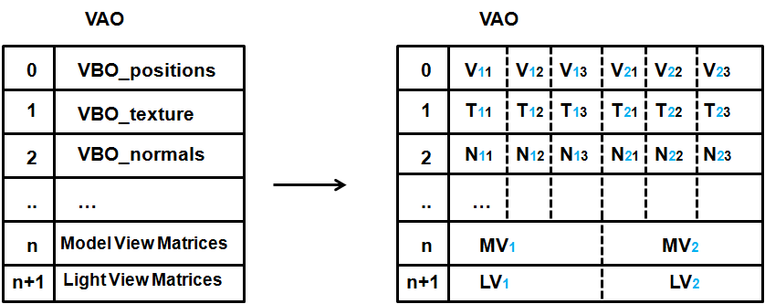

# Instanced Rendering

## Lots of Instances

When drawing a 3D scene is frequent to have many models represented by the same mesh but with different transformations. In this case, even they may be simple objects with just a few triangles, performance can suffer. The cause behind this is the way we are rendering them.

We are basically iterating through a loop and performing a call to the function glDrawElements. As it has been said in previous chapters, calls to OpenGL library should be minimized. Each call to the glDrawElements function imposes an overhead that is reperetad again and again for each GameItem instance.

When dealing with lots of similar objects it would be more efficient to render all of them using a single call. This technicque is called instanced rendering which allows us to do that, OpenGL provides functions named ```glDrawXXXInstanced``` to render a set of elements at once. They can be arrays or elements. In our case, since we are drawing elements we will use the function named glDrawElementsInstanced. This function receives the same arguments as the glDrawElements plus one additional parameter which sets the number of instances to be drawn.

This is a sample of how the glDrawElements is used.

```java
glDrawElements(GL_TRIANGLES, numVertices, GL_UNSIGNED_INT, 0)
```

And this is how the instanced version can be used:

```java
glDrawElementsInstanced(GL_TRIANGLES, numVertices, GL_UNSIGNED_INT, 0, numInstances);
```

But you may be wondering now how can you set the different transformations for each of those instances. Now, before we draw each instance we pass the different transformations and instance related data using uniforms. Before a render call is made we need to setup the specific data for each data. How can we do this when rendering all of them at once ?

When using instanced rendering, in the vertex shader we can use an input variable that holds the index of the instance that is currently being drawn. With that built-in variable we can, for instance, pass an array of uniforms containing the transformations to be applied to each instance and use a single render call.

The problem with this approach is that it’s still imposes too much overhead. Besides that, the number of uniforms that we can pass is limited. Instead of using lists of uniforms we will use instanced arrays.

If you recall from the first chapters, the data for each Mesh is defined by a set of arrays of data named VBOs. The data store in those VBOs is unique per Mesh instance.


With standard VBOs, inside a shader, we can access the data ssociated to each vertex \(its position, colour, textue, etc.\). Whenever the shader is run, the input variables are set to point to the specific vertex data. With instanced arrays we set up data that is changed per instance. With this schema we can still use regular VBOs to store per vertex information and use instanced and can create VBOs that contain per instance data such as model view matrices.


The next figure shows a Mesh composed by three per vetex VBOs definig the positions, texures and normals. The first index of each of those elements is the instance that it belongs to (in blue colour). The second index represents the position inside a instance.

The Mesh is also defined by two per instance VBOs. One for the model view matrix and the other one for the light view matrix. When rendering the vertices for the firs instance (the 1X, ones), the model view and light view matrices will be the same (the 1). When vertices of the second instance are to be rendered the second model view and light view matrices will be used.
 


In order to define per instance data we need to call the function ```glVertexAttribDivisor``` after defining vertex attributes. This function receives two parameters:

* index: The index of the vertex attribute \(as issued in the glVertexAttribPointer function\).

* Divisor: If this vale contains zero, the data is changed for each vertex while rendering. If it is set to one, the data changes once per instance. If it’s set to two it changes every two instances, etc.


So, in order to set data for a instance we need to perform this call after every attribute definition:


```java
glVertexAttribPointer(index, 1);
```

Let’s start changing our code base to support instanced rendering. The first step is to create a new class named ```InstancedMesh``` that inherits from the ```Mesh``` class. The constructor of this class will be similar to the similar to the Mesh one but with an extra parameter, the number of instances.

In the constructor, besides relaying in super’s constructor, we will create two new VBOs, one for the model view matrix and other for the light view matrix. The code for creating the model view matrix is presented below.

```java
modelViewVBO = glGenBuffers();
vboIdList.add(modelViewVBO);
this.modelViewBuffer = BufferUtils.createFloatBuffer(numInstances * MATRIX_SIZE_FLOATS);
glBindBuffer(GL_ARRAY_BUFFER, modelViewVBO);
int start = 5;
for (int i = 0; i < 4; i++) {
    glVertexAttribPointer(start, 4, GL_FLOAT, false, MATRIX_SIZE_BYTES, i * VECTOR4F_SIZE_BYTES);
    glVertexAttribDivisor(start, 1);
    start++;
}
```

The first thing that we do is create a new VBO and create a new ```FloatBuffer``` to store the data on it. The size of that buffer is measured in floats, so it will be equal to the number of instances multipled by the size in floats of a 4x4 matrix, which is equal to 16.

Once the VBO has been bind. We start defining the attributes for it. You can see that this is done in a for loop that iterates four times. Each turn of the loop defines one vector the matrix. Why not simply defining a single attribute for the whole matrix ? The reason for that is that a vertex attribute cannot contain more than four floats. Thus, we need to split the matrix definition. Let’s refresh the parameters of the ```glVertexAttribPointer```:

* Index: The index of the element to be defined.

* Size: The number of components for this attribute. In this case it’s 4, 4 floats, which is the maximum accepted value.

* Type: The type of data \(floats in our case\).

* Normalize: If fixed-point data should be normalized or not.

* Stride: This is important to understand here, this sets the byte offsets between consecutive attributes. In this case, we need to set it to the aholw size of a amatrix in bytes. This acts like a mark that packs the data so it can be changed between vertex or instances.

* Pointer: The offset that this attribute definition applies to. In our case, we need to split the matrix definition into four calls. Each vector of the matrix increments the offset.


After defining the vertex attribute, we need to call the glVertexAttribDivisor using the same index.

The definition of the light view matrix is similar to the previous one, you can check it in the source code. Continuing with the ```InstancedMesh``` class definition it’s important to override the methods that enable the vertex attributes before rendering \(and the one that disables them after\).

```java
@Override
protected void initRender() {
    super.initRender();
    int start = 5;
    int numElements = 4 * 2;
    for (int i = 0; i < numElements; i++) {
        glEnableVertexAttribArray(start + i);
    }
}

@Override
protected void endRender() {
    int start = 5;
    int numElements = 4 * 2;
    for (int i = 0; i < numElements; i++) {
        glDisableVertexAttribArray(start + i);
    }
    super.endRender();
}
```

The InstancedMesh class defines a public method, named ```renderListInstanced```, that renders a list of game items, this method slpits the list of game items into chunks of size equal to the number of instances used to create the ```InstancedMesh```. The real rendering method is called ```renderChunkInstanced``` and is defined like this.

```java
private void renderChunkInstanced(List<GameItem> gameItems, boolean depthMap, Transformation transformation, Matrix4f viewMatrix, Matrix4f lightViewMatrix) {
    this.modelViewBuffer.clear();
    this.modelLightViewBuffer.clear();
    int i = 0;
    for (GameItem gameItem : gameItems) {
        Matrix4f modelMatrix = transformation.buildModelMatrix(gameItem);
        if (!depthMap) {
            Matrix4f modelViewMatrix = transformation.buildModelViewMatrix(modelMatrix, viewMatrix);
            modelViewMatrix.get(MATRIX_SIZE_FLOATS * i, modelViewBuffer);
        }
        Matrix4f modelLightViewMatrix = transformation.buildModelLightViewMatrix(modelMatrix, lightViewMatrix);
        modelLightViewMatrix.get(MATRIX_SIZE_FLOATS * i, this.modelLightViewBuffer);
        i++;
    }
    glBindBuffer(GL_ARRAY_BUFFER, modelViewVBO);
    glBufferData(GL_ARRAY_BUFFER, modelViewBuffer, GL_DYNAMIC_DRAW);
    glBindBuffer(GL_ARRAY_BUFFER, modelLightViewVBO);
    glBufferData(GL_ARRAY_BUFFER, modelLightViewBuffer, GL_DYNAMIC_DRAW);
    glDrawElementsInstanced(GL_TRIANGLES, getVertexCount(), GL_UNSIGNED_INT, 0, gameItems.size());
    glBindBuffer(GL_ARRAY_BUFFER, 0);
}
```

The method is quite simple, we basically iterate over the game items and calculate the model view and light view matrices. These matrices are dumped into their respective buffers. The contents of those buffers are sent to to the GPU and finally we render all of them with a single call to the ```glDrawElementsInstanced``` method.


Going back to the shaders, we need to modify the vertex shader to support instanced rendering. We will firs add new input parameters for the model and view matrices that will be passed when using instanced rendering. 

```glsl
layout (location=5) in mat4 modelViewInstancedMatrix;
layout (location=9) in mat4 modelLightViewInstancedMatrix;
```

As you can see, the model view matrix starts at location 5. Since a matrix is defined by a set of four attributes (each one containing a vector), the light view matrix starts at location 9. Since we want to use a single shader for both non instanced and instanced rendering, we will maintain the uniforms for model and light view matrices. We only need to change their names. 


```glsl
uniform int isInstanced;
uniform mat4 modelViewNonInstancedMatrix;
…
uniform mat4 modelLightViewNonInstancedMatrix;
``` 


We have created another uniform to specedify if we are using instanced rendering or not. In the case we are using instanced rendering the code is very simple, we just use the matrices from the input parameters.

```glsl
void main()
{
    vec4 initPos = vec4(0, 0, 0, 0);
    vec4 initNormal = vec4(0, 0, 0, 0);
    mat4 modelViewMatrix;
    mat4 lightViewMatrix;
    if ( isInstanced > 0 )
    {
        modelViewMatrix = modelViewInstancedMatrix;
        lightViewMatrix = modelLightViewInstancedMatrix;
        initPos = vec4(position, 1.0);
        initNormal = vec4(vertexNormal, 0.0);
    }
```

We don’t support animations for instanced rendering to simplify the example, but this technique can be perfectly used for this. 
Finally, the shader just set up appropriate values as usual.

```glsl
    vec4 mvPos = modelViewMatrix * initPos;
    gl_Position = projectionMatrix * mvPos;
    outTexCoord = texCoord;
    mvVertexNormal = normalize(modelViewMatrix * initNormal).xyz;
    mvVertexPos = mvPos.xyz;
    mlightviewVertexPos = orthoProjectionMatrix * lightViewMatrix * initPos;
    outModelViewMatrix = modelViewMatrix;
}
```

Of course, the Renderer has been modified to support the uniforms changes and to separate the rendering of non instanced meshes from the instanced one. You can check the changes in the source code. 

In addition to that some optimizations have been added to the source code by the JOML author [Kai Burjack](https://github.com/httpdigest). These optimizations have been applied to the Transformation class and is summarized in the following list:
* Removed redundant calls to set up matrices with identity values.
* Use quaternions for rotations which are more efficient.
* Use specific methods for rotating and translating matrices which are optimized for those operations.

 ## Particles revisited

With the support of instanced renderding we can also improve the performance for the particles rendering. Particles are the best use case for this.

In order to support particles we must prvide support for texture atlas. This can be achived by adding a new VBO with textre offsets for instanced rendering. But, instead of adding a new VBO we will set all the instance attributes inside a single VBO. The next figure shows the concept. We are packing up all the attributes inside a single VBO. The values will change per each instance.

*** IMAGE ***

 

**CHAPTER IN PROGRESS**
