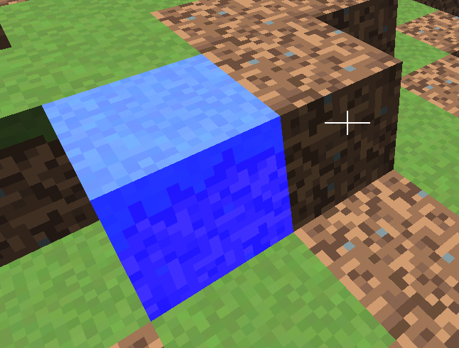

# 3D Object Picking

## Camera Selection

One of the key aspects of every game is the ability to interact with the environment. This capability requires to be able to select objects in the 3D scene. In this chapter we will explore how this can be achieved.

Before we start talking about the steps to be performed to select objects, we need a way to represent selected objects. Thus, the first thing that we must do, is add another attribute to the `GameItem` class, which will allow us to tag selected objects:

```java
private boolean selected;
```

Then we need to be able to use that value in the scene shaders. Let’s start with the fragment shader (```scene_fragment.fs```). In this case, we will assume that we receive a flag, from the vertex shader, that will determine if the fragment to be rendered belongs to a selected object or not.

```glsl
in float outSelected;
```

Then, at the end of the fragment shader, we will modify the final fragment colour, by setting the blue component to $$1$$ if it’s selected.

```glsl
if ( outSelected > 0 ) {
    fragColor = vec4(fragColor.x, fragColor.y, 1, 1);
}
```

Then, we need to be able to set that value for each `GameItem`. If you recall from previous chapters we have two scenarios:

* Rendering of non instanced meshes.
* Rendering of instanced meshes.

In the first case, the data for each ```GameItem``` is passed through uniforms, so we just need to add a new uniform for that in the vertex shader. In the second case, we need to create a new instanced attribute. You can see bellow the additions that need to be integrated into the vertex shader for both cases.

```glsl
layout (location=14) in float selectedInstanced;
...
uniform float selectedNonInstanced;
...
    if ( isInstanced > 0 )
    {
        outSelected = selectedInstanced;
...
    }
    else
    {
    outSelected = selectedNonInstanced;
...
```

Now that the infrastructure has been set up, we just need to define how objects will be selected. Before we continue, if you look at the source code you may notice that the View matrix is now stored in the ```Camera``` class. This is due to the fact that we are recalculating the view matrix in several classes in the source code. Previously it was stored in the ```Transformation``` and in the ```SoundManager``` classes. In order to calculate intersections we would need to create another replica. Instead of that, we centralize that in the ```Camera``` class. This change also requires that the view matrix is updated in our main game loop.

Let’s continue with the picking discussion. In this sample, we will follow a simple approach, selection will be done automatically using the camera. The closest object to where the camera is facing will be selected. Let’s discuss how this can be done.

The following picture depicts the situation we need to solve.


We have the camera, placed in some coordinates in world-space, facing a specific direction. Any object that intersects with a ray cast from camera’s position following camera’s forward direction will be a candidate. Between all the candidates we just need to chose the closest one.

In our sample, game items are cubes, so we need to calculate the intersection of the camera’s forward vector with cubes. It may seem to be a very specific case, but indeed is very frequent. In many games, the game items have associated what’s called a bounding box. A bounding box is a rectangle box, that contains all the vertices for that object. This bounding box is used also, for instance, for collision detection. In fact, in the animation chapter, you saw that each animation frame defined a bounding box, that helps to set the boundaries at any given time.

So, let’s start coding. We will create a new class named ```CameraBoxSelectionDetector```, which will have a method named ```selectGameItem``` which will receive a list of game items and a reference to the camera. The method is defined like this.

```java
public void selectGameItem(GameItem[] gameItems, Camera camera) {
    GameItem selectedGameItem = null;
    float closestDistance = Float.POSITIVE_INFINITY;

    dir = camera.getViewMatrix().positiveZ(dir).negate();
    for (GameItem gameItem : gameItems) {
        gameItem.setSelected(false);
        min.set(gameItem.getPosition());
        max.set(gameItem.getPosition());
        min.add(-gameItem.getScale(), -gameItem.getScale(), -gameItem.getScale());
        max.add(gameItem.getScale(), gameItem.getScale(), gameItem.getScale());
        if (Intersectionf.intersectRayAab(camera.getPosition(), dir, min, max, nearFar) && nearFar.x < closestDistance) {
            closestDistance = nearFar.x;
            selectedGameItem = gameItem;
        }
    }

    if (selectedGameItem != null) {
        selectedGameItem.setSelected(true);
    }
}
```

The method iterates over the game items trying to get the ones that intersect with the ray cast from the camera. It first defines a variable named ```closestDistance```. This variable will hold the closest distance. For game items that intersect, the distance from the camera to the intersection point will be calculated, If it’s lower than the value stored in ```closestDistance```, then this item will be the new candidate.

Before entering into the loop, we need to get the direction vector that points where the camera is facing. This is easy, just use the view matrix to get the z direction taking into consideration camera’s rotation. Remember that positive z points out of the screen, so we need the opposite direction vector, this is why we negate it.


In the game loop intersection calculations are done per each ```GameItem```. But, how do we do this? This is where the glorious [JOML](https://github.com/JOML-CI/JOML "JOML") library comes to the rescue. We are using [JOML](https://github.com/JOML-CI/JOML "JOML")’s ```Intersectionf``` class, which provides several methods to calculate intersections in 2D and 3D. Specifically, we are using the ```intersectRayAab``` method.

This method implements the algorithm that test intersection for Axis Aligned Boxes. You can check the details, as pointed out in the JOML documentation, [here](http://people.csail.mit.edu/amy/papers/box-jgt.pdf "here").

In order to use that class, we need to add another dependency to the `pom.xml` file, to include `joml-primitives` package:

```xml

```

The method tests if a ray, defined by an origin and a direction, intersects a box, defined by minimum and maximum corner. This algorithm is valid, because our cubes, are aligned with the axis, if they were rotated, this method would not work. Thus, the method receives the following parameters:

* An origin: In our case, this will be our camera position.
* A direction: This is where the camera is facing, the forward vector.
* The minimum corner of the box. In our case, the cubes are centered around the GameItem position, the minimum corner will be those coordinates minus the scale. (In its original size, cubes have a length of 2 and a scale of 1).
* The maximum corner. Self explanatory.
* A result vector. This will contain the near and far distances of the intersection points.

The method will return true if there is an intersection. If true, we check the closes distance and update it if needed, and store a reference of the candidate selected ```GameItem```. The next figure shows all the elements involved in this method.


Once the loop has finished, the candidate ```GameItem``` is marked as selected.

And that's all. The ```selectGameItem``` will be invoked in the update method of the DummyGame class, along with the view matrix update.

```java
// Update view matrix
camera.updateViewMatrix();

// Update sound listener position;
soundMgr.updateListenerPosition(camera);

this.selectDetector.selectGameItem(gameItems, camera);
```

Besides that, a cross-hair has been added to the rendering process to check that everything is working properly. The result is shown in the next figure.


Obviously, the method presented here is far from optimal but it will give you the basics to develop more sophisticated methods on your own. Some parts of the scene could be easily discarded, like objects behind the camera, since they are not going to be intersected. Besides that, you may want to order your items according to the distance to the camera to speed up calculations. In addition to that, calculations only need to be done if the camera has moved or rotated from previous update.

## Mouse Selection

Object picking with the camera is great, but what if we want to be able to freely select objects with the mouse? In this case, we want that, whenever the user clicks on the screen, the closest object is automatically selected.

The way to achieve this is similar to the method described above. In the previous method we had the camera position and generated rays from it using the “forward” direction according to camera’s current orientation. In this case, we still need to cast rays, but the direction points to a point far away from the camera, where the click has been made. In this case, we need to calculate that direction vector using the click coordinates.

But, how do we pass from a $$(x,y)$$ coordinates in viewport space to world space? Let’s review how we pass from model space coordinates to view space. The different coordinate transformations that are applied in order to achieve that are:

* We pass from model coordinates to world coordinates using the model matrix.
* We pass from world coordinates to view space coordinates using the view matrix (that provides the camera effect)-
* We pass from view coordinates to homogeneous clip space by applying the perspective projection matrix.
* Final screen coordinates are calculate automatically by OpenGL for us. Before doing that, it passes to normalized device space (by dividing the $$x, y,z$$ coordinates by the $$w$$ component) and then to $$x,y$$ screen coordinates.

So we need just to perform the traverse the inverse path to get from screen coordinates $$(x,y)$$, to world coordinates.

The first step is to transform from screen coordinates to normalized device space. The $$(x, y)$$ coordinates in the view port space are in the range $$[0, screen width]$$ $$[0, screen height]$$. The upper left corner of the screen has a coordinate of $$(0, 0)$$. We need to transform that into coordinates in the range $$[-1, 1]$$.


The maths are simple:

$$x = 2 \cdot screen_x / screenwidth - 1$$

$$y = 1 - 2 * screen_y / screenheight$$

But, how do we calculate the $$z$$ component? The answer is simple, we simply assign it the $$-1$$ value, so that the ray points to the farthest visible distance (Remember that in OpenGL, $$-1$$ points to the screen). Now we have the coordinates in normalised device space.

In order to continue with the transformations we need to convert them to the homogeneous clip space. We need to have the $$w$$ component, that is use homogeneous coordinates. Although this concept was presented in the previous chapters, let’s get back to it. In order to represent a 3D point we just need the $$x$$, $$y$$ and $$z$$ components, but we are continuously working with an additional component, the $$w$$ component. We need this extra component in order to use matrices to perform the different transformations. Some transformations do not need that extra component but other do. For instance, the translation matrix does not work if we only have $$x$$, $$y$$ and $$z$$ components. Thus, we have added the w component and assigned them a value of $$1$$ so we can work with 4 by 4 matrices.

Besides that, most of transformations, or to be more precise, most of the transformation matrices do not alter the $$w$$ component. An exception to this is the projection matrix. This matrix changes the $$w$$ value to be proportional to the $$z$$ component.

Transforming from homogeneous clip space to normalized device coordinates is achieved by dividing the $$x$$, $$y$$ and $$z$$ components by $$w$$. As this component is proportional to the z component, this implies that distant objects are drawn smaller. In our case we need to do the reverse, we need to unproject, but since what we are calculating is a ray we just simply can ignore that step, set the $$w$$ component to $$1$$ and leave the rest of the components at their original value.

Now we need to go back to view space. This is easy, we just need to calculate the inverse of the projection matrix and multiply it by our 4 components vector. Once we have done that, we need to transform them to world space. Again, we just need to use the view matrix, calculate its inverse and multiply it by our vector.

Remember that we are only interested in directions, so, in this case we set the $$w$$ component to $$0$$. Also we can set the $$z$$ component again to $$-1$$, since we want it to point towards the screen. Once we have done that and applied the inverse view matrix we have our vector in world space. We have our ray calculated and can apply the same algorithm as in the case of the camera picking.

We have created a new class named `MouseBoxSelectionDetector` that implements the steps described above. Besides that, we have moved the projection matrix to the `Window` class so we can use them in several places of the source code, and refactored a little bit the `CameraBoxSelectionDetector` so the `MouseBoxSelectionDetector` can inherit from it and use the collision detection method. You can check the source code directly, since the implementation is very simple.

The result now looks like this.



You just need to click over the block with the mouse left button to perform the selection.

In any case, if you can consult the details behind the steps explained here in an [excellent article](https://capnramses.github.io//opengl/raycasting.html "excellent article") with very detailed sketches of the different steps involved.
