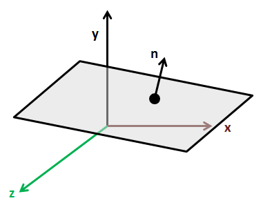

# Optimizations - Frustum Culling \(I\)

At this moment we are using many different graphic effects, such as lights, particles, etc. In addition to that, we have learned how to instanced rendering to reduce the overhead of drawing many similar objects. However, we still have plenty of room for applying simple optimization techniques that will increase the Frames Per Second \(FPS\) that we can achieve.

You may have wondered why are we drawing the whole list of GameItems every frame even if some of them will not be visible \(because they are behind the camera or too far away\). You may even think that this is handled automatically handled by OpenGL, and some way you are true. OpenGL will discard the rendering of vertices that fall off the visible area. This called clipping. The issue with clipping is that it’s done per vertex, after the vertex shader has been executed. Hence, even this operation saves resources, we can be more efficient by not trying to render objects that will not be visible. We would not be wasting resources by sending the data to the GPU and by performing transformations for every vertex that is part of those objects. We need to remove the objects that do are not contained into the view frustum, that is, we need to perform frustum culling.

But, first let’s review what is the view frustum. The view frustum is a volume that contains every object that may be visible taking into consideration the camera position and rotation and the projection that we are using. Typically, the view frustum is a rectangular pyramid like shown in the next figure.


As you can see, the view frustum is defined by six planes, anything that lies outside the view frustum will not be rendering. So, frustum culling is the process of removing objects that are outside the view frustum.

Thus, in order to perform frustum culling we need to:

* Calculate frustum planes using the data contained in the view and projection matrices.

* For every GameItem, check if its contained inside that view frustum, that is, contained between the size frustum planes, and eliminate the ones that lie outside from the rendering process.


So let’s start by calculating the frustum planes. A plane, is defined by a point contained in it and a vector orthogonal to that plane, as shown in the next figure:



The equation of a plane is defined like this:

$$Ax+By+Cz+D=0$$

Hence, we need to calculate the six plane equations for the six sides of our view frustum. In order to to that you basically have two options. You can perform tedious calculations that will get you the six plane equations, that this, the four constants \(A, B, C and D\) from the previous equation. The other option is to let [JOML ](https://github.com/JOML-CI/JOML "JOML")library to calculate this for you. In this case, we will chose the last option.

So let’s start coding. We will create a new class named `FrustumCullingFilter` which will perform, as its name states, filtering operations according to the view frustum.

```java
public class FrustumCullingFilter {

    private static final int NUM_PLANES = 6;

    private final Matrix4f prjViewMatrix;

    private final Vector4f[] frustumPlanes;

    public FrustumCullingFilter() {
        prjViewMatrix = new Matrix4f();
        frustumPlanes = new Vector4f[NUM_PLANES];
        for (int i = 0; i < NUM_PLANES; i++) {
            frustumPlanes[i] = new Vector4f();
        }
    }
```

The `FrustumCullingFilter` class will also have a method to calculate the plane equations called `updateFrustum` which will be called before rendering. The method is defined like this:

```java
public void updateFrustum(Matrix4f projMatrix, Matrix4f viewMatrix) {
    // Calculate projection view matrix
    prjViewMatrix.set(projMatrix);
    prjViewMatrix.mul(viewMatrix);
    // Get frustum planes
    for (int i = 0; i < NUM_PLANES; i++) {
        prjViewMatrix.frustumPlane(i, frustumPlanes[i]);
    }
}
```

First, we store a copy of the projection matrix and multiply it by the view matrix to get the projection view matrix. Then, with that transformation matrix we just simply need to invoke the `frustumPlane` method for each of the frustum planes. It’s important to note that these plane equations are expressed in world coordinates, so all the calculations need to be done in that space.

Now that we have all the planes calculated we just need to check if the `GameItem` instances are inside the frustum or not. How can we do this? Let’s first examine how we can check if a point is inside the frustum. We can achieve that by calculating the signed distance of the point to each of the planes. If the distance of the point to the plane is positive, this means that the point is in front of the plane \(according to its normal\). If it’s negative, this means that the point is behind the plane.


Therefore, a point will be inside the view frustum if the distance to all the planes of the frustum is positive. The distance of a point to the plane is defined like this:

$$dist=Ax_{0}+By_{0}+Cz_{0}+D$$, where $$x_{0}$$, $$y_{0}$$ and $$z_{0}$$ are the coordinates of the point.

So, a point is behind the plane if $$Ax_{0}+By_{0}+Cz_{0}+D <= 0$$.

But we do not have points, we have complex meshes, we cannot just use a point to check if an object is inside a frustum or not. You may think in checking every vertex of the `GameItem` and see if it’s inside the frustum or not. If any of the points is inside, the GameItem should be drawn. But this what OpenGL does in fact when clipping, this is what we are tying to avoid. Remember that frustum culling benefits will be more noticeable the more complex the meshes to be rendered are.

We need to enclose every `GameItem` into a simple volume that is easy to check. Here we have basically two options:

* Bounding boxes.

* Bounding spheres.

In this case, we will use spheres, since is the most simple approach. We will enclose every `GameItem` into a sphere and will check if the sphere is inside the view frustum or not. In order to do that, we just need the center and the radius of the sphere. The checks are almost equal to the point case, except that we need to take the radius into consideration. A sphere will be outside the frustum if it the following condition is met: $$dist=Ax_{0}+By_{0}+Cz_{0} <= -radius$$.


So, we will add a new method to the `FrustumCullingFilter` class to check if a sphere is inside the frustum or not. The method is defined like this.

```java
public boolean insideFrustum(float x0, float y0, float z0, float boundingRadius) {
    boolean result = true;
    for (int i = 0; i < NUM_PLANES; i++) {
        Vector4f plane = frustumPlanes[i];
        if (plane.x * x0 + plane.y * y0 + plane.z * z0 + plane.w <= -boundingRadius) {
            result = false; return result;
        }
    }
    return result;
}
```

Then, we will add method that filters the GameItems that outside the view frustum:

```java
public void filter(List<GameItem> gameItems, float meshBoundingRadius) {
    float boundingRadius;
    Vector3f pos;
    for (GameItem gameItem : gameItems) {
        boundingRadius = gameItem.getScale() * meshBoundingRadius;
        pos = gameItem.getPosition();
        gameItem.setInsideFrustum(insideFrustum(pos.x, pos.y, pos.z, boundingRadius));
    }
}
```

We have added a new attribute, `insideFrustum`, to the `GameItem` class, to track the visibility. As you can see, the radius of the bounding sphere is passed as parameter This is due to the fact that the bounding sphere is associated to the `Mesh`, it’s not a property of the `GameItem`. But, remember that we must operate in world coordinates, and the radius of the bounding sphere will be in model space. We will transform it to world space by applying the scale that has been set up for the `GameItem`, We are assuming also that the position of the `GameItem` is the centre of the sphere \(in world space coordinates\).

The last method, is just a utility one, that accepts the map of meshes and filters all the `GameItem` instances contained in it.

```java
public void filter(Map<? extends Mesh, List<GameItem>> mapMesh) {
    for (Map.Entry<? extends Mesh, List<GameItem>> entry : mapMesh.entrySet()) {
        List<GameItem> gameItems = entry.getValue();
        filter(gameItems, entry.getKey().getBoundingRadius());
    }
}
```

And that’s it. We can use that class inside the rendering process. We just need to update the frustum planes, calculate which GameItems are visible and filter them out when drawing instanced and non instanced meshes.

```java
frustumFilter.updateFrustum(window.getProjectionMatrix(), camera.getViewMatrix());
frustumFilter.filter(scene.getGameMeshes());
frustumFilter.filter(scene.getGameInstancedMeshes());
```

You can play with activating and deactivating the filtering and can check the increase and decrease in the FPS that you can achieve. Particles are not considered in the filtering, but it's trivial to add it. In any case, for particles, it may be better to just check the position of the emitter instead of checking every particle.

# Optimizations - Frustum Culling \(II\)

Once the basis of frustum culling has been explained, we can get advantage of more refined methods that the [JOML](https://github.com/JOML-CI/JOML "JOML") library provides. In particular, it provides a class named `FrustumIntersection` which extracts the planes of the view frustum in a more efficient way as described in this [paper](http://gamedevs.org/uploads/fast-extraction-viewing-frustum-planes-from-world-view-projection-matrix.pdf "paper"). Besides that, this class also provides methods for testing bounding boxes, points and spheres.

So, let's change the `FrustumCullingFilter` class. The attributes and constructor are simplified like this:

```java
public class FrustumCullingFilter {

    private final Matrix4f prjViewMatrix;

    private FrustumIntersection frustumInt;

    public FrustumCullingFilter() {
        prjViewMatrix = new Matrix4f();
        frustumInt = new FrustumIntersection();
    }
```

The `updateFrustum` method just delegates the plane extraction to the `FrustumIntersection` instance.

```java
public void updateFrustum(Matrix4f projMatrix, Matrix4f viewMatrix) {
    // Calculate projection view matrix
    prjViewMatrix.set(projMatrix);
    prjViewMatrix.mul(viewMatrix);
    // Update frustum intersection class
    frustumInt.set(prjViewMatrix);
}
```

And the method that `insideFrustum` method is even simpler:

```java
public boolean insideFrustum(float x0, float y0, float z0, float boundingRadius) {
    return frustumInt.testSphere(x0, y0, z0, boundingRadius);
}
```

With this approach you will even be able to get a few more FPS. Besides that, a global flag has been added to the `Window` class to enable / disable frustum culling. The `GameItem` class also has a flag for enabling / disabling the filtering, because there may be some items for which frustum culling filtering does not make sense.

