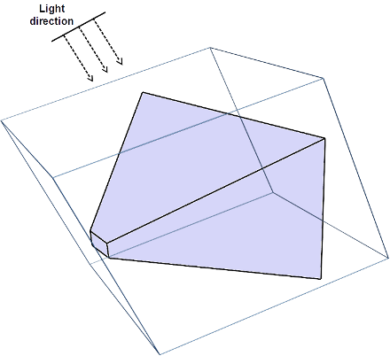
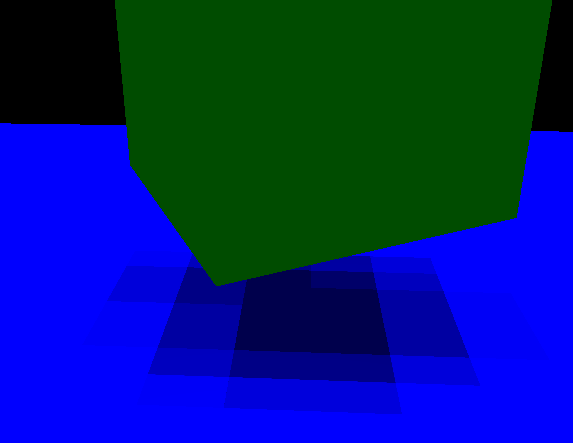

# Cascaded Shadow Maps

In the shadows chapter we presented the shadow map technique to be able to display shadows using directional lights when rendering a 3D scene. The solution presented there, required you to manually tweak some of the parameters in order to improve the results. In this chapter we are going to change that technique to automate all the process and to improve the results for open spaces. In order to achieve that goal we are going to use a technique called Cascaded Shadow Maps \(CSM\).

Let’s first start by examining how we can automate the construction of the light view matrix and the orthographic projection matrix used to render the shadows. If you recall from the shadows chapter, we need to draw the scene from the light’s perspective. This implies the creation of a light view matrix, which acts like a camera for light and a projection matrix. Since light is directional, and is supposed to be located at the infinity, we chose an orthographic projection.

We want all the visible objects to fit into the light view projection matrix. Hence, we need to fit the view frustum into the light frustum. The following picture depicts what we want to achieve.



How can we construct that? The first step is to calculate the frustum corners of the view projection matrix. We get the coordinates in world space. Then we calculate the centre of that frustum. This can be calculating by adding the coordinates for all the corners and dividing the result by the number of corners.


With that information we can set the position of the light. That position and its direction will be used to construct the light view matrix. In order to calculate the position, we start from the centre of the view frustum obtained before. We then go back to the direction of light an amount equal to the distance between the near and far z planes of the view frustum.


Once we have constructed the light view matrix, we need to setup the orthographic projection matrix. In order to calculate them we transform the frustum corners to light view space, just by multiplying them by the light view matrix we have just constructed. The dimensions of that projection matrix will be minimum and maximum x and y values. The near z plane can be set up to the same value used by our standard projection matrices and the far value will be the distance between the maximum and minimum z values of the frustum corners in light view space.

However, if you implement the algorithm described above over the shadows sample, you may be disappointed by the shadows quality.



The reason for that is that shadows resolution is limited by the texture size. We are covering now a potentially huge area, and textures we are using to store depth information have not enough resolution in order to get good results. You may think that the solution is just to increase texture resolution, but this is not sufficient to completely fix the problem. You would need huge textures for that.

There’s a smarter solution for that. The key concept is that, shadows of objects that are closer to the camera need to have a higher quality than shadows for distant objects. One approach could be to just render shadows for objects close to the camera, but this would cause shadows to appear / disappear as long as we move through the scene.

The approach that Cascaded Shadow Maps \(CSMs\) use is to divide the view frustum into several splits. Splits closer to the camera cover a smaller amount spaces whilst distant regions cover a much wider region of space. The next figure shows a view frustum divided into three splits.


For each of these splits, the depth map is rendered, adjusting the light view and projection matrices to cover fit to each split. Thus, the texture that stores the depth map covers a reduced area of the view frustum. And, since the split closest to the camera covers less space, the depth resolution is increased.

As it can be deduced from the explanation above, we will need as many depth textures as splits, and we will also change the light view and projection matrices for each of the. Hence, the steps to be done in order to apply CSMs are:

* Divide the view frustum into n splits.

* While rendering the depth map, for each split:

  * Calculate light view and projection matrices.

  * Render the scene from light’s perspective into a separate depth map

* While rendering the scene:

  * Use the depths maps calculated above.

  * Determine the split that the fragment to be drawn belongs to.

  * Calculate shadow factor as in shadow maps.

As you can see, the main drawback of CSMs is that we need to render the scene, from light’s perspective, for each split. This is why is often only used for open spaces. Anyway, we will see how we can easily reduce that overhead.

So let’s start examining the code, but before we continue a little warning, I will not include the full source code here since it would be very tedious to red. Instead, I will present the main classes their responsibilities and the fragments that may require further explanation in order to get a good understanding. All the shading related classes have been moved to a new package called `org.lwjglb.engine.graph.shadow`.

The code that renders shadows, that is, the scene from light’s perspective has been moved to the `ShadowRenderer` class. \(That code was previously contained in the `Renderer` class\).

The class defines the following constants:

```java
public static final int NUM_CASCADES = 3;
public static final float[] CASCADE_SPLITS = new float[]{Window.Z_FAR / 20.0f, Window.Z_FAR / 10.0f, Window.Z_FAR};
```

The first one is the number of cascades or splits. The second one defines where the far z plane is located for each of these splits. As you can see they are not equally spaced. The split that is closer to the camera has the shortest distance in the z plane.

The class also stores the reference to the shader program used to render the depth map, a list with the information associated to each split, modelled by the `ShadowCascade` class, and a reference to the object that will host the depth map information \(textures\), modelled by the `ShadowBuffer` class.

The `ShadowRenderer` class has methods for setting up the shaders and the required attributes and a render method. The `render` method is defined like this.

```java
public void render(Window window, Scene scene, Camera camera, Transformation transformation, Renderer renderer) {
    update(window, camera.getViewMatrix(), scene);

    // Setup view port to match the texture size
    glBindFramebuffer(GL_FRAMEBUFFER, shadowBuffer.getDepthMapFBO());
    glViewport(0, 0, ShadowBuffer.SHADOW_MAP_WIDTH, ShadowBuffer.SHADOW_MAP_HEIGHT);
    glClear(GL_DEPTH_BUFFER_BIT);

    depthShaderProgram.bind();

    // Render scene for each cascade map
    for (int i = 0; i < NUM_CASCADES; i++) {
        ShadowCascade shadowCascade = shadowCascades.get(i);

        depthShaderProgram.setUniform("orthoProjectionMatrix", shadowCascade.getOrthoProjMatrix());
        depthShaderProgram.setUniform("lightViewMatrix", shadowCascade.getLightViewMatrix());

        glFramebufferTexture2D(GL_FRAMEBUFFER, GL_DEPTH_ATTACHMENT, GL_TEXTURE_2D, shadowBuffer.getDepthMapTexture().getIds()[i], 0);
        glClear(GL_DEPTH_BUFFER_BIT);

        renderNonInstancedMeshes(scene, transformation);

        renderInstancedMeshes(scene, transformation);
    }

    // Unbind
    depthShaderProgram.unbind();
    glBindFramebuffer(GL_FRAMEBUFFER, 0);
}
```

As you can see, it's similar to the previous render method for shadow maps, except that we are performing several rendering passes, one per split. In each pass we change the light view matrix and the orthographic projection matrix with the information contained in the associated `ShadowCascade` instance.

Also, in each pass, we need to change the texture we are using. Each pass will render the depth information to a different texture. This information is stored in the `ShadowBuffer` class, and is setup to be used by the FBO with this line:

```java
glFramebufferTexture2D(GL_FRAMEBUFFER, GL_DEPTH_ATTACHMENT, GL_TEXTURE_2D, shadowBuffer.getDepthMapTexture().getIds()[i], 0);
```

As it has just been mentioned, the `ShadowBuffer` class stores the information related to the textures used to store depth information. The code is very similar to the code used in the shadows chapter, except t that we are using texture arrays. Thus, we have created a new class, `ArrTexture`, that creates an  array of textures with the same attributes. This class also provides a `bind` method that binds all the texture arrays for using them in the scene shader. The method receives a parameter, with the texture unit to start with.

```java
public void bindTextures(int start) {
    for (int i = 0; i < ShadowRenderer.NUM_CASCADES; i++) {
        glActiveTexture(start + i);
        glBindTexture(GL_TEXTURE_2D, depthMap.getIds()[i]);
    }
}
```

The `ShadowCascade` class stores the light view and orthographic projection matrices associated to one split. Each split is defined by a near and a z far plan distance, and with that information the matrices are calculated accordingly.

The class provided and update method which, taking as an input the view matrix and the light direction.  The method calculates the view frustum corners in world space and then calculates the light position. That position is calculated going back, suing the light direction, from the frustum centre to a distance equal to the distance between the far and near z planes.

```java
public void update(Window window, Matrix4f viewMatrix, DirectionalLight light) {
    // Build projection view matrix for this cascade
    float aspectRatio = (float) window.getWidth() / (float) window.getHeight();
    projViewMatrix.setPerspective(Window.FOV, aspectRatio, zNear, zFar);
    projViewMatrix.mul(viewMatrix);

    // Calculate frustum corners in world space
    float maxZ = -Float.MAX_VALUE;
    float minZ =  Float.MAX_VALUE;
    for (int i = 0; i < FRUSTUM_CORNERS; i++) {
        Vector3f corner = frustumCorners[i];
        corner.set(0, 0, 0);
        projViewMatrix.frustumCorner(i, corner);
        centroid.add(corner);
        centroid.div(8.0f);
        minZ = Math.min(minZ, corner.z);
        maxZ = Math.max(maxZ, corner.z);
    }

    // Go back from the centroid up to max.z - min.z in the direction of light
    Vector3f lightDirection = light.getDirection();
    Vector3f lightPosInc = new Vector3f().set(lightDirection);
    float distance = maxZ - minZ;
    lightPosInc.mul(distance);
    Vector3f lightPosition = new Vector3f();
    lightPosition.set(centroid);
    lightPosition.add(lightPosInc);

    updateLightViewMatrix(lightDirection, lightPosition);

    updateLightProjectionMatrix();
}
```

With the light position and the light direction, we can construct the light view matrix. This is done in the `updateLightViewMatrix`:

```java
private void updateLightViewMatrix(Vector3f lightDirection, Vector3f lightPosition) {
    float lightAngleX = (float) Math.toDegrees(Math.acos(lightDirection.z));
    float lightAngleY = (float) Math.toDegrees(Math.asin(lightDirection.x));
    float lightAngleZ = 0;
    Transformation.updateGenericViewMatrix(lightPosition, new Vector3f(lightAngleX, lightAngleY, lightAngleZ), lightViewMatrix);
}
```

Finally, we need to construct the orthographic projection matrix. This is done in the `updateLightProjectionMatrix` method. The method transforms the view frustum coordinates into light space. We then get the minimum and maximum values for the x, y coordinates to construct the bounding box that encloses the view frustum. Near z plane can be set to 0 and the far z plane to the distance between the maximum and minimum value of the coordinates.

```java
private void updateLightProjectionMatrix() {
    // Now calculate frustum dimensions in light space
    float minX =  Float.MAX_VALUE;
    float maxX = -Float.MAX_VALUE;
    float minY =  Float.MAX_VALUE;
    float maxY = -Float.MAX_VALUE;
    float minZ =  Float.MAX_VALUE;
    float maxZ = -Float.MAX_VALUE;
    for (int i = 0; i < FRUSTUM_CORNERS; i++) {
        Vector3f corner = frustumCorners[i];
        tmpVec.set(corner, 1);
        tmpVec.mul(lightViewMatrix);
        minX = Math.min(tmpVec.x, minX);
        maxX = Math.max(tmpVec.x, maxX);
        minY = Math.min(tmpVec.y, minY);
        maxY = Math.max(tmpVec.y, maxY);
        minZ = Math.min(tmpVec.z, minZ);
        maxZ = Math.max(tmpVec.z, maxZ);
    }
    float distz = maxZ - minZ;

    orthoProjMatrix.setOrtho(minX, maxX, minY, maxY, 0, distz);
}
```

Remember that the orthographic projection is like a bounding box that should enclose all the objects that will be rendered. That bounding box is expressed in light view coordinates space. Thus, what we are doing is calculating the minimum bounding box, axis aligned with the light position ,that encloses the view frustum.

The `Renderer` class has been modified to use the classes in the view package and also to modify the information that is passed to the renderers. In the renderer we need to deal with the model, the model view, and the model light matrices. In previous chapters we used the model–view / light–view matrices, to reduce the number of operations. In this case, we opted to simplify the number of elements to be passed and now we are passing just the model, view and light matrices to the shaders. Also, for particles, we need to preserve the scale, since we no longer pass the model view matrix, that information is lost now. We reuse the attribute used to mark selected items to set that scale information. In the particles shader we will use that value to set the scaling again.

In the scene vertex shader, we calculate model light view matrix for each split, and pass it as an output to the fragment shader.

```glsl
mvVertexPos = mvPos.xyz;
for (int i = 0 ; i < NUM_CASCADES ; i++) {
    mlightviewVertexPos[i] = orthoProjectionMatrix[i] * lightViewMatrix[i] * modelMatrix * vec4(position, 1.0);
}
```

In the fragment shader we use those values to query the appropriate depth map depending on the split that the fragment is. This needs to be done in the fragment shader since, for a specific item, their fragments may reside in different splits.

Also, in the fragment shader we must decide which split we are into. In order to do that, we use the z value of the fragment and compare it with the maximum z value for each split. That is, the z far plane value. That information is passed as a new uniform:

```glsl
uniform float cascadeFarPlanes[NUM_CASCADES];
```

We calculate the split like this. The variable `idx` will have the split to be used:

```glsl
int idx;
for (int i=0; i<NUM_CASCADES; i++)
{
    if ( abs(mvVertexPos.z) < cascadeFarPlanes[i] )
    {
        idx = i;
        break;
    }
}
```

Also, in the scene shaders we need to pass an array of textures, an array of `sampler2D`'s, to use the depth map, the texture, associated to the split we are into. The source code, instead of using an array uses a list of uniforms that will hold the texture unit that is used to refer to the depth map associated to each split.

```glsl
uniform sampler2D normalMap;
uniform sampler2D shadowMap_0;
uniform sampler2D shadowMap_1;
uniform sampler2D shadowMap_2;
```

Changing it to an array of uniforms causes problems with other textures that are difficult to track for this sample. In any case, you can try changing it in your code.

The rest of the changes in the source code, and the shaders are just adaptations required by the changes described above. You can check it directly over the source code.

Finally, when introducing these changes you may see that performance has dropped. This is due to the fact that we are rendering three times the depth map. We can mitigate this effect by avoiding rendering at all when the scene has not changed. If the camera has not been moved or the scene items have not changed we do not need to render again and again the depth map. The depth maps are stored in textures, so they are not wiped out for each render call.  Thus, we have added a new variable to the `render` method that indicates if this has changed, avoiding updating the depth maps it remains the same. This increases the FPS dramatically. At the end, you will get something like this:


