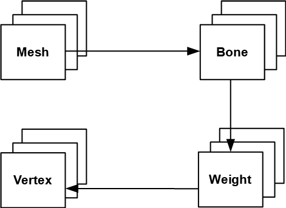

# Assimp

## Static Meshes

The capability of loading complex 3D models in different formats is crucial in order to write a game. The task of writing parsers for some of them would require lots of work. Even just supporting a single format can be time consuming. For instance, the wavefront loader described in chapter 9, only parses a small subset of the specification \(materials are not handled at all\).

Fortunately, the [Assimp](http://assimp.sourceforge.net/) library already can be used to parse many common 3D formats. It’s a C++ library which can load static and animated models in a variety of formats. LWJGL provides the bindings to use them from Java code. In this chapter, we will explain how it can be used.

The first thing is adding assimp maven dependencies to the project pom.xml. We need to add compile time and runtime dependencies.

```xml
<dependency>
    <groupId>org.lwjgl</groupId>
    <artifactId>lwjgl-assimp</artifactId>
    <version>${lwjgl.version}</version>
</dependency>
<dependency>
    <groupId>org.lwjgl</groupId>
    <artifactId>lwjgl-assimp</artifactId>
    <version>${lwjgl.version}</version>
    <classifier>${native.target}</classifier>
    <scope>runtime</scope>
</dependency>
```

Once the dependencies has been set, we will create a new class named `StaticMeshesLoader` that will be used to load meshes with no animations. The class defines two static public methods:

```java
public static Mesh[] load(String resourcePath, String texturesDir) throws Exception {
    return load(resourcePath, texturesDir,
            aiProcess_GenSmoothNormals | aiProcess_JoinIdenticalVertices | aiProcess_Triangulate
                    | aiProcess_FixInfacingNormals | aiProcess_PreTransformVertices);
}

public static Mesh[] load(String resourcePath, String texturesDir, int flags) throws Exception {
    // ....
```

Both methods have the following arguments:

* `resourcePath`: The path to the file where the model file is located. This is an absolute path, because Assimp may need to load additional files and may use the same base path as the resource path \(For instance, material files for wavefront, OBJ, files\). If you embed your resources inside a JAR file, Assimp will not be able to import it, so it must be a file system path.

* `texturesDir`: The path to the directory that will hold the textures for this model. This a CLASSPATH relative path. For instance, a wavefront material file may define several texture files. The code, expect this files to be located in the `texturesDir` directory. If you find texture loading errors you may need to manually tweak these paths in the model file.

The second method has an extra argument named `flags`. This parameter allows to tune the loading process. The first method invokes the second one and passes some values that are useful in most of the situations:

* `aiProcess_JoinIdenticalVertices`: This flag reduces the number of vertices that are used, identifying those that can be reused between faces.

* `aiProcess_Triangulate`: The model may use quads or other geometries to define their elements. Since we are only dealing with triangles, we must use this flag to split all he faces into triangles \(if needed\).

* `aiProcess_FixInfacingNormals`: This flags try to reverse normals that may point inwards.

* `aiProcess_PreTransformVertices`: This flag performs some transformation over the data loaded so the model is placed in the origin and the coordinates are corrected to math OpenGL coordinate System. If you have problems with models that are rotated, make sure to use this flag. Important: do not use this fal is you model uses animations, this flag will remove that information.

There are many other flags that can be used, you can check them in the LWJGL Javadoc documentation.

Let’s go back to the second constructor. The first thing we do is invoke the `aiImportFile` method to load the model with the selected flags.

```java
AIScene aiScene = aiImportFile(resourcePath, flags);
if (aiScene == null) {
    throw new Exception("Error loading model");
}
```

The rest of the code for the constructor is a as follows:

```java
int numMaterials = aiScene.mNumMaterials();
PointerBuffer aiMaterials = aiScene.mMaterials();
List<Material> materials = new ArrayList<>();
for (int i = 0; i < numMaterials; i++) {
    AIMaterial aiMaterial = AIMaterial.create(aiMaterials.get(i));
    processMaterial(aiMaterial, materials, texturesDir);
}

int numMeshes = aiScene.mNumMeshes();
PointerBuffer aiMeshes = aiScene.mMeshes();
Mesh[] meshes = new Mesh[numMeshes];
for (int i = 0; i < numMeshes; i++) {
    AIMesh aiMesh = AIMesh.create(aiMeshes.get(i));
    Mesh mesh = processMesh(aiMesh, materials);
    meshes[i] = mesh;
}

return meshes;
```

We process the materials contained in the model. Materials define colour and textures to be used by the meshes that compose the model. Then we process the different meshes. A model can define several meshes and each of them can use one of the materials defined for the model.

If you examine the code above you may see that many of the calls to the Assimp library return `PointerBuffer` instances. You can think about them like C pointers, they just point to a memory region which contain data. You need to know in advance the type of data that they hold in order to process them. In the case of materials, we iterate over that buffer creating instances of the `AIMaterial` class. In the second case, we iterate over the buffer that holds mesh data creating instance of the `AIMesh` class.

Let’s examine the `processMaterial` method.

```java
private static void processMaterial(AIMaterial aiMaterial, List<Material> materials, String texturesDir) throws Exception {
    AIColor4D colour = AIColor4D.create();

    AIString path = AIString.calloc();
    Assimp.aiGetMaterialTexture(aiMaterial, aiTextureType_DIFFUSE, 0, path, (IntBuffer) null, null, null, null, null, null);
    String textPath = path.dataString();
    Texture texture = null;
    if (textPath != null && textPath.length() > 0) {
        TextureCache textCache = TextureCache.getInstance();
        texture = textCache.getTexture(texturesDir + "/" + textPath);
    }

    Vector4f ambient = Material.DEFAULT_COLOUR;
    int result = aiGetMaterialColor(aiMaterial, AI_MATKEY_COLOR_AMBIENT, aiTextureType_NONE, 0, colour);
    if (result == 0) {
        ambient = new Vector4f(colour.r(), colour.g(), colour.b(), colour.a());
    }

    Vector4f diffuse = Material.DEFAULT_COLOUR;
    result = aiGetMaterialColor(aiMaterial, AI_MATKEY_COLOR_DIFFUSE, aiTextureType_NONE, 0, colour);
    if (result == 0) {
        diffuse = new Vector4f(colour.r(), colour.g(), colour.b(), colour.a());
    }

    Vector4f specular = Material.DEFAULT_COLOUR;
    result = aiGetMaterialColor(aiMaterial, AI_MATKEY_COLOR_SPECULAR, aiTextureType_NONE, 0, colour);
    if (result == 0) {
        specular = new Vector4f(colour.r(), colour.g(), colour.b(), colour.a());
    }

    Material material = new Material(ambient, diffuse, specular, 1.0f);
    material.setTexture(texture);
    materials.add(material);
}
```

We check if the material defines a texture or not. If so, we load the texture. We have created a new class named `TextureCache` which caches textures. This is due to the fact that several meshes may share the same texture and we do not want to waste space loading again and again the same data. Then we try to get the colours of the material for the ambient, diffuse and specular components. Fortunately, the definition that we had for a material already contained that information.

The `TextureCache` definition is very simple is just a map that indexes the different textures by the path to the texture file \(You can check directly in the source code\). Due to the fact, that now textures may use different image formats \(PNG, JPEG, etc.\), we have modified the way that textures are loaded. Instead of using the PNG library, we now use the STB library to be able to load more formats.

Let’s go back to the `StaticMeshesLoader` class. The `processMesh` is defined like this.

```java
private static Mesh processMesh(AIMesh aiMesh, List<Material> materials) {
    List<Float> vertices = new ArrayList<>();
    List<Float> textures = new ArrayList<>();
    List<Float> normals = new ArrayList<>();
    List<Integer> indices = new ArrayList<>();

    processVertices(aiMesh, vertices);
    processNormals(aiMesh, normals);
    processTextCoords(aiMesh, textures);
    processIndices(aiMesh, indices);

    // Texture coordinates may not have been populated. We need at least the empty slots
    if ( textures.size() == 0) {
        int numElements = (vertices.size() / 3) * 2;
        for (int i=0; i<numElements; i++) {
            textures.add(0.0f);
        }
    }

    Mesh mesh = new Mesh(Utils.listToArray(vertices),
        Utils.listToArray(textures),
        Utils.listToArray(normals),
        Utils.listIntToArray(indices)
    );
    Material material;
    int materialIdx = aiMesh.mMaterialIndex();
    if (materialIdx >= 0 && materialIdx < materials.size()) {
        material = materials.get(materialIdx);
    } else {
        material = new Material();
    }
    mesh.setMaterial(material);

    return mesh;
}
```

A `Mesh` is defined by a set of vertices position, normals directions, texture coordinates and indices. Each of these elements are processed in the `processVertices`, `processNormals`, `processTextCoords` and `processIndices` methods. A Mesh also may point to a material, using its index. If the index corresponds to the previously processed materials we just simply associate them to the `Mesh`. After processing all that data we check if texture coordinates have been defined. If not, we just assign a set of texture coordinates to 0.0f to ensure consistency of the VAO.

The `processXXX` methods are very simple, they just invoke the corresponding method over the `AIMesh` instance that returns the desired data. For instance, the `processVertices` is defined like this:

```java
private static void processVertices(AIMesh aiMesh, List<Float> vertices) {
    AIVector3D.Buffer aiVertices = aiMesh.mVertices();
    while (aiVertices.remaining() > 0) {
        AIVector3D aiVertex = aiVertices.get();
        vertices.add(aiVertex.x());
        vertices.add(aiVertex.y());
        vertices.add(aiVertex.z());
    }
}
```

You can see that get get a buffer to the vertices by invoking the `mVertices` method. We just simply process them to create a `List` of floats that contain the vertices positions. Since, the method returns just a buffer you could pass that information directly to the OpenGL methods that create vertices. We do not do it that way for two reasons. The first one is try to reduce as much as possible the modifications over the code base. Second one is that by loading into an intermediate structure you may be able to perform some pros-processing tasks and even debug the loading process.

If you want a sample of the much more efficient approach, that is, directly passing the buffers to OpenGL, you can check this [sample](https://github.com/LWJGL/lwjgl3-demos/blob/master/src/org/lwjgl/demo/opengl/assimp/WavefrontObjDemo.java).

The `StaticMeshesLoader` makes the `OBJLoader` class obsolete, so it has been removed from the base source code. A more complex OBJ file is provided as a sample, if you run it you will see something like this:


## Animations

Now that we have used assimp for loading static meshes we can proceed with animations. If you recall from the animations chapter, the VAO associated to a mesh contains the vertices positions, the texture coordinates, the indices and a list of weights that should be applied to joint positions to modulate final vertex position.


Each vertex position has associated a list of four weights that change the final position, referring the bones indices that will be combined to determine its final position. Each frame, a list of transformation matrices are loaded, as uniforms, for each joint. With that information the final position is calculated.

In the animation chapter, we developed a MD5 parser to load animated meshes. In this chapter we will use assimp library. This will allow us to load many more formats besides MD5, such as [COLLADA](https://en.wikipedia.org/wiki/COLLADA "COLLADA"), [FBX](https://en.wikipedia.org/wiki/FBX "FBX"), etc.

Before we start coding let’s clarify some terminology. In this chapter we will refer to bones and joints indistinguishably. A joint / bone is are just elements that affect vertices, and that have a parent forming a hierarchy. MD5 format uses the term joint, but assimp uses the term bone.

Let’s review first the structures handled by assimp that contain animation information. We will start first with the bones and weights information. For each `Mesh`, we can access the vertices positions, texture coordinates and indices. Meshes store also a list of bones. Each bone is defined by the following attributes:

* A name.
* An offset matrix: This will used later to compute the final transformations that should be used by each bone.

Bones also point to a list of weights. Each weights is defined by the following attributes:

* A weight factor, that is, the number that will be used to modulate the influence of the bone’s transformation associated to each vertex.
* A vertex identifier, that is, the vertex associated to the current bone.

The following picture shows the relationships between all these elements.



Hence, the first thing that we must do is to construct the list of vertices positions, the bones / joints / indices and the associated weights from the structure above. Once we have done that, we need to pre-calculate the transformation matrices for each bone / joint for all the animation frames defined in the model.

Assimp scene object defines a Node’s hierarchy. Each Node is defined by a name a list of children node. Animations use these nodes to define the transformations that should be applied to. This hierarchy is defined indeed the bones’ hierarchy. Every bone is a node, and has a parent, except the root node, and possible a set of children. There are special nodes that are not bones, they are used to group transformations, and should be handled when calculating the transformations. Another issue is that this Nodes hierarchy is defined from the whole model, we do not have separate hierarchies for each mesh.

A scene also defines a set of animations. A single model can have more than one animation to model how a character walks, runs, etc. Each of these animations define different transformations. An animation has the following attributes:

* A name.
* A duration. That is, the duration in time of the animation. The name may seem confusing since an animation is the list of transformations that should be applied to each node for each different frame. 
* A list of animation channels. An animation channel contains, for a specific instant in time the translation, rotation and scaling information that should be applied to each node. The class that models the data contained in the animation channels is the `AINodeAnim`. Animation channels could be assimilated as the key frames.

The following figure shows the relationships between all the elements described above.


For a specific instant of time, for a frame, the transformation to be applied to a bone is the transformation defined in the animation channel for that instant, multiplied by the transformations of all the parent nodes up to the root node. Hence, we need to extract the information stored in the scene, the process is as follows:

* Construct the node hierarchy.
* For each animation, iterate over each animation channel (for each animation node\) and construct the transformation matrices for each of the bones for all the potential animation frames.  Those transformation matrices are a combination of the transformation matrix of the node associated to the bone and the bone transformation matrices.
* We start at the root node, and for each frame, build transformation matrix for that node, which is the the transformation matrix of the node multiplied by the composition of the translation, rotation and scale matrix of that specific frame for that node.
* We then get the bones associated to that node and complement that transformation by multiplying  the offset matrices of the bones. The result will be a transformation matrix associated to the related bones for that specific frame, which will be used in the shaders.
* After that, we iterate over the children nodes, passing the transformation matrix of the parent node to be used also in combination with the children node transformations.

So let’s start coding. We will first create a class named `AnimMeshesLoader` which extends from `StaticMeshesLoader`, but instead of returning an array of `Mesh`, it returns an `AnimGameItem` instance. It defines two public methods for that:

```java
public static AnimGameItem loadAnimGameItem(String resourcePath, String texturesDir)
        throws Exception {
    return loadAnimGameItem(resourcePath, texturesDir,
            aiProcess_GenSmoothNormals | aiProcess_JoinIdenticalVertices | aiProcess_Triangulate
            | aiProcess_FixInfacingNormals | aiProcess_LimitBoneWeights);
}

public static AnimGameItem loadAnimGameItem(String resourcePath, String texturesDir, int flags)
        throws Exception {
    AIScene aiScene = aiImportFile(resourcePath, flags);
    if (aiScene == null) {
        throw new Exception("Error loading model");
    }

    int numMaterials = aiScene.mNumMaterials();
    PointerBuffer aiMaterials = aiScene.mMaterials();
    List<Material> materials = new ArrayList<>();
    for (int i = 0; i < numMaterials; i++) {
        AIMaterial aiMaterial = AIMaterial.create(aiMaterials.get(i));
        processMaterial(aiMaterial, materials, texturesDir);
    }

    List<Bone> boneList = new ArrayList<>();
    int numMeshes = aiScene.mNumMeshes();
    PointerBuffer aiMeshes = aiScene.mMeshes();
    Mesh[] meshes = new Mesh[numMeshes];
    for (int i = 0; i < numMeshes; i++) {
        AIMesh aiMesh = AIMesh.create(aiMeshes.get(i));
        Mesh mesh = processMesh(aiMesh, materials, boneList);
        meshes[i] = mesh;
    }

    Node rootNode = buildNodesTree(aiScene.mRootNode(), null);
    Matrix4f globalInverseTransformation = toMatrix(aiScene.mRootNode().mTransformation()).invert();
    Map<String, Animation> animations = processAnimations(aiScene, boneList, rootNode,
            globalInverseTransformation);
    AnimGameItem item = new AnimGameItem(meshes, animations);

    return item;
}
```

The methods are quite similar to the ones defined in the `StaticMeshesLoader` with the following differences:

* The method that passes a default set of loading flags, uses this new parameter: `aiProcess_LimitBoneWeights`. This will limit the maximum number of weights that affect a vertex to four \(This is also the maximum value that we are currently supporting from the animations chapter\).
* The method that actually loads the model just loads the different meshes but it first calculates the node hierarchy and then calls to the `processAnimations` at the end to build an `AnimGameItem` instance.

The `processMesh` method is quite similar to the one in the `StaticMeshesLoader` with the exception that it creates Meshes passing joint indices and weights as a parameter:

```java
processBones(aiMesh, boneList, boneIds, weights);

Mesh mesh = new Mesh(Utils.listToArray(vertices), Utils.listToArray(textures),
    Utils.listToArray(normals), Utils.listIntToArray(indices),
    Utils.listIntToArray(boneIds), Utils.listToArray(weights));
```

The joint indices and weights are calculated in the `processBones` method:

```java
private static void processBones(AIMesh aiMesh, List<Bone> boneList, List<Integer> boneIds,
        List<Float> weights) {
    Map<Integer, List<VertexWeight>> weightSet = new HashMap<>();
    int numBones = aiMesh.mNumBones();
    PointerBuffer aiBones = aiMesh.mBones();
    for (int i = 0; i < numBones; i++) {
        AIBone aiBone = AIBone.create(aiBones.get(i));
        int id = boneList.size();
        Bone bone = new Bone(id, aiBone.mName().dataString(), toMatrix(aiBone.mOffsetMatrix()));
        boneList.add(bone);
        int numWeights = aiBone.mNumWeights();
        AIVertexWeight.Buffer aiWeights = aiBone.mWeights();
        for (int j = 0; j < numWeights; j++) {
            AIVertexWeight aiWeight = aiWeights.get(j);
            VertexWeight vw = new VertexWeight(bone.getBoneId(), aiWeight.mVertexId(),
                    aiWeight.mWeight());
            List<VertexWeight> vertexWeightList = weightSet.get(vw.getVertexId());
            if (vertexWeightList == null) {
                vertexWeightList = new ArrayList<>();
                weightSet.put(vw.getVertexId(), vertexWeightList);
            }
            vertexWeightList.add(vw);
        }
    }

    int numVertices = aiMesh.mNumVertices();
    for (int i = 0; i < numVertices; i++) {
        List<VertexWeight> vertexWeightList = weightSet.get(i);
        int size = vertexWeightList != null ? vertexWeightList.size() : 0;
        for (int j = 0; j < Mesh.MAX_WEIGHTS; j++) {
            if (j < size) {
                VertexWeight vw = vertexWeightList.get(j);
                weights.add(vw.getWeight());
                boneIds.add(vw.getBoneId());
            } else {
                weights.add(0.0f);
                boneIds.add(0);
            }
        }
    }
}
```

This method traverses the bone definition for a specific mesh, getting their weights and generating filling up three lists:

* `boneList`: It contains a list of nodes, with their offset matrices. It will uses later on to calculate nodes transformations. A new class named `Bone` has been created to hold that information. This list will contain the bones for all the meshes.
* `boneIds`: It contains just the identifiers of the bones for each vertex of the `Mesh`. Bones are identified by its position when rendering. This list only contains the bones for a specific Mesh.
* `weights`: It contains the weights for each vertex of the `Mesh` to be applied for the associated bones.

The information contained in the `weights` and `boneIds` is used to construct the `Mesh` data. The information contained in the `boneList` will be used later when calculating animation data.

The `buildNodesTree` method is quite simple, It just traverses the nodes hierarchy starting from the root node constructing a tree of nodes:

```java
private static Node buildNodesTree(AINode aiNode, Node parentNode) {
    String nodeName = aiNode.mName().dataString();
    Node node = new Node(nodeName, parentNode, toMatrix(aiNode.mTransformation()));

    int numChildren = aiNode.mNumChildren();
    PointerBuffer aiChildren = aiNode.mChildren();
    for (int i = 0; i < numChildren; i++) {
        AINode aiChildNode = AINode.create(aiChildren.get(i));
        Node childNode = buildNodesTree(aiChildNode, node);
        node.addChild(childNode);
    }
    return node;
}
```

Let’s review the `processAnimations` method, which is defined like this:

```java
private static Map<String, Animation> processAnimations(AIScene aiScene, List<Bone> boneList,
                                                            Node rootNode, Matrix4f globalInverseTransformation) {
    Map<String, Animation> animations = new HashMap<>();

    // Process all animations
    int numAnimations = aiScene.mNumAnimations();
    PointerBuffer aiAnimations = aiScene.mAnimations();
    for (int i = 0; i < numAnimations; i++) {
        AIAnimation aiAnimation = AIAnimation.create(aiAnimations.get(i));
        int maxFrames = calcAnimationMaxFrames(aiAnimation);

        List<AnimatedFrame> frames = new ArrayList<>();
        Animation animation = new Animation(aiAnimation.mName().dataString(), frames, aiAnimation.mDuration());
        animations.put(animation.getName(), animation);

        for (int j = 0; j < maxFrames; j++) {
            AnimatedFrame animatedFrame = new AnimatedFrame();
            buildFrameMatrices(aiAnimation, boneList, animatedFrame, j, rootNode,
                    rootNode.getNodeTransformation(), globalInverseTransformation);
            frames.add(animatedFrame);
        }
    }
    return animations;
}
```

This method returns a `Map` of `Animation` instances. Remember that a model can have more than one animation, so they are stored indexed by their names. For each of these animations we construct a list of animation frames (`AnimatedFrame` instances), which are essentially a list of the transformation matrices to be applied to each of the bones that compose the model. For each of the animations, we calculate the maximum number of frames by calling the method `calcAnimationMaxFrames`, which is defined like this: 
```java
private static int calcAnimationMaxFrames(AIAnimation aiAnimation) {
    int maxFrames = 0;
    int numNodeAnims = aiAnimation.mNumChannels();
    PointerBuffer aiChannels = aiAnimation.mChannels();
    for (int i=0; i<numNodeAnims; i++) {
        AINodeAnim aiNodeAnim = AINodeAnim.create(aiChannels.get(i));
        int numFrames = Math.max(Math.max(aiNodeAnim.mNumPositionKeys(), aiNodeAnim.mNumScalingKeys()),
                aiNodeAnim.mNumRotationKeys());
        maxFrames = Math.max(maxFrames, numFrames);
    }

    return maxFrames;
    }
```

Each `AINodeAnim` instance defines some transformations to be applied to a node in the model for a specific frame. These transformations, for a specific node, are defined in the `AINodeAnim` instance. These transformations are defined in the form of position translations, rotations and scaling values. The trick here is that, for example, for a specific node, translation values can stop at a specific frae, but rotations and scaling values can continue for the next frames. In this case, we will have less translation values than rotation or scaling ones. Therefore, a good approximation, to calculate the maximum number of frames is to use the maximum value. The problem gest more complex, because this is defines per node. A node can define just some transformations for the first frames and do not apply more modifications for the rest. In this case, we should use always the last defined values. Therefore, we get the maximum number for all the animations associated to the nodes.

Going back to the `processAnimations` method, with that information, we are ready to iterate over the different frames and build the transformation matrices for the bones by calling the `buildFrameMatrices` method. For each frame we start with the root node, and will apply the transformations recursively from top to down of the nodes hierarchy. The `buildFrameMatrices` is defined like this:
```java
private static void buildFrameMatrices(AIAnimation aiAnimation, List<Bone> boneList, AnimatedFrame animatedFrame, int frame, Node node, Matrix4f parentTransformation, Matrix4f globalInverseTransform) {
    String nodeName = node.getName();
    AINodeAnim aiNodeAnim = findAIAnimNode(aiAnimation, nodeName);
    Matrix4f nodeTransform = node.getNodeTransformation();
    if (aiNodeAnim != null) {
        nodeTransform = buildNodeTransformationMatrix(aiNodeAnim, frame);
    }
    Matrix4f nodeGlobalTransform = new Matrix4f(parentTransformation).mul(nodeTransform);

    List<Bone> affectedBones = boneList.stream().filter( b -> b.getBoneName().equals(nodeName)).collect(Collectors.toList());
    for (Bone bone: affectedBones) {
        Matrix4f boneTransform = new Matrix4f(globalInverseTransform).mul(nodeGlobalTransform).
                mul(bone.getOffsetMatrix());
        animatedFrame.setMatrix(bone.getBoneId(), boneTransform);
    }

    for (Node childNode : node.getChildren()) {
        buildFrameMatrices(aiAnimation, boneList, animatedFrame, frame, childNode, nodeGlobalTransform,
                globalInverseTransform);
    }
}
```

We get the transformation associated to the node. Then we check if this node has an animation node associated to it. If so, we need to get the proper translation, rotation and scaling transformations that apply to the frame that we are handling. With that information, we get the bones associated to that node and update the transformation matrix for each of those bones, for that specific frame by multiplying:

* The model inverse global transformation matrix (the inverse of the root node transformation matrix).
* The transformation matrix for the node.
* The bone offset matrix.

After that, we iterate over the children nodes, using the node transformation matrix as the parent matrix for those child nodes.

Let’s review the `buildNodeTransformationMatrix` method:
```java
 private static Matrix4f buildNodeTransformationMatrix(AINodeAnim aiNodeAnim, int frame) {
    AIVectorKey.Buffer positionKeys = aiNodeAnim.mPositionKeys();
    AIVectorKey.Buffer scalingKeys = aiNodeAnim.mScalingKeys();
    AIQuatKey.Buffer rotationKeys = aiNodeAnim.mRotationKeys();

    AIVectorKey aiVecKey;
    AIVector3D vec;

    Matrix4f nodeTransform = new Matrix4f();
    int numPositions = aiNodeAnim.mNumPositionKeys();
    if (numPositions > 0) {
        aiVecKey = positionKeys.get(Math.min(numPositions - 1, frame));
        vec = aiVecKey.mValue();
        nodeTransform.translate(vec.x(), vec.y(), vec.z());
    }
    int numRotations = aiNodeAnim.mNumRotationKeys();
    if (numRotations > 0) {
        AIQuatKey quatKey = rotationKeys.get(Math.min(numRotations - 1, frame));
        AIQuaternion aiQuat = quatKey.mValue();
        Quaternionf quat = new Quaternionf(aiQuat.x(), aiQuat.y(), aiQuat.z(), aiQuat.w());
        nodeTransform.rotate(quat);
    }
    int numScalingKeys = aiNodeAnim.mNumScalingKeys();
    if (numScalingKeys > 0) {
        aiVecKey = scalingKeys.get(Math.min(numScalingKeys - 1, frame));
        vec = aiVecKey.mValue();
        nodeTransform.scale(vec.x(), vec.y(), vec.z());
    }

    return nodeTransform;
}
```

The `AINodeAnim` instance defines a set of keys that contain translation, rotation and scaling information. These keys are referred to specific instant of times. We assume that information is ordered in time, and construct a list of matrices that contain the transformation to be applied for each frame. As it has been said before, some of those transformations may "stop" at a specific frame, we should use the last values for the last of the frames.

The rest of the changes in the source code are minor changes to adapt some structures. At the end you will be able to load animations like this one \(you need yo press space par to change the frame\).


The complexity of this sample resides more in the adaptations of the assimp structures to adapt it to the engine used in the book and to pre-calculate the data for each frame. Beyond that, the concepts are similar to the ones presented in the animations chapter. You may try also to modify the source code to interpolate between frames to get smoother animations.
