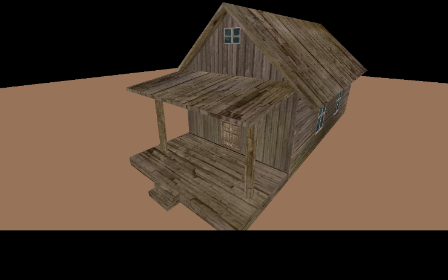
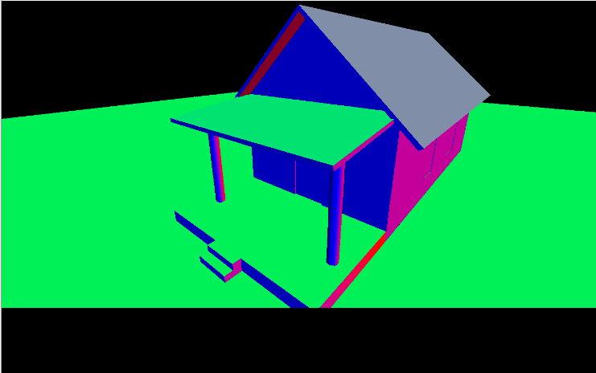
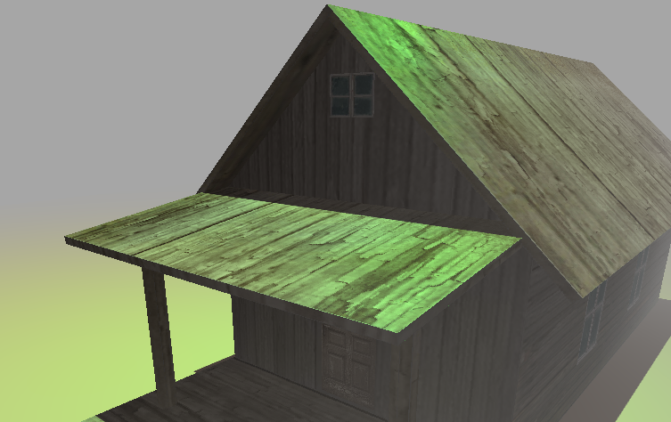

# Deferred Shading

Up to now the way that we are rendering a 3D scene is called forward rendering. We first render the 3D objects and apply the texture and lighting effects in a fragment shader. This method is not very efficient if we have a complex fragment shader pass with many lights and complex effects. In addition to that we may end up applying these effects to fragments that may be later on discarded due to depth testing \(although this is not exactly true if we enable [early fragment testing](https://www.khronos.org/opengl/wiki/Early_Fragment_Test)\).

In order to alleviate the problems described above we may change the way that we render the scene by using a technical called deferred shading. With deferred shading we first render the geometry information that is required in later stages \(in the fragment shader\) to a buffer. The complex calculus required by the fragment shader are postponed, deferred, to a later stage when using the information stored in those buffers.

Hence, with deferred shading we perform two rendering passes. The first one, is the geometry pass, where we render the scene to a buffer that will contain the following information:

* The positions \(in our case in light view coordinate system, although you may see other samples where world coordinates are used\).
* The diffuse colours for each position.
* The specular component for each position.
* The normals at each position \(also in light view coordinate system\).
* Shadow map for the directional light \(you may find that this step is done separately in other implementations\).

All that information is stored in a buffer called G-Buffer.

The second pass is called the lighting pass. This pass takes a quad that fills up all the screen and generates the colour information for each fragment using the information contained in the G-Buffer. When we will be performing the lighting pass, the depth test will have already removed all the scene data that would not be seen. Hence, the number of operations to be done are restricted to what will be displayed on the screen.


You may be asking if performing additional rendering passes will result in an increase of performance or not. The answer is that it depends. Deferred shading is usually used when you have many different light passes. In this case, the additional rendering steps are compensated by the reduction of operations that will be done in the fragment shader.

So let’s start coding. The first task that we will be doing is create a new class for the G-Buffer. The class, named `GBuffer`, is defined like this:

```java
package org.lwjglb.engine.graph;

import org.lwjgl.system.MemoryStack;
import org.lwjglb.engine.Window;
import java.nio.ByteBuffer;
import java.nio.IntBuffer;
import static org.lwjgl.opengl.GL11.*;
import static org.lwjgl.opengl.GL20.*;
import static org.lwjgl.opengl.GL30.*;

public class GBuffer {

    private static final int TOTAL_TEXTURES = 6;

    private int gBufferId;

    private int[] textureIds;

    private int width;

    private int height;
```

The class defines a constant that models the maximum number of buffers to be used. The identifier associated to the G-Buffer itself and an array for the individual buffers. The size of the screen is also stored.

Let’s review the constructor:

```java
public GBuffer(Window window) throws Exception {
    // Create G-Buffer
    gBufferId = glGenFramebuffers();
    glBindFramebuffer(GL_DRAW_FRAMEBUFFER, gBufferId);

    textureIds = new int[TOTAL_TEXTURES];
    glGenTextures(textureIds);

    this.width = window.getWidth();
    this.height = window.getHeight();

    // Create textures for position, diffuse color, specular color, normal, shadow factor and depth
    // All coordinates are in world coordinates system
    for(int i=0; i<TOTAL_TEXTURES; i++) {
        glBindTexture(GL_TEXTURE_2D, textureIds[i]);
        int attachmentType;
        switch(i) {
            case TOTAL_TEXTURES - 1:
                // Depth component
                glTexImage2D(GL_TEXTURE_2D, 0, GL_DEPTH_COMPONENT32F, width, height, 0, GL_DEPTH_COMPONENT, GL_FLOAT,
                        (ByteBuffer) null);
                attachmentType = GL_DEPTH_ATTACHMENT;
                break;
            default:
                glTexImage2D(GL_TEXTURE_2D, 0, GL_RGB32F, width, height, 0, GL_RGB, GL_FLOAT, (ByteBuffer) null);
                attachmentType = GL_COLOR_ATTACHMENT0 + i;
                break;
        }
        // For sampling
        glTexParameterf(GL_TEXTURE_2D, GL_TEXTURE_MIN_FILTER, GL_NEAREST);
        glTexParameterf(GL_TEXTURE_2D, GL_TEXTURE_MAG_FILTER, GL_NEAREST);

        // Attach the texture to the G-Buffer
        glFramebufferTexture2D(GL_FRAMEBUFFER, attachmentType, GL_TEXTURE_2D, textureIds[i], 0);
    }

    try (MemoryStack stack = MemoryStack.stackPush()) {
        IntBuffer intBuff = stack.mallocInt(TOTAL_TEXTURES);
        int values[] = {GL_COLOR_ATTACHMENT0, GL_COLOR_ATTACHMENT1, GL_COLOR_ATTACHMENT2, GL_COLOR_ATTACHMENT3, GL_COLOR_ATTACHMENT4, GL_COLOR_ATTACHMENT5};
        for(int i = 0; i < values.length; i++) {
            intBuff.put(values[i]);
        }
        intBuff.flip();
        glDrawBuffers(intBuff);
    }

    // Unbind
    glBindFramebuffer(GL_FRAMEBUFFER, 0);
}
```

The first thing that we do is create a frame buffer. Remember that a frame buffer is just an OpenGL objects that can be used to render operations instead of rendering to the screen. Then we generate a set of textures \(6 textures\), that will be associated to the frame buffer.

After that, we use a for loop to initialize the textures. We have the following types:

* “Regular textures”, that will store positions, normals, the diffuse component, etc.
* A texture for storing the depth buffer. This will be our last texture.

Once the texture has been initialized, we enable sampling for them and attach them to the frame buffer. Each texture is attached using an identifier which starts at `GL_COLOR_ATTACHMENT0`. Each texture increments by one that id, so the positions are attached using `GL_COLOR_ATTACHMENT0`, the diffuse component uses `GL_COLOR_ATTACHMENT1` \(which is `GL_COLOR_ATTACHMENT0 + 1`\), and so on.

After all the textures have been created, we need to enable them to be used by the fragment shader for rendering. This is done with the `glDrawBuffers` call. We just pass the array with the identifiers of the colour attachments used \(`GL_COLOR_ATTACHMENT0` to `GL_COLOR_ATTACHMENT5`\).

The rest of the class are just getter methods and the cleanup one.

```java
public int getWidth() {
    return width;
}

public int getHeight() {
    return height;
}

public int getGBufferId() {
    return gBufferId;
}

public int[] getTextureIds() {
    return textureIds;
}

public int getPositionTexture() {
    return textureIds[0];
}

public int getDepthTexture() {
    return textureIds[TOTAL_TEXTURES-1];
}

public void cleanUp() {
    glDeleteFramebuffers(gBufferId);

    if (textureIds != null) {
        for (int i=0; i<TOTAL_TEXTURES; i++) {
            glDeleteTextures(textureIds[i]);
        }
    }
}
```

We will create a new class named `SceneBuffer` which is just another frame buffer. We will use it when performing the light pass. Instead of rendering directly to the screen we will render to this frame buffer. By doing it this way, we can apply the rest of the effects \(such as fog, skybox, etc.\). The class is defined like this.

```java
package org.lwjglb.engine.graph;

import org.lwjglb.engine.Window;

import java.nio.ByteBuffer;

import static org.lwjgl.opengl.GL11.*;
import static org.lwjgl.opengl.GL30.*;

public class SceneBuffer {

    private int bufferId;

    private int textureId;

    public SceneBuffer(Window window) throws Exception {
        // Create the buffer
        bufferId = glGenFramebuffers();
        glBindFramebuffer(GL_DRAW_FRAMEBUFFER, bufferId);

        // Create texture
        int[] textureIds = new int[1];
        glGenTextures(textureIds);
        textureId = textureIds[0];
        glBindTexture(GL_TEXTURE_2D, textureId);
        glTexImage2D(GL_TEXTURE_2D, 0, GL_RGB32F, window.getWidth(), window.getHeight(), 0, GL_RGB, GL_FLOAT, (ByteBuffer) null);

        // For sampling
        glTexParameterf(GL_TEXTURE_2D, GL_TEXTURE_MIN_FILTER, GL_NEAREST);
        glTexParameterf(GL_TEXTURE_2D, GL_TEXTURE_MAG_FILTER, GL_NEAREST);

        // Attach the texture to the G-Buffer
        glFramebufferTexture2D(GL_FRAMEBUFFER, GL_COLOR_ATTACHMENT0, GL_TEXTURE_2D, textureId, 0);

        // Unbind
        glBindFramebuffer(GL_FRAMEBUFFER, 0);
    }

    public int getBufferId() {
        return bufferId;
    }

    public int getTextureId() {
        return textureId;
    }

    public void cleanup() {
        glDeleteFramebuffers(bufferId);

        glDeleteTextures(textureId);
    }
}
```

As you can see, this is similar to the `GBuffer` class, but here we will only use a single texture to store the resulting colours. Now that we have created these new classes, we can start using them. In the `Renderer` class, we will no longer be using the forward rendering shaders we were using for rendering the scene \(named `scene_vertex.vs` and `scene_fragment.fs`\).

In the `init` method of the `Renderer` class you may see that a `GBuffer` instance is created and that we initialize and another set of shaders for the geometry pass \(by calling the `setupGeometryShader` method\) and the light pass \(by calling the `setupDirLightShader` and `setupPointLightShader` methods\). You may see also that we create a instance of the class `SceneBuffer` named `sceneBuffer`. This will be used when rendering lights as explained before. An utility matrix named `bufferPassModelMatrix` is also instantiated \(it will be used when performing the geometry pass\). You can see that we create a new `Mesh` at the end of the `init` method. This will be used in the light pass. More on this will be explained later.

```java
public void init(Window window) throws Exception {
    shadowRenderer.init(window);
    gBuffer = new GBuffer(window);
    sceneBuffer = new SceneBuffer(window);
    setupSkyBoxShader();
    setupParticlesShader();
    setupGeometryShader();
    setupDirLightShader();
    setupPointLightShader();
    setupFogShader();

    bufferPassModelMatrix =  new Matrix4f();
    bufferPassMesh = StaticMeshesLoader.load("src/main/resources/models/buffer_pass_mess.obj", "src/main/resources/models")[0];
}
```

The shaders used in the geometry and light passes are defined like usual \(you can check the source code directly\). Let’s focus in their content instead. Let’s focus in their content instead. We will start with the geometry pass, here’s the vertex shader code \(`gbuffer_vertex.vs`\):

```glsl
#version 330

const int MAX_WEIGHTS = 4;
const int MAX_JOINTS = 150;
const int NUM_CASCADES = 3;

layout (location=0) in vec3 position;
layout (location=1) in vec2 texCoord;
layout (location=2) in vec3 vertexNormal;
layout (location=3) in vec4 jointWeights;
layout (location=4) in ivec4 jointIndices;
layout (location=5) in mat4 modelInstancedMatrix;
layout (location=9) in vec2 texOffset;
layout (location=10) in float selectedInstanced;

uniform int isInstanced;
uniform mat4 viewMatrix;
uniform mat4 projectionMatrix;
uniform mat4 modelNonInstancedMatrix;
uniform mat4 jointsMatrix[MAX_JOINTS];
uniform mat4 lightViewMatrix[NUM_CASCADES];
uniform mat4 orthoProjectionMatrix[NUM_CASCADES];
uniform int numCols;
uniform int numRows;
uniform float selectedNonInstanced;

out vec2  vs_textcoord;
out vec3  vs_normal;
out vec4  vs_mvVertexPos;
out vec4  vs_mlightviewVertexPos[NUM_CASCADES];
out mat4  vs_modelMatrix;
out float vs_selected;

void main()
{
    vec4 initPos = vec4(0, 0, 0, 0);
    vec4 initNormal = vec4(0, 0, 0, 0);
    mat4 modelMatrix;
    if ( isInstanced > 0 )
    {
        vs_selected = selectedInstanced;
        modelMatrix = modelInstancedMatrix;

        initPos = vec4(position, 1.0);
        initNormal = vec4(vertexNormal, 0.0);
    }
    else
    {
        vs_selected = selectedNonInstanced;
        modelMatrix = modelNonInstancedMatrix;

        int count = 0;
        for(int i = 0; i < MAX_WEIGHTS; i++)
        {
            float weight = jointWeights[i];
            if(weight > 0) {
                count++;
                int jointIndex = jointIndices[i];
                vec4 tmpPos = jointsMatrix[jointIndex] * vec4(position, 1.0);
                initPos += weight * tmpPos;

                vec4 tmpNormal = jointsMatrix[jointIndex] * vec4(vertexNormal, 0.0);
                initNormal += weight * tmpNormal;
            }
        }
        if (count == 0)
        {
            initPos = vec4(position, 1.0);
            initNormal = vec4(vertexNormal, 0.0);
        }
    }
    mat4 modelViewMatrix = viewMatrix * modelMatrix;
    vs_mvVertexPos = modelViewMatrix * initPos;
    gl_Position = projectionMatrix * vs_mvVertexPos;

    // Support for texture atlas, update texture coordinates
    float x = (texCoord.x / numCols + texOffset.x);
    float y = (texCoord.y / numRows + texOffset.y);

    vs_textcoord = vec2(x, y);
    vs_normal = normalize(modelViewMatrix * initNormal).xyz;

    for (int i = 0 ; i < NUM_CASCADES ; i++) {
        vs_mlightviewVertexPos[i] = orthoProjectionMatrix[i] * lightViewMatrix[i] * modelMatrix * initPos;
    }

    vs_modelMatrix = modelMatrix;
}
```

This shader is very similar to the vertex shader used in previous chapters to render a scene. There are some changes in the name of the output variables but in essence is the same shader. Indeed, it should be almost the same, the way we render the vertices should not change, the major changes are done in the fragment shader, which is defined like this \(`gbuffer_fragment.fs`\):

```glsl
#version 330

const int NUM_CASCADES = 3;

in vec2  vs_textcoord;
in vec3  vs_normal;
in vec4  vs_mvVertexPos;
in vec4  vs_mlightviewVertexPos[NUM_CASCADES];
in mat4  vs_modelMatrix;
in float vs_selected;

layout (location = 0) out vec3 fs_worldpos;
layout (location = 1) out vec3 fs_diffuse;
layout (location = 2) out vec3 fs_specular;
layout (location = 3) out vec3 fs_normal;
layout (location = 4) out vec2 fs_shadow;

uniform mat4 viewMatrix;

struct Material
{
    vec4 diffuse;
    vec4 specular;
    int hasTexture;
    int hasNormalMap;
    float reflectance;
};

uniform sampler2D texture_sampler;
uniform sampler2D normalMap;
uniform Material  material;

uniform sampler2D shadowMap_0;
uniform sampler2D shadowMap_1;
uniform sampler2D shadowMap_2;
uniform float cascadeFarPlanes[NUM_CASCADES];
uniform mat4 orthoProjectionMatrix[NUM_CASCADES];
uniform int renderShadow;

vec4 diffuseC;
vec4 speculrC;

void getColour(Material material, vec2 textCoord)
{
    if (material.hasTexture == 1)
    {
        diffuseC = texture(texture_sampler, textCoord);
        speculrC = diffuseC;
    }
    else
    {
        diffuseC = material.diffuse;
        speculrC = material.specular;
    }
}

vec3 calcNormal(Material material, vec3 normal, vec2 text_coord, mat4 modelMatrix)
{
    vec3 newNormal = normal;
    if ( material.hasNormalMap == 1 )
    {
        newNormal = texture(normalMap, text_coord).rgb;
        newNormal = normalize(newNormal * 2 - 1);
        newNormal = normalize(viewMatrix * modelMatrix * vec4(newNormal, 0.0)).xyz;
    }
    return newNormal;
}

float calcShadow(vec4 position, int idx)
{
    if ( renderShadow == 0 )
    {
        return 1.0;
    }

    vec3 projCoords = position.xyz;
    // Transform from screen coordinates to texture coordinates
    projCoords = projCoords * 0.5 + 0.5;
    float bias = 0.005;

    float shadowFactor = 0.0;
    vec2 inc;
    if (idx == 0)
    {
        inc = 1.0 / textureSize(shadowMap_0, 0);
    }
    else if (idx == 1)
    {
        inc = 1.0 / textureSize(shadowMap_1, 0);
    }
    else
    {
        inc = 1.0 / textureSize(shadowMap_2, 0);
    }
    for(int row = -1; row <= 1; ++row)
    {
        for(int col = -1; col <= 1; ++col)
        {
            float textDepth;
            if (idx == 0)
            {
                textDepth = texture(shadowMap_0, projCoords.xy + vec2(row, col) * inc).r; 
            }
            else if (idx == 1)
            {
                textDepth = texture(shadowMap_1, projCoords.xy + vec2(row, col) * inc).r; 
            }
            else
            {
                textDepth = texture(shadowMap_2, projCoords.xy + vec2(row, col) * inc).r; 
            }
            shadowFactor += projCoords.z - bias > textDepth ? 1.0 : 0.0;        
        }    
    }
    shadowFactor /= 9.0;

    if(projCoords.z > 1.0)
    {
        shadowFactor = 1.0;
    }

    return 1 - shadowFactor;
} 

void main()
{
    getColour(material, vs_textcoord);

    fs_worldpos   = vs_mvVertexPos.xyz;
    fs_diffuse    = diffuseC.xyz;
    fs_specular   = speculrC.xyz;
    fs_normal     = normalize(calcNormal(material, vs_normal, vs_textcoord, vs_modelMatrix));

    int idx;
    for (int i=0; i<NUM_CASCADES; i++)
    {
        if ( abs(vs_mvVertexPos.z) < cascadeFarPlanes[i] )
        {
            idx = i;
            break;
        }
    }
    fs_shadow  = vec2(calcShadow(vs_mlightviewVertexPos[idx], idx), material.reflectance);

    if ( vs_selected > 0 ) {
        fs_diffuse = vec3(fs_diffuse.x, fs_diffuse.y, 1);
    }
}
```

The most relevant lines are:

```glsl
layout (location = 0) out vec3 fs_worldpos;
layout (location = 1) out vec3 fs_diffuse;
layout (location = 2) out vec3 fs_specular;
layout (location = 3) out vec3 fs_normal;
layout (location = 4) out vec2 fs_shadow;
```

This is where we are referring to the textures that this fragment shader will write to. As you can see we just dump the position \(in light view coordinates\), the diffuse colour \(which can be the colour of the associated texture of a component of the material\), the specular component, the normal, and the depth values for the shadow map.

SIDE NOTE: We have simplified the `Material` class definition removing the ambient colour component.

Going back to the `Renderer` class, the `render` method is defined like this:

```java
public void render(Window window, Camera camera, Scene scene, boolean sceneChanged) {
    clear();

    if (window.getOptions().frustumCulling) {
        frustumFilter.updateFrustum(window.getProjectionMatrix(), camera.getViewMatrix());
        frustumFilter.filter(scene.getGameMeshes());
        frustumFilter.filter(scene.getGameInstancedMeshes());
    }

    // Render depth map before view ports has been set up
    if (scene.isRenderShadows() && sceneChanged) {
        shadowRenderer.render(window, scene, camera, transformation, this);
    }

    glViewport(0, 0, window.getWidth(), window.getHeight());

    // Update projection matrix once per render cycle
    window.updateProjectionMatrix();

    renderGeometry(window, camera, scene);

    initLightRendering();
    renderPointLights(window, camera, scene);
    renderDirectionalLight(window, camera, scene);
    endLightRendering();

    renderFog(window, camera, scene);
    renderSkyBox(window, camera, scene);
    renderParticles(window, camera, scene);
}
```

The geometry pass is done in the `renderGeometry` method \(you can see that we no longer have a `renderScene`\). The lighting pass is done in several steps, first we setup the buffer and other parameters to be used \(`initLightRendering`\), then we render point lights \(`renderPointLights`\) and the directional light \(`renderDirectionalLight`\) and finally the state is restored \(`endLightRendering`\).

Let’s start with the geometry pass. The `renderGeometry` method is almost equivalent to the `renderScene` method used in previous chapters:

```java
private void renderGeometry(Window window, Camera camera, Scene scene) {
    // Render G-Buffer for writing
    glBindFramebuffer(GL_DRAW_FRAMEBUFFER, gBuffer.getGBufferId());

    clear();

    glDisable(GL_BLEND);

    gBufferShaderProgram.bind();

    Matrix4f viewMatrix = camera.getViewMatrix();
    Matrix4f projectionMatrix = window.getProjectionMatrix();
    gBufferShaderProgram.setUniform("viewMatrix", viewMatrix);
    gBufferShaderProgram.setUniform("projectionMatrix", projectionMatrix);

    gBufferShaderProgram.setUniform("texture_sampler", 0);
    gBufferShaderProgram.setUniform("normalMap", 1);

    List<ShadowCascade> shadowCascades = shadowRenderer.getShadowCascades();
    for (int i = 0; i < ShadowRenderer.NUM_CASCADES; i++) {
        ShadowCascade shadowCascade = shadowCascades.get(i);
        gBufferShaderProgram.setUniform("orthoProjectionMatrix", shadowCascade.getOrthoProjMatrix(), i);
        gBufferShaderProgram.setUniform("cascadeFarPlanes", ShadowRenderer.CASCADE_SPLITS[i], i);
        gBufferShaderProgram.setUniform("lightViewMatrix", shadowCascade.getLightViewMatrix(), i);
    }
    shadowRenderer.bindTextures(GL_TEXTURE2);
    int start = 2;
    for (int i = 0; i < ShadowRenderer.NUM_CASCADES; i++) {
        gBufferShaderProgram.setUniform("shadowMap_" + i, start + i);
    }
    gBufferShaderProgram.setUniform("renderShadow", scene.isRenderShadows() ? 1 : 0);

    renderNonInstancedMeshes(scene);

    renderInstancedMeshes(scene, viewMatrix);

    gBufferShaderProgram.unbind();

    glEnable(GL_BLEND);
}
```

The only differences are:

* We bind to the G-Buffer instead of the screen.
* We disable blending. Since we just want to work with the values that are closest to the camera \(the lowest depth values\), we do not need blending.

If you debug the sample execution with an OpenGL debugger \(such as RenderDoc\), you can view the textures generated during the geometry pass. The positions texture will look like this:


The texture that holds the values for the diffuse component will look like this:



The texture that holds the values for the normals will look like this:



Now it’s the turn of the light pass. We first need to set up a few things before rendering, this is done in the `initLightRendering` method:

```java
private void initLightRendering() {
    // Bind scene buffer
    glBindFramebuffer(GL_FRAMEBUFFER, sceneBuffer.getBufferId());

    // Clear G-Buffer
    clear();

    // Disable depth testing to allow the drawing of multiple layers with the same depth
    glDisable(GL_DEPTH_TEST);

    glEnable(GL_BLEND);
    glBlendEquation(GL_FUNC_ADD);
    glBlendFunc(GL_ONE, GL_ONE);

    // Bind GBuffer for reading
    glBindFramebuffer(GL_READ_FRAMEBUFFER, gBuffer.getGBufferId());
}
```

Since we won’t be rendering to the screen, we first need to bind to the texture that will hold the results of the lighting pass. Then we clear that buffer and disable depth testing. This is not required any more, as depth testing has been already done in the geometry pass. Another important step is to enable blending. The last action is to enable the G-Buffer for reading, it will be used during the light pass.

Before analyzing the render methods for the different types of light, let’s think a little bit about how we will render the lights. We need to use the contents of the G-Buffer, but in order to use them, we need to first render something. But, we have already drawn the scene, what are we going to render. now? The answer is simple, we just need to render a quad that fills all the screen. For each fragment of that quad, we will use the data contained in the G-Buffer and generate the correct output colour. Do you remember the `Mesh` that we loaded in the `init` method of the `Renderer` class? It was named `bufferPassMesh`, and it just contains that, a quad that fills up the whole screen.

So, how the vertex shader for the light pass looks like?

```glsl
#version 330

layout (location=0) in vec3 position;
uniform mat4 projectionMatrix;
uniform mat4 modelMatrix;

void main()
{
    gl_Position = projectionMatrix * modelMatrix * vec4(position, 1.0);
}
```

The code above is the vertex shader used when rendering point lights and directional light \(`light_vertex.vs`\). It just dumps the vertices using the model matrix and a projection matrix. There’s no need to use a view matrix, we don’t need a camera here.

The fragment shader for point lights \(`point_light_fragment.fs`\) is defined like this:

```glsl
#version 330

out vec4 fragColor;

struct Attenuation
{
    float constant;
    float linear;
    float exponent;
};

struct PointLight
{
    vec3 colour;
    // Light position is assumed to be in view coordinates
    vec3 position;
    float intensity;
    Attenuation att;
};

uniform sampler2D positionsText;
uniform sampler2D diffuseText;
uniform sampler2D specularText;
uniform sampler2D normalsText;
uniform sampler2D shadowText;
uniform sampler2D depthText;

uniform vec2 screenSize;

uniform float specularPower;
uniform PointLight pointLight;

vec2 getTextCoord()
{
    return gl_FragCoord.xy / screenSize;
}

vec4 calcLightColour(vec4 diffuseC, vec4 speculrC, float reflectance, vec3 light_colour, float light_intensity, vec3 position, vec3 to_light_dir, vec3 normal)
{
    vec4 diffuseColour = vec4(0, 0, 0, 1);
    vec4 specColour = vec4(0, 0, 0, 1);

    // Diffuse Light
    float diffuseFactor = max(dot(normal, to_light_dir), 0.0);
    diffuseColour = diffuseC * vec4(light_colour, 1.0) * light_intensity * diffuseFactor;

    // Specular Light
    vec3 camera_direction = normalize(-position);
    vec3 from_light_dir = -to_light_dir;
    vec3 reflected_light = normalize(reflect(from_light_dir , normal));
    float specularFactor = max( dot(camera_direction, reflected_light), 0.0);
    specularFactor = pow(specularFactor, specularPower);
    specColour = speculrC * light_intensity  * specularFactor * reflectance * vec4(light_colour, 1.0);

    return (diffuseColour + specColour);
}

vec4 calcPointLight(vec4 diffuseC, vec4 speculrC, float reflectance, PointLight light, vec3 position, vec3 normal)
{
    vec3 light_direction = light.position - position;
    vec3 to_light_dir  = normalize(light_direction);
    vec4 light_colour = calcLightColour(diffuseC, speculrC, reflectance, light.colour, light.intensity, position, to_light_dir, normal);

    // Apply Attenuation
    float distance = length(light_direction);
    float attenuationInv = light.att.constant + light.att.linear * distance +
        light.att.exponent * distance * distance;
    return light_colour / attenuationInv;
}

void main()
{
    vec2 textCoord = getTextCoord();
    float depth = texture(depthText, textCoord).r;
    vec3 worldPos = texture(positionsText, textCoord).xyz;
    vec4 diffuseC = texture(diffuseText, textCoord);
    vec4 speculrC = texture(specularText, textCoord);
    vec3 normal  = texture(normalsText, textCoord).xyz;
    float shadowFactor = texture(shadowText, textCoord).r;
    float reflectance = texture(shadowText, textCoord).g;

    fragColor = calcPointLight(diffuseC, speculrC, reflectance, pointLight, worldPos.xyz, normal.xyz) * shadowFactor;
}
```

As you can see, it contains functions that should look familiar to you. They were used in previous chapters in the scene fragment shader. The important things here to note are the following lines:

```glsl
uniform sampler2D positionsText;
uniform sampler2D diffuseText;
uniform sampler2D specularText;
uniform sampler2D normalsText;
uniform sampler2D shadowText;
uniform sampler2D depthText;
```

These uniforms model the different textures that compose the G-Buffer. We will use them to access the data. You may be asking now, how do we know which pixel to peek from those textures when we are rendering a fragment? The answer is by using the `gl_FragCoord` input variable. This variable contains the windows relative coordinates for the current fragment. To transform from that coordinates system to the textures one we use this function:

```glsl
vec2 getTextCoord()
{
    return gl_FragCoord.xy / screenSize;
}
```

The fragment shader for the directional light is also quite similar, you can check the source code. Now that the shaders have been presented, let’s go back to the `Renderer` class. For point lights we will do as many passes as lights are, we just bind the shaders used for this type of lights and draw the quad for each of them.

```java
private void renderPointLights(Window window, Camera camera, Scene scene) {
    pointLightShaderProgram.bind();

    Matrix4f viewMatrix = camera.getViewMatrix();
    Matrix4f projectionMatrix = window.getProjectionMatrix();
    pointLightShaderProgram.setUniform("modelMatrix", bufferPassModelMatrix);
    pointLightShaderProgram.setUniform("projectionMatrix", projectionMatrix);

    // Specular factor
    pointLightShaderProgram.setUniform("specularPower", specularPower);

    // Bind the G-Buffer textures
    int[] textureIds = this.gBuffer.getTextureIds();
    int numTextures = textureIds != null ? textureIds.length : 0;
    for (int i=0; i<numTextures; i++) {
        glActiveTexture(GL_TEXTURE0 + i);
        glBindTexture(GL_TEXTURE_2D, textureIds[i]);
    }

    pointLightShaderProgram.setUniform("positionsText", 0);
    pointLightShaderProgram.setUniform("diffuseText", 1);
    pointLightShaderProgram.setUniform("specularText", 2);
    pointLightShaderProgram.setUniform("normalsText", 3);
    pointLightShaderProgram.setUniform("shadowText", 4);

    pointLightShaderProgram.setUniform("screenSize", (float) gBuffer.getWidth(), (float)gBuffer.getHeight());

    SceneLight sceneLight = scene.getSceneLight();
    PointLight[] pointLights = sceneLight.getPointLightList();
    int numPointLights = pointLights != null ? pointLights.length : 0;
    for(int i=0; i<numPointLights; i++) {
        // Get a copy of the point light object and transform its position to view coordinates
        PointLight currPointLight = new PointLight(pointLights[i]);
        Vector3f lightPos = currPointLight.getPosition();
        tmpVec.set(lightPos, 1);
        tmpVec.mul(viewMatrix);
        lightPos.x = tmpVec.x;
        lightPos.y = tmpVec.y;
        lightPos.z = tmpVec.z;
        pointLightShaderProgram.setUniform("pointLight", currPointLight);

        bufferPassMesh.render();
    }

    pointLightShaderProgram.unbind();
}
```

The approach is quite similar for directional light. In this case, we just use do one pass:

```java
private void renderDirectionalLight(Window window, Camera camera, Scene scene) {
    dirLightShaderProgram.bind();

    Matrix4f viewMatrix = camera.getViewMatrix();
    Matrix4f projectionMatrix = window.getProjectionMatrix();
    dirLightShaderProgram.setUniform("modelMatrix", bufferPassModelMatrix);
    dirLightShaderProgram.setUniform("projectionMatrix", projectionMatrix);

    // Specular factor
    dirLightShaderProgram.setUniform("specularPower", specularPower);

    // Bind the G-Buffer textures
    int[] textureIds = this.gBuffer.getTextureIds();
    int numTextures = textureIds != null ? textureIds.length : 0;
    for (int i=0; i<numTextures; i++) {
        glActiveTexture(GL_TEXTURE0 + i);
        glBindTexture(GL_TEXTURE_2D, textureIds[i]);
    }

    dirLightShaderProgram.setUniform("positionsText", 0);
    dirLightShaderProgram.setUniform("diffuseText", 1);
    dirLightShaderProgram.setUniform("specularText", 2);
    dirLightShaderProgram.setUniform("normalsText", 3);
    dirLightShaderProgram.setUniform("shadowText", 4);

    dirLightShaderProgram.setUniform("screenSize", (float) gBuffer.getWidth(), (float)gBuffer.getHeight());

    // Ambient light
    SceneLight sceneLight = scene.getSceneLight();
    dirLightShaderProgram.setUniform("ambientLight", sceneLight.getAmbientLight());

    // Directional light
    // Get a copy of the directional light object and transform its position to view coordinates
    DirectionalLight currDirLight = new DirectionalLight(sceneLight.getDirectionalLight());
    tmpVec.set(currDirLight.getDirection(), 0);
    tmpVec.mul(viewMatrix);
    currDirLight.setDirection(new Vector3f(tmpVec.x, tmpVec.y, tmpVec.z));
    dirLightShaderProgram.setUniform("directionalLight", currDirLight);

    bufferPassMesh.render();

    dirLightShaderProgram.unbind();
}
```

The `endLightRendering` simply restores the state.

```java
private void endLightRendering() {
    // Bind screen for writing
    glBindFramebuffer(GL_FRAMEBUFFER, 0);
    glEnable(GL_DEPTH_TEST);
    glDisable(GL_BLEND);
}
```

If you execute the sample you will see something like this:



This chapter got longer than expected but there are a few key points that need to be clarified:

* Spot lights have been removed in order to simplify this chapter.
* A common technique for point lights used in deferred shading is to calculate the area of the scene affected by that light. In this case, instead of rendering a quad that fills up the screen, you can use a smaller quad, a sphere, etc. Keep in mind that the best is enemy of the good. Performing complex calculus to determine the smallest shape required may be slower than using other coarse approaches.
* If you do not have many lights, this method will be slower than forward shading.

As a final note, if you want to see how these techniques are used in real world games, you can check [this superb explanation](http://www.adriancourreges.com/blog/2015/11/02/gta-v-graphics-study/ "GTA V - Graphics Study") about how a GTA V frame gets rendered.

