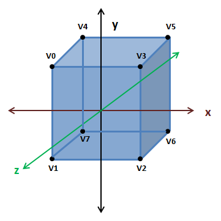

# Textures 


## Create a 3D cube

In this chapter we will learn how to load textures and use them in the rendering process. In order to show all the concepts related to textures we will transform the quad that we have been using in previous chapters into a 3D cube. With the code base we have created, in order to draw a cube we just need to correctly define the coordinates of a cube and it should be drawn correctly.

In order to draw a cube we just need to define eight vertices.


 
So the associated coordinates array will be like this:

```java
float[] positions = new float[] {
    // VO
    -0.5f,  0.5f,  0.5f,
    // V1
    -0.5f, -0.5f,  0.5f,
    // V2
    0.5f, -0.5f,  0.5f,
    // V3
     0.5f,  0.5f,  0.5f,
    // V4
    -0.5f,  0.5f, -0.5f,
    // V5
     0.5f,  0.5f, -0.5f,
    // V6
    -0.5f, -0.5f, -0.5f,
    // V7
     0.5f, -0.5f, -0.5f,
};
```

Of course, since we have 4 more vertices we need to update the array of colours. Just repeat the first four items by now.

```java
float[] colours = new float[]{
    0.5f, 0.0f, 0.0f,
    0.0f, 0.5f, 0.0f,
    0.0f, 0.0f, 0.5f,
    0.0f, 0.5f, 0.5f,
    0.5f, 0.0f, 0.0f,
    0.0f, 0.5f, 0.0f,
    0.0f, 0.0f, 0.5f,
    0.0f, 0.5f, 0.5f,
};
```

Finally, since a cube is made of six faces we need to draw twelve triangles (two per face), so we need to update the indices array. Remember that triangles must be defined in counter clock wise order.

```java
int[] indices = new int[] {
    // Front face
    0, 1, 3, 3, 1, 2,
    // Top Face
    4, 0, 3, 5, 4, 3,
    // Right face
    3, 2, 7, 5, 3, 7,
    // Left face
    0, 1, 6, 4, 0, 6,
    // Bottom face
    6, 1, 2, 7, 6, 2,
    // Back face
    4, 6, 7, 5, 4, 7,
};
```

In order to better view the cube we will change code that rorates the model in the ```DummyGame``` class to rotate along the three axis.

```java
// Update rotation angle
float rotation = gameItem.getRotation().x + 1.5f;
if ( rotation > 360 ) {
    rotation = 0;
}
gameItem.setRotation(rotation, rotation, rotation);  
```

An that’s all, we are now able to display a spining 3D cube. You can now compile an run your example and you will obtain something like this.


There is something weird with this cube, some faces are not being painted correctly. What is happening? The reason why the cube has this aspect is that the triangles that compose the cube are being drawn in a sort of random order. The pixels that are far away should be drawn before pixels that are closer. This is not happening right now and in order to do that we must enable depth test.

This is can be done in the ```Window``` class at the end of the ```init``` method:

```java
glEnable(GL_DEPTH_TEST);
```

Now our cube is being rendered correctly!.


 
If you see the code for this part of the chapter you may see that we have done a minor reorganization in the ```Mesh``` class. The identifiers of the VBOs are now stored in a list to easily iterate over them.

## Adding texture to the cube

Now we are going to apply a texture to our cube. A texture is an image which is used to draw the colour of the pixels of a certain model. You can think about a texture like a skin that is wrapped around your 3D model. What you do is assign points in the image texture to the vertices in your model. With that information OpenGL is able to calculate the colour to apply to the other pixels based on the texture image.


 
The texture image does not have to have the same size as the model, it can be larger or smaller. OpenGL will extrapolate the colour if the pixel to be processed cannot be mapped to a specific point in the texture.  You can control how this process is done when a specific texture is created. 

So basically what we must do, in order to apply a textura to a model, is assign texture coordinates to each of our vertices. Texture coordinates system are a bit different than the coordinates system of our model. First of all, we have a 2D texture so our coordinates will only have two components, x and y. Besides that, the origin is setup in the top left corner of the image and the maximum value of the x or y value is equal to 1.


 
How do we relate texture coordinates with our position coordinates? Easy, the same way as we passed the colour information, we set up a VBO which will have a texture coordinate for each vertex position.

So let’s start modifying the code base to use textures in our 3D cube. The first step is to load the image that will be used as a texture. For this tasks, in previous versions of LWJGL, the Slick2D library was commonly used. At the moment of this writing it seems that this library is not compatible with LWJGL 3 so we will need to follow a more verbose approach.  We will use a library called pngdecoder, thus, we need to declare that dependency in our ```pom.xml``` file. 

```xml
<dependency>
    <groupId>org.l33tlabs.twl</groupId>
    <artifactId>pngdecoder</artifactId>
    <version>${pngdecoder.version}</version>
</dependency>
```

And define the version of the library to use.

```xml
<properties>
    [...]
    <pngdecoder.version> 1.0 </pngdecoder.version>
    [...]
</properties>
```

One thing that you may see in some web pages is that the first thing we must do is enable the textures in our OpenGL context by calling ```glEnable(GL_TEXTURE_2D)```. This is true if you are using fixed pipepline, since we are using GLSL shader is not required anymore.

Now we will create a new ```Texture``` class that will perform all the necessary steps to load a texture. Our texture image will be located in the resources folder and can be accessed as a CLASSPATH resource and passed as an input stream to the ```PNGDecoder``` class.

```java
PNGDecoder decoder = new PNGDecoder(
     Texture.class.getResourceAsStream(fileName));
```

Then we need to decode the PNG image and store its content into a buffer by using the ```decode``` method of the ```PNGDecoder``` class. The PNG image will be decoded in RGBA format (RGB for Red, Green, Blue and A for Alpha or transparency) which uses four bytes per pixel. 

The ```decode``` method requires two parameters:
* ```buffer```: The ByteBuffer that will hold the decoded image (since each pixel uses four bytes its size will be 4 * width * height).
* ```stride```:  Specifies the distance in bytes from the start of a line to the start of the next line. In this case it will be the number of bytes per line.
* ```format```: The target format into which the image should be decoded (RGBA).

```java
ByteBuffer buf = ByteBuffer.allocateDirect(
    4 * decoder.getWidth() * decoder.getHeight());
decoder.decode(buf, decoder.getWidth() * 4, Format.RGBA);
buf.flip();
```

One important thing to remember is that OpenGL, for historical reasons, requires that texture images have a size in bytes of a power of two (2, 4, 8, 16, ....). Some drivers remove that constraint but it’s better to stick to it to avoid problems.

The next step is to upload the texture into the graphics card memory. First of all we need to create a new texture identifier. Each operation related to that texture will use that identifier so we need to bind to it.

```java
// Create a new OpenGL texture 
int textureId = glGenTextures();
// Bind the texture
glBindTexture(GL_TEXTURE_2D, textureId);
```

Then we need to tell OpenGL how to unpack our RGBA bytes. Each component is one byte size

```java
glPixelStorei(GL_UNPACK_ALIGNMENT, 1);
```

And finally we can upload our texture data:

```java
glTexImage2D(GL_TEXTURE_2D, 0, GL_RGBA, decoder.getWidth(),
    decoder.getHeight(), 0, GL_RGBA, GL_UNSIGNED_BYTE, buf);
```

The glTextImage2D method has the following parameters:
* target: Specifies the target texture (its type). In this case: GL_TEXTURE_2D. 
* level: Specifies the level-of-detail number. Level 0 is the base image level. Level n is the nth mipmap reduction image. More on this later.
* internal format: Specifies the number of colour components in the texture.
* width: Specifies the width of the texture image.
* height: Specifies the height of the texture image.
* border: This value must be zero.
* format: Specifies the format of the pixel data: RGBA in this case.
* type: Specifies the data type of the pixel data. We are using unsigned bytes for this.
* data: The buffer that stores our data.

In some code snippets that you may find yow ill probably see that before calling the ```glTextImage2D``` method filtering parameters are set up. Filtering refers to how the image will be drawn when scaling and how pixels will be interpolated.

If those parameters are not set the texture will not be displayed. So before the glTextImage2D method you could see something like this:

```java
glTexParameteri(GL_TEXTURE_2D, GL_TEXTURE_MIN_FILTER, GL_NEAREST);
glTexParameteri(GL_TEXTURE_2D, GL_TEXTURE_MAG_FILTER, GL_NEAREST);
```

This parameter basically says that when a pixel is drawn with no direct one to one association to a texture coordinate it will pick the nearest texture coordinate point.

By this moment we will not set up those parameters, instead of that we will generate a mipmap. A mipmap is a decreasing resolution set of images generated from a high detailed texture. Those lower resolution images will be used automatically when our object is scaled.

In order to generate mipmaps we just need to set the following line (in this case after the glTextImage2D method:

```java
glGenerateMipmap(GL_TEXTURE_2D);
```

And that’s all, we have successfully loaded our texture. Now we need to use it. As we have said before we need to pass texture coordinates as another VBO. So we will modify our Mesh class to accept an array of floats, that contains texture coordinates, instead of the colour (we could have colours and texture but in order to simplify it we will strip colours off). Our constructor will be like this:

```java
public Mesh(float[] positions, float[] textCoords, int[] indices,
    Texture texture)
```

The texture coordinates VBO is created in the same way as the colour one, the only difference is that it has two elements instead of three:

```java
vboId = glGenBuffers();
vboIdList.add(vboId);
FloatBuffer textCoordsBuffer = BufferUtils.createFloatBuffer(textCoords.length);
textCoordsBuffer.put(textCoords).flip();
glBindBuffer(GL_ARRAY_BUFFER, vboId);
glBufferData(GL_ARRAY_BUFFER, textCoordsBuffer, GL_STATIC_DRAW);
glVertexAttribPointer(1, 2, GL_FLOAT, false, 0, 0);
```

Now we need to use those textures in our shader. In the vertex shader we have changed the second uniform parameter because now it’s a ```vec2``` (we also changed the uniform name, so remember to change it in the ```Renderer``` class). The vertex shader, as in the colour case, just passes the texture coordinates to be used by the fragment shader.

```glsl
#version 330

layout (location=0) in vec3 position;
layout (location=1) in vec2 texCoord;

out vec2 outTexCoord;

uniform mat4 worldMatrix;
uniform mat4 projectionMatrix;

void main()
{
    gl_Position = projectionMatrix * worldMatrix * vec4(position, 1.0);
    outTexCoord = texCoord;
} 
```

In the fragment shader we must use those texture coordinates in order to set the pixel colours:

```glsl
#version 330

in  vec2 outTexCoord;
out vec4 fragColor;

uniform sampler2D texture_sampler;

void main()
{
    fragColor = texture(texture_sampler, outTexCoord);
}
```

Before analyzing the code let’s clarify some concepts. A graphic card has several spaces or slots to store textures. Each of these spaces is called a texture unit. When we are working with textures we almost set the texture unit that we want to work with. As you can we have a new uniform named texture_sampler. That uniform has a ```sampler2D``` type. That uniform will hold the value of the texture unit that we want to work with.

In the main function we use the texture ```lookup``` function named “texture”. This function takes two arguments: a sampler and a texture coordinate and will return the correct colour. The sampler uniform allow us to do multi-texturing. We will not cover that topic right now but we will try to prepare the code to evolve it more easily later on.

Thus, in our ```ShaderProgram``` class we will create a new method that allows us to set an integer value for a uniform:

```java
public void setUniform(String uniformName, int value) {
    glUniform1i(uniforms.get(uniformName), value);
}
```

In the init method of our Renderer class we will create a new uniform:
shaderProgram.createUniform("texture_sampler");

In the ```render``` method of our ```Renderer``` class we will set the uniform value to 0. (We are not using several textures right now so we are just using unit 0.

```java
shaderProgram.setUniform("texture_sampler", 0);
```

Finally we just need to change the render method of the ```Mesh``` class to use the texture. At the beginning of that method we put the following lines:

```java
// Activate first texture unit
glActiveTexture(GL_TEXTURE0);
// Bind the texture
glBindTexture(GL_TEXTURE_2D, texture.getId());
```

We basically are binding to the texture identified by  ```texture.getId()``` in the texture unit 0.
Right now, we have just modified our code base to support textures, now we need to setup texture coordinates for our 3D cube. Our texture image file will be something like this:


 
In our 3D model we have eight vertices. Let’s see how this can be done. Let’s first define the front face texture coordinates for each vertex.


| Vertex | Texture Coordinate |
| -- | -- |
| V0 | (0.0, 0.0) |
| V1 | (0.0, 0.5) |
| V2 | (0.5, 0.5) |
| V3 | (0.5, 0.0) |
 

Now, let’s define the texture mapping of the top face.


 
| Vertex | Texture Coordinate |
| -- | -- |
| V4 | (0.0, 0.5) |
| V5 | (0.5, 0.5) |
| V0 | (0.0, 1.0) |
| V3 | (0.5, 1.0) |
	

As you can see we have a problem, we need to setup different texture coordinates for the same vertices (V0 and V3). How can we solve this ? The only way to solve it is to repeat some points. For the top face we need to repeat the four vertices and assign them the correct texture coordinates.

Since the front, back and lateral faces use the same texture we won’t need to repeat all of the vertices. You have the complete definition in the source code, but we needed to pass from 8 points to 20. The final result is like this.


 
In the next chapters we will learn how to load models generated by 3D modelling tools so we won’t need to define by hand the positions and texture coordinates (which by the way, would be impractical for more complex models).
