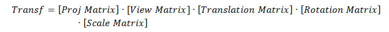

# Camera 

In this chapter we will learn how to setup move inside a rendered 3D scene, this capability is like having a camera that can move inside the 3D world and in fact is the term used to refer to it. In OpenGL there is no camera concept, or in other words the camera is always fixed, centred in the (0, 0, 0) position at the centre of the screen.

So what we will do is a simulation that gives us the impression that we have a camera capable of moving inside the 3D scene. How do we achieve this ? Well, if we cannot move the camera then we must move all the objects contained in our 3D space at once. In other words, if we cannot move a camera we will move the whole world.
So, suppose that we would like to move the camera position along the z axis from a starting position (Cx, Cy, Cz) to a position (Cx, Cy, Cz+dz) to get closer to the object which is placed at the coordinates (Ox, Oy, Oz).

 

What we will actually do is move the object (all the objects in our 3D space indeed) in the opposite direction that the camera should move. Think about it like the objects being placed in a treadmill.


A camera can be displaced along the three axis (x, y and z) and also can rotate along them (roll, pitch and yaw).

 

And how are we going to do this ? The answer is to apply another transformation that will translate all of our vertices in the opposite direction of the movement of the camera and will rotate them according to the camera rotation. This will be done of course with another matrix, the so called view matrix. This matrix will first perform the translation and then the rotation along the axis.
If you remember from the transformations chapter our transformation equation was like this:


The view matrix should be applied before multiplying by the projection matrix, so our equation should be now like this:
 


So let’s start modifying our code to support a camera. First of all we will create a new class called ```Camera``` which will hold the position and rotation state of our camera. This class will provide methods to set the new position or rotation state (```setPosition``` or ```setRotation```) or to update those values with an offset upon the current state (```movePosition``` and ```moveRotation```)

```java
package org.lwjglb.engine.graph;

import org.joml.Vector3f;

public class Camera {

    private final Vector3f position;
    
    private final Vector3f rotation;
    
    public Camera() {
        position = new Vector3f(0, 0, 0);
        rotation = new Vector3f(0, 0, 0);
    }
    
    public Camera(Vector3f position, Vector3f rotation) {
        this.position = position;
        this.rotation = rotation;
    }

    public Vector3f getPosition() {
        return position;
    }

    public void setPosition(float x, float y, float z) {
        position.x = x;
        position.y = y;
        position.z = z;
    }
    
    public void movePosition(float offsetX, float offsetY, float offsetZ) {
        position.x += offsetX;
        position.y += offsetY;
        position.z += offsetZ;
    }

    public Vector3f getRotation() {
        return rotation;
    }
    
    public void setRotation(float x, float y, float z) {
        rotation.x = x;
        rotation.y = y;
        rotation.z = z;
    }

    public void moveRotation(float offsetX, float offsetY, float offsetZ) {
        rotation.x += offsetX;
        rotation.y += offsetY;
        rotation.y += offsetZ;
    }
}
```

Next in our ```Transformation``` class we will hold a new matrix to hold the values of the view matrix.

```java
private final Matrix4f transformationMatrix;
```

We will also provide a method to update its value. Like the projection matrix this matrix will be the same for all the objects to be rendered in a render cycle.

```java
public void updateViewMatrix(Camera camera) {
    viewMatrix.identity();
    Vector3f cameraPos = camera.getPosition();
    Vector3f rotation = camera.getRotation();
    viewMatrix.translate(-cameraPos.x, -cameraPos.y, -cameraPos.z).
            rotateX((float)Math.toRadians(rotation.x)).
            rotateY((float)Math.toRadians(rotation.y)).
            rotateZ((float)Math.toRadians(rotation.z));
}
```

As you can see we first do the translation and then the rotation. Finally we need to use it in our ```getTransformationMatrix``` method.

```java
public Matrix4f getTransformationMatrix(GameItem gameItem) {
    Vector3f rotation = gameItem.getRotation();
    transformationMatrix.identity().translate(gameItem.getPosition()).
            rotateX((float)Math.toRadians(-rotation.x)).
            rotateY((float)Math.toRadians(-rotation.y)).
            rotateZ((float)Math.toRadians(-rotation.z)).
            scale(gameItem.getScale());
    Matrix4f currProj = new Matrix4f(projectionMatrix);
    Matrix4f viewCurr = new Matrix4f(viewMatrix);
    return currProj.mul(viewCurr.mul(transformationMatrix));
}
```

As with the projection matrix, the ```getTransformationMatrix``` method will be called per each ```GameItem``` instance so we must work over a copy of the view matrix so transformations do not get accumulated in each call (Remember that ```Matrix4f``` class is not immutable).

In the render method of the ```Renderer``` class we just need to update the view matrix according to the camera values, just after the projection matrix is also updated.

```java
public void render(Window window, Camera camera, GameItem[] gameItems) {
    clear();

    shaderProgram.bind();
        
    // Update projection Matrix
    transformation.updateProjectionMatrix(FOV, window.getWidth(), window.getHeight(), Z_NEAR, Z_FAR);
    // Update view Matrix
    transformation.updateViewMatrix(camera);
    //..[Removed code]..
```

And that’s all, our base code supports the concept of a camera. Now we need to use it. We can change the way we handle the input and update the camera. We will set the following controls:
* Keys “A” and “D” to move the camera to the left and right (x axis) respectively.
* Keys “W” and “S” to move the camera forward and backwards (z axis) respectively.
* Keys “Z” and “X” to move the camera up and down (y axis) respectively.

We will use the mouse position to rotate the camera along the x and y axis when the right button of the mouse is pressed.
As you can see we will be using the mouse for the first time. We will create a new class named MouseInput that will encapsulate mouse access. Here’s the code for that class.

```java
package org.lwjglb.engine;

import org.joml.Vector2d;
import org.joml.Vector2f;
import static org.lwjgl.glfw.GLFW.*;
import org.lwjgl.glfw.GLFWCursorPosCallback;
import org.lwjgl.glfw.GLFWCursorEnterCallback;
import org.lwjgl.glfw.GLFWMouseButtonCallback;

public class MouseInput {

    private static final float MOUSE_SENSITIVITY = 0.5f;

    private final Vector2d previousPos;

    private final Vector2d currentPos;

    private final Vector2f displVec;

    private boolean inWindow = false;

    private boolean leftButtonPressed = false;

    private boolean rightButtonPressed = false;

    public MouseInput() {
        previousPos = new Vector2d(-1, -1);
        currentPos = new Vector2d(0, 0);
        displVec = new Vector2f();
    }

    public void init(Window window) {
        glfwSetCursorPosCallback(window.getWindowHandle(), new GLFWCursorPosCallback() {
            @Override
            public void invoke(long window, double xpos, double ypos) {
                currentPos.x = xpos;
                currentPos.y = ypos;
            }
        });
        glfwSetCursorEnterCallback(window.getWindowHandle(), new GLFWCursorEnterCallback() {
            @Override
            public void invoke(long window, int entered) {
                inWindow = entered == 1;
            }
        });
        glfwSetMouseButtonCallback(window.getWindowHandle(), new GLFWMouseButtonCallback() {
            @Override
            public void invoke(long window, int button, int action, int mods) {
                leftButtonPressed = button == GLFW_MOUSE_BUTTON_1 && action == GLFW_PRESS;
                rightButtonPressed = button == GLFW_MOUSE_BUTTON_2 && action == GLFW_PRESS;
            }
        });
    }

    public Vector2f getDisplVec() {
        return displVec;
    }

    public void input(Window window) {
        displVec.x = 0;
        displVec.y = 0;
        if (previousPos.x > 0 && previousPos.y > 0 && inWindow) {
            double deltax = currentPos.x - previousPos.x;
            double deltay = currentPos.y - previousPos.y;
            boolean rotateX = deltax != 0;
            boolean rotateY = deltay != 0;
            if (rotateX) {
                displVec.y = (float) deltax * MOUSE_SENSITIVITY;
            }
            if (rotateY) {
                displVec.x = (float) deltay * MOUSE_SENSITIVITY;
            }
        }
        previousPos.x = currentPos.x;
        previousPos.y = currentPos.y;
    }

    public boolean isLeftButtonPressed() {
        return leftButtonPressed;
    }

    public boolean isRightButtonPressed() {
        return rightButtonPressed;
    }
}
```

The ```MouseInput``` class provides an ```init``` method which should be called during the initialization phase and registers a set of callbacks to process mouse events:
* ```glfwSetCursorPosCallback```: Registers a callback that will be invoked when the mouse is moved.
* ```glfwSetCursorEnterCallback```: Registers a callback that will be invoked when the mouse enters our window. We will be received mouse evevents even if the mouse is not in our window. We use this callback to track when the mouse is in our window.
* ```glfwSetMouseButtonCallback```: Registers a callback that will be invoked when a mouse button is pressed.

The ```MouseInput``` class provides an input method which should be when game input is processed. This method calculates the mouse displacement from the previous position and stores it into ```Vector2f``` ```displVec``` variable so it can be used by our game.

The ```MouseInput``` class will be instantiated in our ```GameEngine``` class and will be passed as a parameter in the ```init``` and ```update``` methods of the game implementation (so we need to change the interface accordingly).

```java
void input(Window window, MouseInput mouseInput);

void update(float interval, MouseInput mouseInput);
```

The mouse input will be processed in the input method of the ```GameEngine``` class before passing the control to the game implementation.

```java
protected void input() {
    mouseInput.input(window);
    gameLogic.input(window, mouseInput);
}
```

Now we are ready to update our ```DummyGame``` class to process the keyboard and mouse input. The input method of that class will be like this:

```java
@Override
public void input(Window window, MouseInput mouseInput) {
    cameraInc.set(0, 0, 0);
    if (window.isKeyPressed(GLFW_KEY_W)) {
        cameraInc.z = -1;
    } else if (window.isKeyPressed(GLFW_KEY_S)) {
        cameraInc.z = 1;
    }
    if (window.isKeyPressed(GLFW_KEY_A)) {
        cameraInc.x = -1;
    } else if (window.isKeyPressed(GLFW_KEY_D)) {
        cameraInc.x = 1;
    }
    if (window.isKeyPressed(GLFW_KEY_Z)) {
        cameraInc.y = -1;
    } else if (window.isKeyPressed(GLFW_KEY_X)) {
        cameraInc.y = 1;
    }
}
```

It just updates a ```Vector3f``` variable named ```cameraInc``` which holds the camera displacement that should be applied. 
The update method of the ```DummyGame``` class modifies the camera position and rotation according to the processes key and mouse events.

```java
@Override
public void update(float interval, MouseInput mouseInput) {
    for (GameItem gameItem : gameItems) {
        // Update camera position
        camera.movePosition(cameraInc.x * CAMERA_POS_STEP, cameraInc.y * CAMERA_POS_STEP, cameraInc.z * CAMERA_POS_STEP);

        // Update camera based on mouse            
        if (mouseInput.isRightButtonPressed()) {
            Vector2f rotVec = mouseInput.getDisplVec();
            camera.moveRotation(rotVec.x * MOUSE_SENSITIVITY, rotVec.y * MOUSE_SENSITIVITY, 0);
        }
    }
}
```

